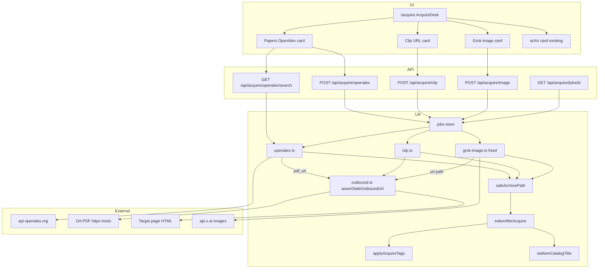

# Season Design: Acquire Depth & Accuracy — Helix Library

| Field | Value |
| --- | --- |
| **Document** | Season design — Acquire depth & accuracy |
| **Author** | Helix owner + design loop |
| **Date** | 2026-08-07 |
| **Status** | **Implemented** (Tier 1 on main, 2026-08-07) — rev 2; Tier 2 Grokipedia optional |
| **Approval** | Owner directed design + Tier 1 implement |
| **Workspace** | `/home/brandon/Projects/non-os` (package `helix-library`) |
| **Baseline tip** | `413a70a` on `main` (Discovery season shipped; 121 tests) |
| **Prior seasons** | [Curation & intake](./2026-08-curation-intake.md) · [Discovery depth & reading room](./2026-08-discovery-reading.md) — both **Implemented** |
| **Audience** | Senior engineers implementing on `main` |
| **Revision** | rev 2 (2026-08-07) — design review: OpenAlex key, shared SSRF, concrete clip extract, full job/tag plumbing, image cloud gate |

---

## Overview

Helix Library is a localhost personal OPAC: Next.js 15 App Router + SQLite FTS5 over explicit scan roots, hybrid catalog search, media preview, collections/tags/smart shelves, reading room, knowledge graph, Ask the Librarian, and an **Acquire** desk that maps public-library ILL to “search-or-paste → fetch into Archive → auto-tag → reindex.”

**Curation** made holdings curatable; **Discovery** made them usable in place. This season deepens **intake accuracy and breadth**: pull only when a real file (or clean article body) is resolvable; fix broken Grok image generation; add scholarly search beyond arXiv (OpenAlex + DOI → OA PDF); add single-page web clips as Markdown notes; design (and optionally ship) Grokipedia holdings preferred over Wikipedia.

**Season thesis:** **Acquire depth & accuracy.** Every desk card follows the same contract — resolve source → prove content is obtainable → write under path jail → index + provenance tags → human catalog title — without Sci-Hub, full-site WARC, or turning Helix into Zotero.

Success looks like: search OpenAlex (or paste a DOI) and **Fetch** only lights when an OA PDF URL exists; paste a blog URL and get a readable `.md` under `notes/` with source URL + date; Grok image works again with current xAI models; docs and in-app `/docs` describe the expanded desk; Tier 2 Grokipedia has a chosen, reliable approach with provenance tags.

---

## Background & Motivation

### What prior seasons shipped

| Season | Outcome relevant to Acquire |
| --- | --- |
| Curation & intake | `items.title` + `title_source`; `item_tags.source`; **unified SQLite `jobs`** (legacy `globalThis` + `acquire-jobs.json` is gone); Ask `acquire_*` after approve; rescue / untagged |
| Discovery | Reading room, related holdings, smart shelves, graph 2D/3D — **consumes** acquired holdings; does not expand intake |

### Product today (Acquire anchors in tree)

| Area | Reality |
| --- | --- |
| Desk UI | `/acquire` → `AcquireDesk.tsx` — cards: arXiv (search + id), YouTube/podcast, Grok image |
| arXiv | `src/lib/acquire/arxiv.ts` — Atom search; PDF from `export.arxiv.org`; `%PDF-` magic; `maxFileBytes`; `setItemCatalogTitle(..., "arxiv")` |
| YouTube | `src/lib/acquire/youtube.ts` — yt-dlp spawn (no arbitrary shell); progress parsing; **per-kind busy lock** on route + agent |
| Grok image | `src/lib/acquire/grok-image.ts` — POST `https://api.x.ai/v1/images/generations`, default model `grok-imagine-image`, `response_format: "b64_json"`; checks `hasXaiApiKey()` only (**not** `xaiCloudAllowed()`); URL branch has no timeout/size/magic; **reported broken** |
| Jobs | `HelixJobKind` = `reindex \| arxiv \| youtube \| image` (`src/lib/jobs/types.ts`); `toHelixJob` **collapses unknown kinds to `"reindex"`** → `getAcquireJob` returns null for those rows |
| Path jail | `safeArchivePath(subdir, filename)` — subdirs `documents \| images \| video \| audio \| notes` under Archive root only; **single-segment** filenames |
| Post-fetch | `indexAfterAcquire` → full `runReindex` → `applyAcquireTags` (`acquired` + source label + EXIF-ish); **catch fallback** also hardcodes youtube/arxiv/image |
| Titles | `nextTitle` in `indexer/run.ts` already preserves **any** `titleSource !== "filename"` (no per-source special case needed for openalex/clip) |
| Agent | `acquire_arxiv` / `acquire_youtube` / `acquire_image` in `actions.ts` — desk-first; approve starts async job |
| Caps | `acquireCapabilities()` — `grokImage: hasXaiApiKey && xaiCloudAllowed`; desk chip still shows only “keyed” / “no key” |

### Pain points

1. **arXiv is a narrow net.** Preprints only; many DOI / publisher OA PDFs and repository copies are invisible. No “can we actually get the file?” badge beyond arXiv’s always-PDF contract.
2. **Grok image is broken.** xAI docs (2026) document **`grok-imagine-image-quality`** as the primary Imagine model; default response is **URL**; `b64_json` still documented. URL download lacks hardening; cloud opt-out not enforced inside `acquireGrokImage`.
3. **No web clip.** Reading room can open notes/Markdown, but intake has no “save this page as a holding” path.
4. **Reference articles undecided.** Owner wants **Grokipedia > Wikipedia** when reference fetch ships.
5. **Docs lag desk.** PRODUCT / SESSION-HANDOFF / AGENTS / in-app `/docs` describe arXiv + YT + Grok image only; handoff still has a stale “globalThis + acquire-jobs.json” line in the code map.

### Constraints (non-negotiable)

From `AGENTS.md` / product hard rules:

1. **Localhost by default** — loopback bind; LAN only with password + explicit env.
2. **Explicit scan roots** — never default-scan `$HOME`.
3. **Librarian mutations approval-gated** — desk first; Ask `acquire_*` may follow same patterns later this season only if cheap.
4. **SuperGrok ≠ developer API** — images and Grok need `XAI_API_KEY` from console.x.ai.
5. **Paths from tools only** — agent must not invent file paths.
6. **Media serve gated** — `/api/media/[id]` under enabled location roots only.
7. **Do not commit** secrets, `library.config.json`, `data/`, personal `archive/**`.

Additional season constraints:

- Prefer **editing existing modules** over new frameworks.
- **Accuracy gate:** download/write only when content is resolvable (OA PDF URL, successful HTML extract, successful image bytes) — never invent papers or ghost holdings.
- **No Sci-Hub / shadow libraries.**
- Web clip: **concrete zero-dep pipeline first** (see Theme C); `linkedom` only if fixtures fail quality bar (PR4 entry criterion).
- No multi-user SaaS; no Zotero as catalog backend; no WARC / full-site crawl.
- **All outbound acquires** (OpenAlex PDF, clip HTML, image URL) share one SSRF helper.

---

## Goals & Non-Goals

### Goals (season — Tier 1 required)

| # | Theme | Outcome |
| --- | --- | --- |
| **G1** | Fix Grok image | Reliable generate → `archive/images/`; default `grok-imagine-image-quality`; robust b64 **or** URL (timeout, size, magic, SSRF); `xaiCloudAllowed` enforced in `acquireGrokImage`; desk copy matrix (no key / cloud off / entitlement) |
| **G2** | Papers: OpenAlex + DOI | Free OpenAlex API key **strongly recommended**; search or paste DOI; hits show **PDF resolvable** badge; fetch only when https `pdf_url` resolvable + SSRF-safe; human title + tags |
| **G3** | Web clip | URL → specified pure HTML→MD pipeline → `notes/*.md` + frontmatter; shared SSRF; fixture-tested extract |
| **G4** | Jobs + tags plumbing | Exhaustive kind/list/busy/toHelixJob/auto-tag/backfill updates before any openalex/clip job is written |
| **G5** | Desk UX | Papers + Clip cards; image error display; arXiv remains fast path |
| **G6** | Docs | PRODUCT, SESSION-HANDOFF (incl. jobs storage fix), AGENTS, `/docs`, acquire metadata, image model default |
| **G7** | Tests | OpenAlex parse/OA URL fixtures; clip HTML fixtures; image response parse; job kind round-trip |

### Goals (Tier 2 — design required; implement if time)

| # | Theme | Outcome |
| --- | --- | --- |
| **G8** | Grokipedia article → Markdown holding | Preferred reference source; provenance tags; **not** Wikipedia-first; **spike live HTML before PR6** |
| **G9** | Project Gutenberg / Standard Ebooks | Optional stretch design note only |

### Non-goals (this season)

| Out of scope | Why |
| --- | --- |
| Sci-Hub / LibGen / shadow libraries | Legal/ethics; product hard boundary |
| Zotero as catalog backend; CSL | Metaphor drift; weight |
| Full web crawl / WARC | Accuracy + storage |
| Embeddings as primary search | Deferred |
| Multi-user SaaS | Product hard boundary |
| Image-by-URL (found images) | Tier 3 |
| Podcast RSS polish | Tier 3 |
| Wikipedia as primary reference fetcher | Owner: Grokipedia preferred; default out |
| Unpaywall as secondary PDF resolver | Deferred; OpenAlex-only for Tier 1 (see Alternatives) |
| Bulk OpenAlex corpora | Personal desk, not research platform |
| Raising public `maxFileBytes` | Keep config; OpenAlex has tighter desk cap |
| Agent shell / unsolicited disk writes | Hard constraint |
| Discovery PR6 open events, yt-dlp JS runtime, export/backup | Separate known gaps |

---

## Key Decisions

| ID | Decision | Choice | Rationale |
| --- | --- | --- | --- |
| **KD1** | Scholarly wider net | **OpenAlex** search + DOI lookup; arXiv stays dedicated fast path | Free catalog + OA metadata; `best_oa_location.pdf_url` is the accuracy signal |
| **KD2** | Fetch gate | **Download only when `pdf_url` is https and non-empty** after OpenAlex resolve; no landing-page HTML scrape as “PDF” | Accuracy: only real PDFs; avoid paywall HTML masquerading as success |
| **KD3** | DOI input | Normalize DOI → OpenAlex work by DOI; also accept OpenAlex work ids (`W…`) and `openalex.org/works/…` URLs | One code path for paste + search-hit fetch |
| **KD4** | OpenAlex auth | **Strongly recommend free API key** (`NON_OS_OPENALEX_API_KEY` or `OPENALEX_API_KEY`) as documented prerequisite for reliable desk use. Unkeyed calls allowed for trial only. Mailto in User-Agent is **courtesy**, not a substitute. Map 402/409/429 (+ credit headers if present) to desk errors with link to [openalex.org/settings/api](https://openalex.org/settings/api) | 2026 freemium: free daily budget without key is tiny; opaque limit errors otherwise |
| **KD5** | PDF size | Cap download at `min(config.maxFileBytes, 100 * 1024 * 1024)` for OpenAlex | Config can be 2 GiB; OpenAlex hosts are **untrusted third parties** (unlike arXiv CDN) so desk is tighter |
| **KD6** | Filename | Prefer `doi-slug.pdf` or `openalex-{shortId}.pdf` under `documents/`; never path separators | Jail + stable-ish names |
| **KD7** | Title source | Extend `TitleSource` with `"openalex"` \| `"clip"` | `setItemCatalogTitle` is typed; **no** new branch in `indexer/run.ts` — `nextTitle` already keeps any non-`filename` source |
| **KD8** | Web clip target | **`notes/`** flat `clip-{stamp}-{slug}.md` | Reading room + `safeArchivePath` single-segment; `.md` → text kind |
| **KD9** | HTML extract | **Commit to zero-dep pure pipeline** specified in Theme C (tokenizer + block rules + fixtures). **PR4 entry criterion:** if fixtures fail quality bar, add **one** small dep (`linkedom` only) in same PR — no jsdom/Playwright | Implementable without inventing a mini-readability stack mid-PR |
| **KD10** | Clip frontmatter | YAML: `title`, `source_url`, `acquired_at` (ISO); body after `---` | Provenance in-file; FTS will index frontmatter keys too (**feature**: `source_url` searchable) |
| **KD11** | Grok image model | Default **`grok-imagine-image-quality`** via `NON_OS_IMAGE_MODEL`; override for cheaper `grok-imagine-image` | Aligns with current xAI docs |
| **KD12** | Grok image bytes | Request `response_format: "b64_json"`; **always** accept `url` with timeout + size + SSRF + magic; empty data hard error | Format drift; URLs temporary |
| **KD13** | Image entitlement UX | Explicit desk matrix + `xaiCloudAllowed` **inside** `acquireGrokImage` (and thus route/agent) | Closes gap where capability hides button but API path still runs |
| **KD14** | Grokipedia (Tier 2) | Public HTML primary; Grok API secondary when keyed; reject unofficial scrapers | No official bulk API |
| **KD15** | Wikipedia | **Default out** this season | Owner preference |
| **KD16** | Ask agent acquire | New actions optional (PR7); **PR1 still gates existing `acquire_image`** with `xaiCloudAllowed` | Desk-first; fix existing hole |
| **KD17** | Job kinds | New kinds **`openalex`** and **`clip`** (not reuse `arxiv`) | Labels, busy locks, no poll collapse |
| **KD18** | Docs PR | PR5 final; fix stale jobs storage line in SESSION-HANDOFF | Consistency |
| **KD19** | Shared outbound SSRF | **`assertSafeOutboundUrl` / `fetchSafeOutbound`** used by OpenAlex PDF, clip HTML, and Grok image URL download | OA `pdf_url` is arbitrary third-party https — same or higher SSRF surface than user-pasted clip |
| **KD20** | Busy lock | **Per-kind single-flight** for `openalex` and `clip` (mirror YouTube route/agent); reject with clear “already running” message | Protect Archive + reindex thrash |
| **KD21** | HTTP asymmetry | PDF / image URL downloads: **https only**. Clip page fetch: **https preferred, http allowed** (desk warn) with same private-IP rules | Many blog origins still http; OA PDF http is rare and out of scope |
| **KD22** | Cancel | Best-effort: check `isCancelRequested` **between stages** only (same as arXiv); no mid-stream abort required for Tier 1 | YouTube has richer cancel; not blocking |

---

## Proposed Design

### Architecture (season delta)



### Shared acquire contract

All Tier 1 sources implement the same lifecycle (already established by arXiv):

```text
1. Parse / search (no disk write)
2. Resolve: prove bytes or markdown obtainable
3. Busy-lock check (openalex, clip, youtube) → createAcquireJob → return jobId
4. Download / generate with progress; isCancelRequested between stages
5. Validate (magic, size, non-empty)
6. safeArchivePath(subdir, filename) + writeFile
7. indexAfterAcquire(path, { source: kind })
8. setItemCatalogTitle when human title known
9. completeJob(result) | failJob(message)
```

**Accuracy rules:**

| Source | Resolve means | Fail closed when |
| --- | --- | --- |
| arXiv (existing) | Parseable id | Id unparseable; non-PDF body |
| OpenAlex | Work found **and** `resolveOaPdfUrl(work)` returns https URL that passes SSRF | No PDF URL; SSRF fail; non-PDF body; size > cap |
| Clip | Safe URL; HTTP 2xx HTML under size/time; extract ≥ min body chars | Unsafe host; binary; empty extract |
| Image | Key + cloud allowed; API returns b64 or safe downloadable url → buffer ≥ 32 bytes + image magic | No key; cloud disabled; API error; non-image body |

### Shared outbound URL safety (KD19) — **required for Theme B + C + A url path**

**New module:** `src/lib/acquire/outbound.ts` (pure helpers, unit-tested).

```ts
export type SafeOutboundOpts = {
  /** Default true for PDF + image URL; false allows http for clip */
  httpsOnly?: boolean;
  /** Max redirects to follow with re-validation (default 5) */
  maxRedirects?: number;
};

/**
 * Throws if scheme/host/IP is unsafe for server-side fetch.
 * - Block: file:, data:, javascript:, non-http(s)
 * - If httpsOnly: require https:
 * - Resolve hostname; block loopback, RFC1918, link-local, metadata (169.254.169.254),
 *   IPv6 unique-local/link-local, and obvious cloud metadata hostnames
 * - Reject credentials in URL userinfo
 */
export function assertSafeOutboundUrl(url: string, opts?: SafeOutboundOpts): URL;

/**
 * fetch with redirect: 'manual' loop: assertSafeOutboundUrl on each Location;
 * optional maxBytes streaming cap; timeout via AbortSignal.
 */
export async function fetchSafeOutbound(
  url: string,
  opts: SafeOutboundOpts & {
    timeoutMs: number;
    maxBytes: number;
    headers?: Record<string, string>;
  },
): Promise<{ res: Response; finalUrl: string; buf: Buffer }>;
```

**Consumers (mandatory):**

| Call site | `httpsOnly` | maxBytes (order of magnitude) |
| --- | --- | --- |
| OpenAlex PDF download | **true** | `min(maxFileBytes, 100_MB)` |
| Clip HTML fetch | **false** (http ok) | 2 MB |
| Grok image URL download | **true** | 25 MB |

**Not** applied to OpenAlex API host itself (fixed `api.openalex.org`) or xAI API host (fixed `api.x.ai`) beyond normal TLS.

---

### Theme A — Grok image fix (G1)

#### Root cause hypotheses (investigate in PR, then fix)

1. **Model id drift:** default `grok-imagine-image` may be restricted for some keys; docs primary is `grok-imagine-image-quality`.
2. **Response shape:** default is **URL**; if API ignores `response_format: b64_json`, URL path needs timeout/size/magic/SSRF.
3. **Gates:** Capability uses `hasXaiApiKey() && xaiCloudAllowed()`, but `acquireGrokImage` / agent only check key today — **must fix**.
4. **Entitlement:** key may work for chat but not Imagine — clear 4xx messaging.

#### Gates (required in `acquireGrokImage` itself)

```ts
if (!hasXaiApiKey()) {
  throw new Error(
    "XAI_API_KEY is not set. Add a developer key from console.x.ai to generate images.",
  );
}
if (!xaiCloudAllowed()) {
  throw new Error(
    "Cloud Grok is disabled (NON_OS_USE_XAI=0). Image generation is unavailable.",
  );
}
```

Route and agent inherit this when they call `acquireGrokImage` (PR1 — not deferred to PR7).

#### Code changes (`src/lib/acquire/grok-image.ts`)

```ts
const DEFAULT_MODEL =
  process.env.NON_OS_IMAGE_MODEL?.trim() || "grok-imagine-image-quality";

const IMAGE_DOWNLOAD_MAX = 25 * 1024 * 1024;
const IMAGE_API_TIMEOUT_MS = 180_000;
const IMAGE_URL_FETCH_TIMEOUT_MS = 60_000;

/** Pure helper — unit-tested with fixture JSON */
export function extractImageBytesFromResponse(data: {
  data?: Array<{ b64_json?: string; url?: string }>;
}): { kind: "b64" | "url"; value: string } {
  const first = data.data?.[0];
  if (!first) throw new Error("No image in xAI response (empty data[])");
  if (first.b64_json?.trim()) return { kind: "b64", value: first.b64_json };
  if (first.url?.trim()) return { kind: "url", value: first.url };
  throw new Error("Image response missing b64_json and url");
}
```

Request body:

```json
{
  "model": "<DEFAULT_MODEL>",
  "prompt": "<prompt>",
  "n": 1,
  "response_format": "b64_json"
}
```

On success path:

1. Parse JSON → `extractImageBytesFromResponse`.
2. If `b64` → `Buffer.from(..., "base64")`.
3. If `url` → `fetchSafeOutbound(url, { httpsOnly: true, timeoutMs, maxBytes: IMAGE_DOWNLOAD_MAX })`.
4. **Reject non-image bodies:** require magic sniff success for png/jpeg/webp (same as write path). Optionally soft-check `Content-Type` starts with `image/` when present; magic wins if they disagree and magic is valid.
5. Reject buffer &lt; 32 bytes.
6. `safeArchivePath("images", filename)` → write → `indexAfterAcquire(..., { source: "image" })`.

Error mapping (job.error / desk):

| Condition | Message shape |
| --- | --- |
| No `XAI_API_KEY` | console.x.ai developer key note; SuperGrok alone insufficient |
| `!xaiCloudAllowed()` | Cloud disabled `NON_OS_USE_XAI=0` |
| HTTP 401/403 | Key invalid or lacks Imagine entitlement |
| HTTP 404 + model | Model `{id}` not available — try env override |
| Empty / no fields | First ~200 chars of body; **never** echo full API key |
| Unsafe URL / non-image | Explicit SSRF or magic failure message |

#### Capability / status + desk copy matrix (PR1)

`acquireCapabilities()` returns:

```ts
{
  // existing fields...
  grokImage: hasXaiApiKey() && xaiCloudAllowed(),
  hasXaiApiKey: hasXaiApiKey(),
  xaiCloudAllowed: xaiCloudAllowed(),
  imageModel: process.env.NON_OS_IMAGE_MODEL?.trim() || "grok-imagine-image-quality",
}
```

| Condition | Chip / warn copy |
| --- | --- |
| `!hasXaiApiKey` | Chip: “no key”; warn: set `XAI_API_KEY` from console.x.ai |
| `hasXaiApiKey && !xaiCloudAllowed` | Chip: “cloud off”; warn: `NON_OS_USE_XAI=0` disables image gen |
| both true | Chip: “keyed” (optional: show short model id) |
| job 4xx after attempt | ResultPanel: entitlement / model message from server |

#### Tests

- `extractImageBytesFromResponse` for b64-only, url-only, empty, both (prefer b64).
- `assertSafeOutboundUrl` rejects private IP / file: / http when httpsOnly.
- Optional mock fetch for URL path magic rejection.

---

### Theme B — OpenAlex papers (G2)

#### Module: `src/lib/acquire/openalex.ts`

Mirror structure of `arxiv.ts`: pure parse + search + acquire.

```ts
export type OpenAlexHit = {
  id: string;           // OpenAlex short id e.g. W2741809807
  doi: string | null;   // bare 10.xxxx/...
  title: string;
  abstract: string;     // reconstructed / truncated
  authors: string[];
  year: number | null;
  citedBy: number;
  oaStatus: string | null;
  isOa: boolean;
  pdfUrl: string | null;    // resolved for UI badge (https only)
  landingUrl: string | null;
  concepts: string[];
  openAlexUrl: string;
};
```

##### Parsing

```ts
export function parseDoi(input: string): string | null;
export function parseOpenAlexWorkId(input: string): string | null;
export function normalizeOpenAlexInput(input: string):
  | { type: "doi"; doi: string }
  | { type: "work"; id: string }
  | { type: "search"; q: string };
```

DOI rules: strip `https://doi.org/`, `doi:`, whitespace; validate roughly `10.\d{4,9}/...`.

##### OA PDF resolution (accuracy core)

```ts
/**
 * Prefer best_oa_location.pdf_url, then primary_location.pdf_url,
 * then first oa_locations[].pdf_url. Only https URLs.
 *
 * Honesty: a non-null pdf_url means “OpenAlex listed a direct PDF link,”
 * not a libre license claim. primary_location may be publisher-hosted;
 * we still require %PDF- magic after download. Landing pages are never used.
 * http:// repository PDFs are out of scope (KD21).
 */
export function resolveOaPdfUrl(work: OpenAlexWorkJson): string | null { ... }
```

**UI badge policy:**

| Badge | Condition | Fetch button |
| --- | --- | --- |
| **PDF** (strong) | `pdfUrl != null` | Enabled |
| **OA** (soft) | `is_oa` but no pdf_url | **Disabled** + tip “No direct PDF URL in OpenAlex” |
| **Closed** | not OA | Disabled |

Never fetch landing pages as PDFs. Never use Sci-Hub. Unpaywall secondary resolver is **out** this season.

##### Abstract reconstruction (desk snippet)

OpenAlex often returns `abstract_inverted_index: Record<string, number[]>`.

```ts
/** Pure — unit-test with small fixture */
export function reconstructAbstract(
  inverted: Record<string, number[]> | null | undefined,
  maxChars = 480,
): string {
  if (!inverted) return "";
  const positions: { pos: number; word: string }[] = [];
  for (const [word, idxs] of Object.entries(inverted)) {
    for (const i of idxs) positions.push({ pos: i, word });
  }
  positions.sort((a, b) => a.pos - b.pos);
  const text = positions.map((p) => p.word).join(" ");
  return text.length <= maxChars ? text : text.slice(0, maxChars - 1) + "…";
}
```

##### Auth + search client

```ts
function openAlexApiKey(): string | undefined {
  return (
    process.env.NON_OS_OPENALEX_API_KEY?.trim() ||
    process.env.OPENALEX_API_KEY?.trim() ||
    undefined
  );
}

function openAlexHeaders(): HeadersInit {
  const mailto = process.env.NON_OS_OPENALEX_MAILTO?.trim();
  const ua = mailto
    ? `HelixLibrary/0.1 (personal OPAC; mailto:${mailto})`
    : `HelixLibrary/0.1 (personal OPAC; localhost)`;
  return { "User-Agent": ua };
}

// Append api_key= when present to works URLs
```

- Timeout 30s for search/metadata.
- **Error mapping:** on 401/402/403/409/429, throw message that includes “Free OpenAlex API key recommended — https://openalex.org/settings/api” and status code. Do not dump full response bodies that might include secrets; slice ≤ 400 chars.
- `acquireCapabilities()` may expose `openAlexKey: boolean` for desk chip “OpenAlex key” yes/no (optional soft warn if missing: “Works better with free OpenAlex key”).

##### Search

```
GET https://api.openalex.org/works?search={q}&per_page={max}&select=...
```

- `max` clamp 1–25 (default 10).
- Do **not** default-filter `is_oa:true` (Q7) — badge honesty.

##### DOI / work paste → single work

```
GET https://api.openalex.org/works/https://doi.org/{doi}
GET https://api.openalex.org/works/{W id}
```

##### Acquire sequence

```ts
export async function acquireOpenAlexPdf(
  idOrDoiOrUrl: string,
  onProgress?: ProgressCb,
  opts?: { jobId?: number },
): Promise<OpenAlexAcquireResult>;
```

1. Resolve work (by id/DOI); free-text only → error “pick a search hit or paste DOI”.
2. `pdfUrl = resolveOaPdfUrl(work)`; if null → throw clear error.
3. Filename: DOI-based or `openalex-{id}.pdf` via `sanitizeFilename`.
4. `dest = safeArchivePath("documents", filename)`.
5. **Download via `fetchSafeOutbound(pdfUrl, { httpsOnly: true, timeoutMs: 120_000, maxBytes: min(config.maxFileBytes, 100_MB) })`** — re-validate redirects; progress from received bytes.
6. Between stages: if `opts.jobId` and `isCancelRequested(jobId)` → throw Cancelled.
7. Validate `%PDF-` magic; size cap.
8. Write; `indexAfterAcquire(dest, { source: "openalex" })`.
9. `setItemCatalogTitle(itemId, work.title, "openalex")`.
10. Extra tags after auto-tags: DOI policy + top 3–5 concepts via `valueToTagName` + `addTagToItem(..., "acquire")`.

**DOI tag length:** Always tag `openalex`. If `doi:` + bare DOI ≤ 48 → tag it; else tag generic `doi` and store full DOI only in job result — **never** truncate DOI mid-string.

##### HTTP API + busy lock

| Method | Path | Behavior |
| --- | --- | --- |
| GET | `/api/acquire/openalex/search?q=&max=` | Sync search `{ ok, total, hits }` |
| POST | `/api/acquire/openalex` | If `isAcquireBusy("openalex")` → **409** `{ ok:false, error: "…" }`; else async job |

Mirror YouTube busy pattern in route (and agent if PR7).

##### arXiv interaction

- Keep arXiv card unchanged.
- Desk copy: “arXiv = fast preprints; Papers = wider OA net + free OpenAlex key recommended.”

---

### Theme C — Web clip (G3)

#### Module: `src/lib/acquire/clip.ts`

```ts
export type ClipAcquireResult = {
  path: string;
  relPath: string;
  title: string;
  sourceUrl: string;
  bytes: number;
  itemId: number | null;
  tags?: string[];
};

export function isAllowedClipUrl(url: string): boolean; // wraps assertSafeOutboundUrl(httpsOnly: false)
export function htmlToMarkdownArticle(html: string, baseUrl: string): {
  title: string;
  markdown: string;
  bodyChars: number;
};
export async function acquireWebClip(
  urlRaw: string,
  onProgress?: ProgressCb,
  opts?: { jobId?: number },
): Promise<ClipAcquireResult>;
```

#### Fetch safety

Use **`fetchSafeOutbound`** with `httpsOnly: false`, `maxBytes: 2 * 1024 * 1024`, `timeoutMs: 30_000`. Prefer `text/html` Content-Type; reject obvious binary (magic / content-type).

Desk: warn when user enters `http:` URL (“Prefer https when available”).

#### Extraction — committed zero-dep pipeline (KD9)

**No DOM library in v1.** Concrete stages (all pure, unit-tested):

```text
1. Normalize: decode UTF-8; if charset meta says something else, best-effort only (UTF-8 default).
2. Strip blocks (case-insensitive, non-greedy regex on well-formed tags):
   - comments <!-- ... -->
   - <script>...</script>, <style>...</style>, <noscript>...</noscript>
   - <svg>...</svg>, <iframe>...</iframe>
3. Title priority:
   a) <meta property="og:title" content="...">
   b) <meta name="twitter:title" content="...">
   c) <title>...</title>
   d) hostname of baseUrl
   Entity-decode title (&amp; &lt; &gt; &quot; &#NN;).
4. Body root selection (first match wins on stripped HTML string):
   a) first <article>...</article>
   b) first <main>...</main>
   c) first role="main" container if cheaply matchable
   d) else content between <body> and </body>, else full string
5. Remove by tag name (open…close) from root: nav, footer, aside, form, header (header only if not sole content).
6. Tokenize to a flat list of events via a minimal tag scanner:
   - Recognize start/end tags for: h1–h6, p, br, hr, li, ul, ol, blockquote, pre, code, a, strong/b, em/i, img
   - Ignore unknown tags but keep inner text
   - Entity-decode text nodes
7. Emit Markdown:
   - hN → "#"*N + text
   - p / div-ish text runs → paragraph + blank line
   - li → "- " item (nested lists: best-effort flat indent; no perfect nesting required)
   - a → [text](absoluteUrl) using baseUrl for resolution
   - img → alt text only in parentheses or skip if empty (default: **no hotlinked images** — use alt or omit)
   - pre/code → fenced ``` block
   - br → newline; collapse ≥3 newlines to 2
8. Quality gate: strip markdown markers for count; require bodyChars ≥ 80
   else throw "Could not extract article text (page may be JS-only or blocked)."
```

**Checked-in fixtures** (PR4 must add under e.g. `tests/fixtures/clip/`):

| Fixture | Expect |
| --- | --- |
| `simple-article.html` | Title from og:title; body ≥ 200 chars; contains key phrase |
| `blog-with-nav.html` | Nav/footer text **absent** from markdown; article body present |
| `entities.html` | `&amp;` → `&` in title/body |
| `too-thin.html` | `htmlToMarkdownArticle` yields bodyChars &lt; 80 → acquire fails |

**PR4 entry criterion:** If fixtures cannot pass with pure pipeline after a good-faith implementation (e.g. real sample pages need real DOM), switch to **`linkedom` only** in the same PR, keep `htmlToMarkdownArticle` API stable, document in PR description. Still no Playwright/jsdom.

#### Output file

```markdown
---
title: "Example Article Title"
source_url: "https://example.com/post"
acquired_at: "2026-08-07T15:04:05.000Z"
---

# Example Article Title

Article body in markdown…
```

- Filename: `clip-{ISO-stamp}-{slugify(title)}.md` via `safeArchivePath("notes", ...)`.
- `indexAfterAcquire(dest, { source: "clip" })`.
- `setItemCatalogTitle(itemId, title, "clip")`.
- **FTS note:** reindex samples full file text including YAML frontmatter — `source_url` becomes searchable. **Feature, not a bug.** Stripping frontmatter from FTS is out of season.

#### Tags

- Source label **`clip` only** (not also `web-clip`).
- Optional short host tag via `valueToTagName(hostname)`.

#### HTTP API + busy lock

| Method | Path | Behavior |
| --- | --- | --- |
| POST | `/api/acquire/clip` | If `isAcquireBusy("clip")` → **409**; else job kind `clip` |

---

### Theme D — Jobs, tags, titles plumbing (G4)

**PR2 must land before any code path writes `openalex` or `clip` job rows.** Unknown kinds collapse in `toHelixJob` → poll breaks.

#### 1. Types (`src/lib/jobs/types.ts`)

```ts
export type HelixJobKind =
  | "reindex"
  | "arxiv"
  | "youtube"
  | "image"
  | "openalex"
  | "clip";
  // Tier 2 later: | "grokipedia"

export const ACQUIRE_JOB_KINDS = [
  "arxiv",
  "youtube",
  "image",
  "openalex",
  "clip",
] as const;

export function isHelixJobKind(k: string): k is HelixJobKind {
  return (
    k === "reindex" ||
    (ACQUIRE_JOB_KINDS as readonly string[]).includes(k)
  );
}
```

Also update any **schema comment** on `jobs.kind` in `migrate.ts` / `schema.ts` listing allowed values (documentation only).

#### 2. Store serialization (`src/lib/jobs/store.ts`)

- `toHelixJob` already uses `isHelixJobKind` — extending the guard is **sufficient** if done first.
- **Unit test (required):** `createJob({ kind: "openalex", label: "t" })` → `getJob(id).kind === "openalex"` (not collapsed to `reindex`).
- Same for `clip`.

#### 3. Acquire wrapper (`src/lib/acquire/jobs.ts`) — no hardcoding

```ts
export function listAcquireJobs(limit = 12): AcquireJob[] {
  return listJobs({
    limit,
    kinds: [...ACQUIRE_JOB_KINDS], // NOT a hand-copied array
  });
}

export function isAcquireBusy(kind?: AcquireJobKind): boolean {
  if (kind) return isKindBusy(kind);
  return ACQUIRE_JOB_KINDS.some((k) => isKindBusy(k));
}
```

Grep for `["arxiv", "youtube", "image"]` and replace.

#### 4. Auto-tags — **both branches** (`src/lib/acquire/auto-tags.ts`)

Happy path in `tagsFromExifAndSource`:

```ts
if (source === "openalex") out.add("openalex");
if (source === "clip") out.add("clip");
// existing youtube / arxiv / image
```

**Catch fallback** in `applyAcquireTags` (currently only youtube/arxiv/image) must add the same for openalex/clip:

```ts
if (source === "openalex") {
  addTagToItem(itemId, "openalex", "acquire");
  applied.push("openalex");
}
if (source === "clip") {
  addTagToItem(itemId, "clip", "acquire");
  applied.push("clip");
}
```

#### 5. Backfill SQL (`src/lib/tags/backfill-source.ts`)

`ACQUIRE_TAG_NAMES` alone is **not enough** — SQL embeds names twice:

```ts
export const ACQUIRE_TAG_NAMES = [
  "acquired",
  "youtube",
  "arxiv",
  "grok-image",
  "openalex",
  "clip",
] as const;

// Prefer building the IN list from the const:
const IN_LIST = ACQUIRE_TAG_NAMES.map((n) => `'${n}'`).join(", ");
// Use IN_LIST in both UPDATE … tag_id IN (SELECT id FROM tags WHERE name IN (...))
// clauses so future tags cannot drift.
```

If dynamic SQL is undesirable, **update both** hardcoded `IN (...)` lists in the same PR and add a test that every `ACQUIRE_TAG_NAMES` entry appears in the SQL source (string includes check) — or refactor to one helper.

#### 6. JobsPanel

| kind | label |
| --- | --- |
| openalex | OpenAlex PDF |
| clip | Web clip |

Even without desk cards, labels prevent “unknown kind” if tests create jobs.

#### 7. TitleSource (`src/lib/catalog/query.ts`)

```ts
export type TitleSource =
  | "filename"
  | "arxiv"
  | "manual"
  | "yt-dlp"
  | "pdf"
  | "openalex"
  | "clip";
```

**Reindex preserve:** `nextTitle` in `indexer/run.ts` already returns existing title when `titleSource !== "filename"`. **PR2 does not add a special-case branch for openalex/clip** — only extend the type + optional test mirroring arxiv preserve (`setItemCatalogTitle(..., "openalex")` survives reindex).

#### 8. PR2 acceptance checklist

- [ ] `isHelixJobKind` includes openalex + clip **before** any writer
- [ ] `listAcquireJobs` / `isAcquireBusy` use `ACQUIRE_JOB_KINDS`
- [ ] `toHelixJob` round-trip unit test for both new kinds
- [ ] Auto-tag happy path **and** catch fallback
- [ ] Backfill SQL / const not drifted
- [ ] JobsPanel labels
- [ ] TitleSource union + preserve test
- [ ] Schema comment updated if present

---

### Theme E — Desk UI (G5)

1. **Papers (OpenAlex)** — Search | DOI; PDF/OA/Closed badges; Fetch disabled without `pdfUrl`; soft chip if no OpenAlex key; busy + progress.
2. **Clip URL** — URL field; http warn; busy + progress.
3. **Grok image** — copy matrix from Theme A.
4. Generalize `busy` / `pollJob` / `post` unions for `openalex` | `clip`.
5. Footer: personal use; OA PDF only; respect site ToS; free OpenAlex key note.
6. Page metadata update (`src/app/acquire/page.tsx`).

---

### Theme F — Grokipedia (Tier 2) (G8)

| Option | Verdict |
| --- | --- |
| A. Public HTML `https://grokipedia.com/page/{Slug}` + clip pipeline | **Primary** |
| B. Grok API grounded to domain when keyed | Secondary; tag `grokipedia-generated` |
| C. Unofficial scrape APIs | **Reject** |

**Before PR6:** spike one live page, save HTML fixture, confirm extract threshold + ToS/personal-use disclaimer next to clip. URL pattern not guaranteed stable — spike may cancel PR6 without blocking season.

Wikipedia: out unless `NON_OS_ALLOW_WIKIPEDIA_CLIP=1` later.

---

### Theme G — Project Gutenberg / Standard Ebooks (Tier 2 note) (G9)

Out of Tier 1. Optional later: known-host EPUB only.

---

## API / Interface Changes

### New routes

| Method | Path | Body / query | Response |
| --- | --- | --- | --- |
| GET | `/api/acquire/openalex/search` | `q`, `max?` | `{ ok, total, hits, query }` or limit-error message |
| POST | `/api/acquire/openalex` | `{ idOrDoiOrUrl }` | job **or** 409 busy |
| POST | `/api/acquire/clip` | `{ url }` | job **or** 409 busy |

### Changed routes

| Path | Change |
| --- | --- |
| `POST /api/acquire/image` | Fixed `acquireGrokImage` (cloud gate + URL harden) |
| `GET /api/acquire/status` | `imageModel`, `xaiCloudAllowed`, optional `openAlexKey` |
| `GET /api/acquire/jobs/[id]` | Works for new kinds **after** PR2 `isHelixJobKind` |

### Type surface (selected)

```ts
// acquire/outbound.ts
export function assertSafeOutboundUrl(url: string, opts?: SafeOutboundOpts): URL;
export function fetchSafeOutbound(...): Promise<{ res: Response; finalUrl: string; buf: Buffer }>;

// acquire/openalex.ts
export function reconstructAbstract(inverted, maxChars?): string;
export function resolveOaPdfUrl(work: OpenAlexWorkJson): string | null;
// ... parseDoi, searchOpenAlex, acquireOpenAlexPdf

// acquire/clip.ts
export function htmlToMarkdownArticle(html, baseUrl): { title; markdown; bodyChars };

// acquire/grok-image.ts
export function extractImageBytesFromResponse(data: unknown): { kind: "b64" | "url"; value: string };
```

### Agent actions

| Action | When |
| --- | --- |
| Existing `acquire_image` | **PR1** gains cloud gate via `acquireGrokImage` |
| `acquire_openalex` / `acquire_clip` | Optional PR7 only |

---

## Data Model Changes

**No new SQLite tables.**

| Change | Where |
| --- | --- |
| Job `kind` text values | Existing `jobs.kind`; must be recognized by `isHelixJobKind` |
| `title_source` values | App-level `TitleSource` union; column unchanged |
| Tags | New names via existing tables |
| Files | Archive `documents/` and `notes/` |

Migration: **none**. Title preserve: **no** `run.ts` special case — only type + tests.

---

## Alternatives Considered

### 1. Scholarly source

| Alternative | Pros | Cons | Decision |
| --- | --- | --- | --- |
| **OpenAlex (chosen)** | Wide coverage; OA fields; DOI; free key | pdf_url sometimes missing; freemium limits | **Yes** |
| Semantic Scholar | Graph | Weaker OA PDF consistency | No |
| Unpaywall only | PDF-focused | Less discovery search | No as desk search |
| **Unpaywall as secondary** when OpenAlex `pdf_url` null | More PDFs | Extra API, email, complexity | **Deferred** (explicit non-goal this season) |
| Crossref only | DOI metadata | Not full-text OA resolver | No as primary |
| arXiv-only | Works today | Misses journal OA | Fast path only |

### 2. Web clip extraction

| Alternative | Pros | Cons | Decision |
| --- | --- | --- | --- |
| **Specified zero-dep pipeline + fixtures (chosen)** | No deps; implementable | Messy sites | **v1** |
| `linkedom` if fixtures fail | Real DOM | One small dep | PR4 escape hatch only |
| Mozilla Readability + jsdom | Quality | Heavy | No |
| Playwright | JS sites | Out of scope | No |

### 3. Grok image

| Alternative | Decision |
| --- | --- |
| Fix REST `/v1/images/generations` | **Yes** |
| AI SDK `generateImage` | Optional later |
| Drop card | No |

### 4. Grokipedia

HTML primary + optional Grok fallback; reject unofficial APIs.

### 5. Job kind reuse

New kinds `openalex`/`clip` — **yes** (poll/label clarity; avoid reindex collapse confusion).

### 6. SSRF scope

| Alternative | Decision |
| --- | --- |
| Clip-only private IP checks | Rejected — OA pdf_url is higher risk |
| Shared helper for all outbound acquires | **Chosen (KD19)** |

---

## Security & Privacy Considerations

| Threat / concern | Severity | Mitigation |
| --- | --- | --- |
| SSRF via clip **or** OpenAlex PDF **or** image URL | Medium | Shared `assertSafeOutboundUrl` + redirect re-check; PDF/image https-only |
| Oversized download | Medium | 100 MB OpenAlex (untrusted hosts); config maxFileBytes; 2 MB HTML; 25 MB image URL |
| Path traversal | High if broken | Existing `safeArchivePath` |
| API keys in logs/errors | High | Env only; slice error bodies; never echo `XAI_API_KEY` / OpenAlex key |
| Copyright / ToS | User responsibility | Desk disclaimer; personal localhost |
| Sci-Hub | High policy | Hard non-goal |
| Concurrent reindex thrash | Low–Med | Per-kind busy for openalex/clip |

Localhost default remains; no new network bind.

**Cancel:** best-effort between stages via `isCancelRequested` (KD22). No mid-stream cancel requirement for OpenAlex/clip.

---

## Observability

| Signal | How |
| --- | --- |
| Job progress | `jobs.progress_json` |
| Job errors | Desk + JobsPanel; no secrets |
| Success | path, itemId, bytes, doi/openalex id, model |
| Metrics | None |

| Kind | Stages |
| --- | --- |
| openalex | `resolving` → `downloading` → `writing` → `reindexing` → `done` |
| clip | `fetching` → `extracting` → `writing` → `reindexing` → `done` |
| image | `generating` → `downloading` (if url) → `writing` → `reindexing` → `done` |

---

## Rollout Plan

### Env

| Env | Effect |
| --- | --- |
| `NON_OS_IMAGE_MODEL` | Default `grok-imagine-image-quality` |
| `NON_OS_USE_XAI=0` | Disables image (enforced in `acquireGrokImage`) |
| `NON_OS_OPENALEX_API_KEY` or `OPENALEX_API_KEY` | **Strongly recommended** free key |
| `NON_OS_OPENALEX_MAILTO` | Polite UA courtesy only |

### Rollback

Revert PR; job kind history harmless; files already written remain; image model env override.

### Definition of season done (Tier 1)

- [ ] Grok image succeeds or clear entitlement/cloud error
- [ ] OpenAlex search + DOI + OA-PDF-only fetch E2E (with free key for smoke)
- [ ] Web clip → readable MD + fixtures green
- [ ] Full job/tag plumbing (PR2 checklist)
- [ ] Unit tests G7
- [ ] Docs G6 including handoff jobs storage fix
- [ ] `npm run typecheck && npm test && npm run build`

Tier 2 design sufficient if Grokipedia unimplemented.

**After this rev:** no further design gate for **PR1–PR2**; spike extract fixtures before locking PR4 coding scope.

---

## Risks

| Risk | Severity | Mitigation |
| --- | --- | --- |
| OpenAlex `pdf_url` null for “OA” | Medium | Badge honesty; disable Fetch |
| OpenAlex limit without key | Medium | KD4; desk error + settings link |
| PDF hosts block UA | Medium | Polite UA; surface status |
| HTML extract quality | Medium | Fixtures; fail closed; linkedom escape hatch |
| Job kind collapse | **High if PR2 skipped** | PR2 first; round-trip test |
| SSRF via pdf_url | Medium | Shared outbound helper |
| xAI model rename | Medium | Env override |

---

## Open Questions

| # | Question | Default if unanswered |
| --- | --- | --- |
| Q1 | Env name for OpenAlex key | Accept **either** `NON_OS_OPENALEX_API_KEY` or `OPENALEX_API_KEY`; docs prefer `NON_OS_*` |
| Q2 | Clip nested `documents/web/` vs flat `notes/`? | **`notes/` flat** (resolved) |
| Q3 | Ask `acquire_openalex` / `acquire_clip` this season? | **No** unless PR7 small |
| Q4 | Image model default? | **Quality** (resolved) |
| Q5 | Grokipedia if Tier 1 early? | Optional PR6 after HTML spike |
| Q6 | Block private IPs? | **Yes** shared helper (resolved) |
| Q7 | Default `is_oa:true` search filter? | **No** (resolved) |

---

## PR Plan

Ordered, mergeable PRs. Each ends green on typecheck + tests.

### PR1 — Fix Grok image generation

**Scope:** Theme A + shared `outbound.ts` helpers used by image URL path (export SSRF early; OpenAlex/clip adopt in PR3/PR4).

- Default model `grok-imagine-image-quality`.
- `xaiCloudAllowed()` inside `acquireGrokImage`.
- `extractImageBytesFromResponse`; URL via `fetchSafeOutbound`; magic/size/timeout.
- Desk copy matrix; status fields.
- Unit tests: parse + outbound rejects private IP.
- Gates existing agent `acquire_image` path (no PR7 wait).

**Done when:** Live success **or** clear entitlement/cloud error (env-dependent); tests green offline.

### PR2 — Job kinds + tags + TitleSource plumbing

**Scope:** Theme D exhaustive checklist. **Must merge before PR3/PR4 write jobs.**

- Types, `isHelixJobKind`, `ACQUIRE_JOB_KINDS` consumers, round-trip test.
- Auto-tags both branches; backfill SQL from const or dual update + drift test.
- JobsPanel labels (visible if jobs created).
- TitleSource union + preserve test (**no** `run.ts` special case).
- Schema comment if any.

**Done when:** PR2 checklist all checked; no desk cards required.

### PR3 — OpenAlex search + OA PDF fetch

**Scope:** Theme B + Papers card. Depends on PR2 + outbound from PR1.

- `openalex.ts` + routes; busy 409; free key error mapping.
- Optional tiny shared `fetchWithProgress` extracted from arxiv (nice-to-have, not separate PR).
- Desk Papers card.
- Tests: parseDoi, work id, resolveOaPdfUrl, reconstructAbstract fixtures (offline).

**Done when:** Offline unit tests green; **manual smoke** with free OpenAlex key: search + OA PDF fetch + closed cannot fetch.

### PR4 — Web clip URL → Markdown

**Scope:** Theme C + Clip card. **Spike fixtures first** if not already.

- Pure pipeline + fixtures; linkedom only if entry criterion fails.
- Busy 409; frontmatter; tags.
- Desk card.

**Done when:** Fixture tests pass; manual clip opens in reading room; FTS finds body (and may find source_url).

### PR5 — Docs & season polish

- PRODUCT, SESSION-HANDOFF (**fix code map:** acquire jobs = unified SQLite `jobs`, not globalThis/json), AGENTS, README (`NON_OS_IMAGE_MODEL` default + OpenAlex key), in-app `/docs`, acquire page metadata.
- Known gap #4 OpenAlex multi-source → shipped.
- Design status → Implemented when Tier 1 merged.

### PR6 (optional) — Grokipedia

After live HTML spike + fixture. Tags `grokipedia`; no Wikipedia.

### PR7 (optional) — Ask acquire parity

`acquire_openalex` / `acquire_clip` only if cheap. Image cloud gate already in PR1.

---

## Implementation checklist (engineer)

```text
src/lib/acquire/outbound.ts          NEW (PR1; used by PR3/PR4)
src/lib/acquire/openalex.ts          NEW (PR3)
src/lib/acquire/clip.ts              NEW (PR4)
src/lib/acquire/grok-image.ts        EDIT (PR1)
src/lib/acquire/auto-tags.ts         EDIT (PR2) — happy + catch
src/lib/acquire/jobs.ts              EDIT (PR2) — ACQUIRE_JOB_KINDS
src/lib/acquire/status.ts            EDIT (PR1/PR3)
src/lib/jobs/types.ts                EDIT (PR2)
src/lib/jobs/store.ts                verify toHelixJob via tests (PR2)
src/lib/catalog/query.ts             TitleSource only (PR2)
src/lib/indexer/run.ts               NO special-case required
src/lib/tags/backfill-source.ts      const + SQL (PR2)
src/lib/db/schema.ts|migrate.ts      kind comment if present (PR2)
src/app/api/acquire/openalex/**      NEW (PR3)
src/app/api/acquire/clip/route.ts    NEW (PR4)
src/app/api/acquire/image/route.ts   inherits PR1
src/components/AcquireDesk.tsx       EDIT (PR1, PR3, PR4)
src/components/JobsPanel.tsx         EDIT (PR2)
src/app/acquire/page.tsx             EDIT (PR5 / earlier ok)
src/app/docs/page.tsx                EDIT (PR5)
tests/acquire*.test.ts               EXTEND
tests/fixtures/clip/*                NEW (PR4)
docs/*                               PR5
```

Verify:

```bash
npm run typecheck
npm run test
npm run build
# manual: /acquire — image, openalex (with free key), clip
```

---

## References

| Doc / code | Role |
| --- | --- |
| [AGENTS.md](../../AGENTS.md) | Hard constraints, runbook |
| [docs/PRODUCT.md](../PRODUCT.md) | Product metaphor |
| [docs/SESSION-HANDOFF.md](../SESSION-HANDOFF.md) | Known gaps; acquire map (fix jobs storage in PR5) |
| [docs/ARCHITECTURE.md](../ARCHITECTURE.md) | Layers |
| [docs/designs/2026-08-curation-intake.md](./2026-08-curation-intake.md) | Jobs, titles, tag sources |
| [docs/designs/2026-08-discovery-reading.md](./2026-08-discovery-reading.md) | Reading room |
| `src/lib/acquire/arxiv.ts` | Search-then-fetch pattern |
| `src/lib/jobs/store.ts` `toHelixJob` | Kind collapse hazard |
| `src/lib/indexer/run.ts` `nextTitle` | Generic non-filename preserve |
| [OpenAlex API](https://developers.openalex.org/) | Works, freemium key |
| [OpenAlex authentication](https://developers.openalex.org/guides/authentication) | Free key / pricing |
| [xAI Image Generation](https://docs.x.ai/developers/model-capabilities/images/generation) | quality model, url / b64 |
| Grokipedia | `https://grokipedia.com/page/{Slug}` (spike before PR6) |

---

## Revision History

| Rev | Date | Notes |
| --- | --- | --- |
| 1 | 2026-08-07 | Initial season design |
| 2 | 2026-08-07 | Design review: KD4 free OpenAlex key; KD19 shared SSRF; KD9 concrete clip pipeline + fixtures; Theme D exhaustive job/tag/backfill plumbing; Theme A xaiCloudAllowed + desk matrix + image magic; busy locks; TitleSource/nextTitle precision; PR plan smoke/offline notes; PR5 handoff jobs storage; Unpaywall deferred; KD20–KD22 |
