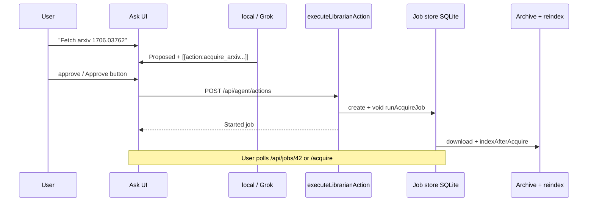
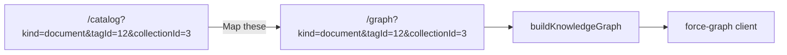
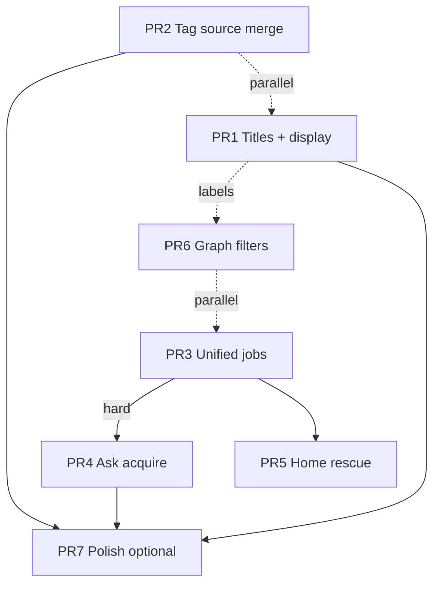

# Season Design: Curation & Intake Integrity — Helix Library

| Field | Value |
| --- | --- |
| **Document** | Season design — Curation & intake integrity |
| **Author** | Helix owner + design loop |
| **Date** | 2026-08-06 |
| **Status** | **Implemented** (PR1–PR7 on main, 2026-08-06) — rev 2 |
| **Approval** | Owner approved design + PR plan; all planned PRs landed |
| **Workspace** | `/home/brandon/Projects/non-os` |
| **Audience** | Senior engineers implementing on `main` |

---

## Overview

Helix Library is a daily-usable personal OPAC (Next.js 15 App Router + SQLite FTS5) with catalog, collections/tags, knowledge graph, Ask the Librarian, and an Acquire desk (arXiv / YouTube / Grok images). The product is strong at **finding and previewing** holdings; it is weaker at **curation quality** (tag chaos, filename titles) and **intake integrity** (Ask cannot start acquires, dual job stores, home does not surface rescue work).

This season doubles down on the personal OPAC loop: **curation quality + intake integrity**. Work is scoped as six ordered themes, delivered in **~7 independently mergeable PRs** (PR2 may split into 2a/2b if review size warrants; PR7 optional). Explicit non-goals: multi-user SaaS, federation, vector-DB-first search, reading-room product weight.

Success looks like: weekly “found it without the file manager” moments; declining tag count/noise with **usable Vision/Acquire hygiene filters** after backfill; Ask can stage an acquire that only runs after approve; one trustworthy jobs surface; arXiv PDFs show human titles **in list, detail, graph, and tabs**; graph stays usable past ~1k holdings.

---

## Background & Motivation

### Current state (anchors)

| Area | Reality in tree |
| --- | --- |
| Agent mutations | `LibrarianAction` in `src/lib/agent/actions.ts` — reindex, tags, shelves, locations only. `propose_actions` in `src/lib/agent/tools.ts` + local NLP in `src/lib/agent/local.ts`. Approve via UI / chat → `POST /api/agent/actions` or `tryHandleConfirmOrCancel`. |
| Acquire | Full pipeline in `src/lib/acquire/*`, UI `AcquireDesk.tsx`, APIs under `/api/acquire/**`. Jobs: **in-memory `globalThis` + `data/acquire-jobs.json`** (`src/lib/acquire/jobs.ts`). String ids `acq-{ts}-{seq}`. `isAcquireBusy` used on **YouTube** route only. |
| Reindex jobs | SQLite `jobs` table (`status`, `stats_json`, `error`) — no `kind`, no progress %, no cancel. `startReindexAsync` single-flight in `src/lib/indexer/run.ts`. `serializeJob` / Services / home / `probeMachine` read `statsJson`. |
| Tags | `tags` + `item_tags` (no source/provenance). Hygiene: delete bulk only (`TagHygienePanel.tsx`, `DELETE /api/tags`). Meta hide: hard-coded `vision-tagged` in `src/lib/tags/hidden.ts`. Live DB (~2026-08-06): **~937 tags / ~1312 item_tags**; majority vision-adjacent. Vision writer: raw SQL in `scripts/vision_tag_images.py` (`INSERT OR IGNORE INTO item_tags(tag_id, item_id)` — **bypasses** TypeScript). |
| Titles | Indexer always sets `title = path.basename(...)` on insert/update (`run.ts` ~L236, L305). Live DB: essentially **0** rows with `title != name`. arXiv saves as `{id}.pdf`; API title not written. **Primary UI uses `name`:** `ItemRow.tsx` list/grid, graph `label: row.name` (`build.ts` ~L205), detail `generateMetadata` uses `item.name`. Detail metadata row shows Title field but browse chrome stays filename-centric. |
| Home | Stats + missing chip + reindex status strip + **indexed-recent** (`recentItems` sort `indexed`). No open-history, no untagged hotspot, no acquire failures. |
| Graph | `buildKnowledgeGraph` caps at 600 items / 36 tags (`src/lib/graph/build.ts`). Layer toggles client-side; **no** kind/location/tag server filters; no “open graph from catalog selection”. |
| migrate.ts | Idempotent `CREATE TABLE IF NOT EXISTS` only — **no** `ensureColumn` / `PRAGMA table_info` yet. Editing CREATE body alone does not alter existing DBs. |

### Pain points

1. **Intake is desk-only.** User must leave Ask → `/acquire` to fetch a paper they just discussed. Breaks librarian metaphor.
2. **Two job models.** Reindex is queryable from Services/home; acquire progress only lives on Acquire desk poll. Failed YT/arXiv jobs are easy to miss after navigation.
3. **Tag graph pollution.** Vision/EXIF/acquire auto-tags create long tails; delete-only hygiene cannot merge “ml” / “machine-learning” or rename typos. Without **source backfill**, new source filters would mis-label ~all existing links as `manual`.
4. **Title = filename forever.** arXiv display like `2604.01262.pdf` degrades search, **list/graph/tab** chrome, and Ask citations — enrichment must include a **display policy**, not only DB fields.
5. **Home is a lobby, not a desk.** Missing holdings chip exists; untagged clusters, failed jobs, and “what I opened yesterday” do not.
6. **Graph at scale.** Global 600-item prioritization helps, but users who filtered catalog still load the global constellation.

### Constraints (non-negotiable)

From `AGENTS.md` / product hard rules:

1. Localhost by default; LAN only with password.
2. Explicit scan roots — never default-scan `$HOME`.
3. Librarian mutations **approval-gated** — no shell, no unsolicited writes, no deleting project source.
4. SuperGrok subscription ≠ developer API (`XAI_API_KEY`).
5. Paths from tools only — never invent paths.
6. Media serve gated under enabled location roots.
7. Do not commit `library.config.json`, `data/`, personal `archive/**`, secrets.

---

## Goals & Non-Goals

### Goals (season)

| # | Theme | Outcome |
| --- | --- | --- |
| G1 | Ask → Acquire (approve) | Librarian can propose `acquire_*` actions; after human approve, existing acquire pipeline **starts async** and returns `jobId` (integer SQLite id post-PR3); never awaits full download in action route. |
| G2 | Tag merge + source hygiene | Merge N→1, rename; provenance on applications with **one-shot backfill** so Vision/Acquire filters work on existing chaos; hygiene UI beyond delete. User-hide facets deferred (PR7). |
| G3 | Unified jobs | One status/progress/error model for reindex + acquire; SQLite integer ids; hard cutover from JSON; list/poll/cancel (best-effort) from Services. |
| G4 | Home rescue + recent opens | Rescue panel: missing, failed jobs, untagged hotspots; client open-history for recently useful holdings. |
| G5 | Title / metadata enrichment | arXiv human titles in **browse UX + FTS**; reindex must not clobber; display prefers enriched title. |
| G6 | Graph filter + perf | Server-side kind/location/tag/collection/q filters; caps; entry from catalog filter state; item labels use enriched titles. |

### Non-goals (this season)

- Multi-user / hosted Helix / multi-tenant auth.
- Full SBERT / embedding core as primary search (optional later).
- Live OpenAlex / Semantic Scholar as catalog backend.
- Zotero / Immich product parity.
- Document “reading room”.
- Saved views / smart shelves (optional thin stretch only if natural at end — prefer not to bloat).
- Arbitrary cancel of in-flight reindex mid-walk (document as future).
- **PDF first-line / pdfinfo title heuristics** and **YouTube ffprobe Title → catalog title** (PR7 stretch only; not PR1).
- **`tags.hidden` user-hide** in PR2 (PR7; keep name-based `HIDDEN_FACET_TAGS` until then).
- Dual long-term job id namespaces (`acq-*` and integer); cutover is hard.

---

## Proposed Design

### Architecture (season delta)

```mermaid
flowchart TB
  subgraph UI
    Ask[Ask / LibrarianChat]
    Acquire[AcquireDesk]
    Home[Home rescue + recent]
    Coll[Collections TagHygiene]
    Graph[/graph filters]
    Svc[Services JobsPanel]
  end

  subgraph Agent
    Propose[propose_actions / local NLP]
    Actions[executeLibrarianAction]
  end

  subgraph Jobs
    Unified[jobs table + lib/jobs facade]
    Reindex[runReindex / startReindexAsync]
    AcqRun[runAcquireJob work fns]
  end

  subgraph Catalog
    Tags[tags + item_tags.source]
    Items[items.title + title_source]
    GraphBuild[buildKnowledgeGraph filters]
    Display[displayTitle helper]
  end

  Ask --> Propose --> Actions
  Actions -->|acquire_* after approve| AcqRun
  Acquire --> AcqRun
  AcqRun --> Unified
  Reindex --> Unified
  Svc --> Unified
  Home --> Unified
  Actions -->|merge_tags / rename_tag later| Tags
  Coll --> Tags
  AcqRun -->|set title after index| Items
  Reindex -->|preserve enriched title| Items
  Items --> Display
  Display --> UI
  Graph --> GraphBuild
  GraphBuild --> Items
  GraphBuild --> Tags
```

### Theme 1 — Ask → Acquire (approve)

#### Action shapes

Extend `LibrarianAction` (and `ACTION_TYPES`, `actionLabel`, `describeAction`, `executeLibrarianAction`, `propose_actions` zod enum, local NLP, system prompt allow-list):

```ts
// New variants — network I/O only after human approve
| {
    type: "acquire_arxiv";
    idOrUrl: string; // bare id, arxiv:…, or abs/pdf URL
  }
| {
    type: "acquire_youtube";
    url: string;
    mode?: "video" | "audio"; // default video
  }
| {
    type: "acquire_image";
    prompt: string;
    /** Optional single-segment filename under archive/images — validated like desk */
    filenameHint?: string;
  }
```

#### Execute path (must stay non-blocking)

Mirror `src/app/api/acquire/*/route.ts` and reindex’s `startReindexAsync` pattern:

1. Validate inputs (reuse `parseArxivId`, URL checks from youtube/image modules).
2. Enforce **concurrency policy** (below); if busy, return `{ ok: false, message: "…" }`.
3. `createAcquireJob(kind, label)` (post-PR3: SQLite integer id via facade).
4. **`void runAcquireJob(job, work)`** — **never** `await runAcquireJob` inside `executeLibrarianAction`.
5. Return immediately:

```ts
{
  ok: true,
  action,
  message: "Started acquire job #42 — open Services or /acquire for progress.",
  data: { jobId: 42, kind: "arxiv" } // integer after PR3
}
```

`executeLibrarianAction` remains **synchronous** in signature (returns `ActionResult`); like reindex, it only **starts** async work. Implementers must not await network/download in the approve path (`POST /api/agent/actions` has no long `maxDuration`; ask route is ~120s).

**PR4 test (required):** mock work fn delayed 2s; assert `executeLibrarianAction` returns in &lt;100ms and job reaches `running`/`completed` later.

#### Proposal UX

- Grok: `propose_actions` gains the three types + fields `idOrUrl`, `url`, `mode`, `prompt`, `filenameHint`.
- Local librarian: intent patterns e.g.  
  - `fetch arxiv 1706.03762` / `acquire paper 1706.03762`  
  - `download youtube <url>`  
  - `generate image <prompt>` (only if xAI key present; else explain).
- **`describeAction` must show the full target for human approve** (must-have tests):
  - arXiv: parsed id + original input.
  - YouTube: **full URL** (https only after validation).
  - Image: prompt preview (first ~120 chars + ellipsis if longer).
  - Plus: writes under Archive only; network required; no shell.
- Prompt (`src/lib/agent/prompt.ts`): add acquire to allowed mutations; forbid inventing arxiv ids/URLs not present in user text or prior tool output.

#### Safety & concurrency

| Rule | Enforcement |
| --- | --- |
| Approve gate | Same as all `LibrarianAction` — no execute tool for models. |
| Path jail | All writes via existing `safeArchivePath` / acquire modules. |
| No shell | Continue using `yt-dlp` only inside existing youtube helper. |
| Image gen | Requires `XAI_API_KEY`; fail action with clear message if missing. |
| **Concurrency** | **Match desk routes:** serialize **YouTube** with `isAcquireBusy("youtube")` (yt-dlp heavy); **allow parallel** arXiv/image (sole user, light). Agent-started jobs use the **same** rules as HTTP acquire routes — not a separate “one global acquire” lock — so desk + Ask behave identically. |
| URL schemes | YouTube: `https:` only after normalize; reject non-http(s). |

#### Sequence



---

### Theme 2 — Tag merge + source-aware hygiene

#### Data model

**`item_tags` provenance** (application-level — preferred over tag-row source):

```sql
-- via ensureColumn after CREATE IF NOT EXISTS block
ALTER TABLE item_tags ADD COLUMN source TEXT NOT NULL DEFAULT 'manual';
-- values: 'manual' | 'vision' | 'exif' | 'acquire'

CREATE INDEX IF NOT EXISTS item_tags_source_idx ON item_tags(source);
```

Drizzle: extend `itemTags` in `src/lib/db/schema.ts` with `source: text("source").notNull().default("manual")`.

**`tags.hidden`:** **out of PR2** (see KD14). Season continues to use name-based `HIDDEN_FACET_TAGS` (`vision-tagged`) until optional PR7. PR2 delivers merge/rename + source filters without DB hide column.

#### One-shot source backfill (required — live ~937 tags)

Column default alone would mark **all existing** `item_tags` as `manual`, breaking Vision/Acquire hygiene filters. PR2 migrate/boot **must** run a single idempotent backfill after `ensureColumn`:

```ts
// src/lib/tags/backfill-source.ts — call once from migrate() when column was just added
// or always safe to re-run if guarded by meta flag / only updates source='manual' rows

/**
 * Heuristic backfill (imperfect OK — better than all-manual).
 * Priority when both would apply: acquire > vision for pure source tag names;
 * for other labels on vision-tagged items → vision.
 */
export function backfillItemTagSources(sqlite: Database.Database): {
  vision: number;
  acquire: number;
  leftManual: number;
} {
  // 1) ACQUIRE_TAG_NAMES = acquired, youtube, arxiv, grok-image
  //    UPDATE item_tags SET source='acquire'
  //    WHERE source='manual' AND tag_id IN (SELECT id FROM tags WHERE name IN (...))
  //
  // 2) Items that have tag name 'vision-tagged':
  //    UPDATE item_tags SET source='vision'
  //    WHERE source='manual' AND item_id IN (...vision-tagged items...)
  //      AND tag_id NOT IN (acquire tag ids)  -- don't demote acquire labels
  //
  // 3) Residual stays manual
}
```

Document in code: imperfect is OK; future writers set source correctly. **Test:** fixture with vision-tagged item + labels + `arxiv` tag → after backfill, vision labels `vision`, `arxiv` link `acquire`, residual manual.

#### Write path — single upsert helper (invariant)

**All writers** must set source via one helper in `src/lib/tags/source.ts`:

```ts
export type TagSource = "manual" | "vision" | "exif" | "acquire";

/** Higher rank wins on re-apply. manual > acquire > exif > vision */
export const SOURCE_RANK: Record<TagSource, number> = {
  manual: 40,
  acquire: 30,
  exif: 20,
  vision: 10,
};

export function isBetterSource(next: TagSource, current: TagSource): boolean {
  return SOURCE_RANK[next] > SOURCE_RANK[current];
}

/** Insert item_tags or upgrade source if better. Never demotes. */
export function upsertItemTag(
  itemId: number,
  tagId: number,
  source: TagSource,
): void {
  // INSERT ... ON CONFLICT(tag_id, item_id) DO UPDATE
  //   SET source = excluded.source
  //   WHERE SOURCE_RANK(excluded) > SOURCE_RANK(existing)
  // SQLite: implement as select → insert or conditional update
}
```

| Caller | Source |
| --- | --- |
| `addTagToItem` / bulk / agent `tag` | `manual` (default) |
| `applyAcquireTags` source labels | `acquire` |
| `applyAcquireTags` EXIF-derived | `exif` |
| **`scripts/vision_tag_images.py`** | **`vision`** (must update SQL) |
| Merge result edges | `upsertItemTag` with priority |

**Invariant (document in `source.ts`):** no raw `INSERT INTO item_tags` outside `upsertItemTag` / approved Python path that sets `source`.

**Python script (PR2 required file):** `scripts/vision_tag_images.py` today:

```python
INSERT OR IGNORE INTO item_tags(tag_id, item_id) VALUES (?, ?)
```

Change to include `source` (and recreate INSERT after column exists):

```python
INSERT INTO item_tags(tag_id, item_id, source) VALUES (?, ?, 'vision')
ON CONFLICT(tag_id, item_id) DO UPDATE SET
  source = CASE
    WHEN excluded.source = 'manual' THEN 'manual'  # won't fire from this script
    ...
  END
# Simpler for Python: INSERT OR IGNORE with source='vision';
# if row exists with better source, leave it (IGNORE). If exists as vision/manual,
# optional separate UPDATE only when current is missing/weaker — keep Python simple:
# INSERT OR IGNORE (tag_id, item_id, source) VALUES (?, ?, 'vision')
```

After DEFAULT `manual`, **without this change new vision runs stamp `manual`**. Grep other raw writers in PR2 checklist: `rg "item_tags" --type-add 'py:*.py' -t py -t ts`.

**Tests for upgrade:** vision then manual → `manual`; acquire then vision → stays `acquire`.

#### Merge / rename APIs

New functions in `src/lib/collections/manage.ts` (prefer extend existing):

```ts
export function mergeTags(opts: {
  sourceTagIds: number[];
  targetTagId?: number;
  targetName?: string;
}): { targetId: number; moved: number; deletedSources: number };

export function renameTag(
  tagId: number,
  newName: string,
  opts?: { mergeIfExists?: boolean },
): { id: number; merged: boolean };
```

**Merge algorithm (transaction):**

1. Resolve target tag (getOrCreate / get by id).
2. For each source ≠ target:  
   - For each `item_tags` row on source: `upsertItemTag(itemId, targetId, row.source)`.  
   - Delete source tag row (cascade `item_tags`).
3. Cap `sourceTagIds` length (e.g. 50) like delete.

**Invariants (tests):** no duplicate PK; overlapping items one link; orphan tags removed; files untouched.

#### Hygiene UI (PR2b if split)

Extend `TagHygienePanel.tsx`:

- **Merge into…** (text input or pick target).
- **Rename** single selection.
- Filter chips: Low use | Meta (`isHiddenFacetTag`) | **Vision-sourced** | **Acquire** | All — driven by `item_tags.source` aggregates (`GROUP BY tag_id` with max/any source counts).
- **No Hide button in PR2** (no `tags.hidden` yet).

API:

- `DELETE /api/tags` — keep.
- `POST /api/tags/merge` — `{ sourceIds, targetId? | targetName? }`.
- `PATCH /api/tags` — `{ id, name }` rename only in PR2.

Agent `merge_tags` / `rename_tag`: **PR7 stretch** (UI-first).

---

### Theme 3 — Unified jobs surface

#### Problem

| | Reindex | Acquire (today) |
| --- | --- | --- |
| Store | SQLite `jobs` | `globalThis` + JSON file |
| Id | integer autoincrement | `acq-{ts}-{seq}` |
| Progress | none (status only) | `{ stage, percent, detail }` |
| Payload | `stats_json` | `result` object |
| UI | Services + home strip | Acquire desk only |

#### Closed decisions (KD13)

1. **Canonical external id = SQLite integer** (`jobs.id`). APIs accept/return `id: number` (JSON number). String form only as `String(id)` when needed for keys. **Do not** keep long-term dual namespaces (`acq-*` as primary id).
2. **Hard cutover:** wrappers read/write SQLite only after PR3 ships. No dual-write loop.
3. **JSON import on first boot of new code:**
   - If `data/acquire-jobs.json` exists, import jobs with status **`completed` or `failed` only** into SQLite (`kind`, `label`, progress, result, timestamps). Store old `acq-…` string in `label` suffix or `result_json.legacyId` for forensics only — **new polls use integer id**.
   - Any disk job with status `pending` or `running` → import as **`failed`** with `error = "Interrupted by jobs migration"` (safe sole-user; avoids half-live memory/SQLite races).
   - Rename/move file to `data/acquire-jobs.json.migrated` (or delete) so import is one-shot.
4. **In-flight process during deploy:** sole user restarts `next dev`/`start`; any in-memory acquire dies; no attempt to hand off mid-download. Document in SESSION-HANDOFF gotcha.
5. **`serializeAcquireJob` shape for desk:** keep field names `id, kind, status, createdAt, startedAt, finishedAt, error, result, label, progress` but **`id` becomes number** (or stringified number — prefer number; update `AcquireDesk` poll URL `/api/acquire/jobs/${id}`). Progress stages unchanged (`queued`, `downloading`, …).

#### Schema

```sql
-- ensureColumn for each on existing DBs; also add to CREATE TABLE for greenfield
ALTER TABLE jobs ADD COLUMN kind TEXT NOT NULL DEFAULT 'reindex';
ALTER TABLE jobs ADD COLUMN label TEXT;
ALTER TABLE jobs ADD COLUMN progress_json TEXT; -- { stage, percent, detail }
ALTER TABLE jobs ADD COLUMN result_json TEXT;   -- acquire payload only
ALTER TABLE jobs ADD COLUMN cancel_requested INTEGER NOT NULL DEFAULT 0;

CREATE INDEX IF NOT EXISTS jobs_kind_status_idx ON jobs(kind, status);
CREATE INDEX IF NOT EXISTS jobs_created_idx ON jobs(created_at);
```

**Keep `stats_json` for reindex** (season-long). Do not migrate reindex stats into `result_json`.

#### Unified types

```ts
export type HelixJobKind = "reindex" | "arxiv" | "youtube" | "image";
export type HelixJobStatus =
  | "pending"
  | "running"
  | "completed"
  | "failed"
  | "cancelled";

export type HelixJobProgress = {
  stage: string;
  percent: number | null;
  detail?: string;
};

export type HelixJob = {
  id: number; // SQLite PK — canonical
  kind: HelixJobKind;
  status: HelixJobStatus;
  label: string;
  createdAt: number;
  startedAt: number | null;
  finishedAt: number | null;
  error: string | null;
  progress: HelixJobProgress;
  /** acquire: parsed result_json; reindex: parsed stats_json (not result_json) */
  result: Record<string, unknown> | null;
  cancelRequested: boolean;
};
```

Facade mapping:

```ts
function toHelixJob(row: JobRow): HelixJob {
  const result =
    row.kind === "reindex"
      ? (parseJson(row.statsJson) as Record<string, unknown> | null)
      : (parseJson(row.resultJson) as Record<string, unknown> | null);
  // progress: parse progress_json or default from status
  // ...
}
```

**Reindex continues writing `stats_json`** via existing `executeReindexJob` path; facade exposes it as `result` for JobsPanel. `serializeJob` / `ReindexButton` / `probeMachine` keep working on `statsJson` — update only if needed for new columns (non-breaking).

**Acquire** writes `result_json` (`itemId`, `path`, `tags`, …) + `progress_json`.

#### Facade `src/lib/jobs/store.ts`

- `createJob({ kind, label })` → insert; **retain last 50** jobs by `created_at` (delete older rows on create — single policy, see KD15).
- `updateJobProgress(id, partial)` — throttle ~400ms like today’s acquire.
- `completeJob` / `failJob` / `requestCancel`.
- `listJobs({ limit, kinds?, status? })`.
- `getJob(id: number)`.
- `importLegacyAcquireJobsFileOnce()`.

#### Cancel (best-effort)

- `requestCancel(jobId)` sets `cancel_requested=1`.
- **Minimum:** check flag between acquire stages (arxiv chunks, post-yt-dlp stages).
- **YouTube kill:** today `spawn` handle is local to the download Promise in `youtube.ts` — **not** registered globally. Season: either (a) register `ChildProcess` in a module-level `Map<jobId, ChildProcess>` when starting yt-dlp and `child.kill` on cancel, or (b) stage-boundary only. **(a) preferred if small; (b) acceptable minimum.** Document in PR3.
- Reindex: no mid-walk cancel required this season.

#### API / UI

| Endpoint | Role |
| --- | --- |
| `GET /api/jobs?limit=20` | Unified list. |
| `GET /api/jobs/[id]` | Poll one job (`id` integer). |
| `POST /api/jobs/[id]/cancel` | Soft cancel. |
| `/api/acquire/jobs/[id]` | Proxy to `getJob(Number(id))`; 404 if NaN. |
| `/api/reindex` | Unchanged contract for `stats`; kind/label set on insert. |

**Services:** `JobsPanel` — kind badge, progress bar, error, link `/catalog/{itemId}` when acquire `result.itemId`, Cancel when running. Reindex rows show stats summary from `result` (stats fields).

---

### Theme 4 — Home rescue + recent opens

#### Server rescue model

New helper `src/lib/catalog/rescue.ts`:

```ts
export type RescueSnapshot = {
  missingCount: number;
  untaggedCount: number;
  untaggedSample: CatalogItemRow[];
  failedJobs: HelixJob[];
  runningJobs: HelixJob[];
  lowUseTagCount: number;
};
```

Untagged SQL (enabled locations only):

```sql
SELECT count(*) FROM items i
JOIN locations l ON l.id = i.location_id AND l.enabled = 1
WHERE i.is_missing = 0
  AND NOT EXISTS (SELECT 1 FROM item_tags it WHERE it.item_id = i.id);
```

Home: **Rescue** section when any count &gt; 0 or failed/running jobs exist.

Links: `/catalog?missing=1`, `/catalog?untagged=1`, Services `#jobs`, `/collections` hygiene.

#### Catalog filter: untagged (naming)

Mirror missing weeding:

| Query string | `CatalogSearchParams` field |
| --- | --- |
| `?missing=1` | `missingOnly` |
| `?untagged=1` | `untaggedOnly` |

Parse in `src/app/catalog/page.tsx` like missing: `sp.untagged === "1" | "true" | "yes"` → `untaggedOnly: true`. Implement as `NOT EXISTS item_tags` in `searchCatalog`.

#### Recent opens (client)

- `src/lib/client/open-history.ts` — `localStorage` key `helix-open-history`, cap 40, `{ id, name, kind, openedAt }` (store **display title** when recording if available).
- **`OpenHistoryRecorder`:** `"use client"` only; mount on RSC `/catalog/[id]` page (same pattern as other client islands — never pass functions from server).
- Home: client `RecentOpens`; hide when empty.

---

### Theme 5 — Title / metadata enrichment

#### Root cause

Indexer sets `title = path.basename(...)` every insert/update. UI primarily renders **`name`**, so DB-only enrichment is invisible in browse/graph/tabs.

#### Schema

```sql
ALTER TABLE items ADD COLUMN title_source TEXT NOT NULL DEFAULT 'filename';
-- 'filename' | 'arxiv' | 'manual'  (season PR1); optional later: yt-dlp | pdf | exif
```

Greenfield: add column to `CREATE TABLE items` **and** `ensureColumn` for existing DBs (see Migration pattern).

#### Reindex policy

```ts
function nextTitle(
  existing: { title: string; titleSource: string; name: string } | undefined,
  basename: string,
): { title: string; titleSource: string } {
  if (!existing) return { title: basename, titleSource: "filename" };
  if (existing.titleSource && existing.titleSource !== "filename") {
    return { title: existing.title, titleSource: existing.titleSource };
  }
  if (existing.title && existing.title !== existing.name) {
    return { title: existing.title, titleSource: "manual" };
  }
  return { title: basename, titleSource: "filename" };
}
```

`name` always tracks on-disk basename; `title` is display/search-oriented.

#### Display policy (required for G5 — PR1)

Central helper `src/lib/format.ts` or `src/lib/catalog/display.ts`:

```ts
/** Prefer enriched catalog title for OPAC chrome; basename remains path identity. */
export function displayTitle(item: {
  name: string;
  title: string;
  titleSource?: string | null;
}): string {
  if (item.titleSource && item.titleSource !== "filename" && item.title?.trim()) {
    return item.title.trim();
  }
  if (item.title && item.title !== item.name) return item.title;
  return item.name;
}
```

**Wire in PR1 (minimum surface):**

| Surface | Change |
| --- | --- |
| `ItemRow.tsx` / list & grid | Primary line: `displayTitle(item)`; keep `name` in secondary/path or tooltip if title differs |
| `ItemCard.tsx` if used | Same |
| `src/app/catalog/[id]/page.tsx` | Heading + `generateMetadata` title use `displayTitle` |
| Graph `build.ts` | SELECT `i.title`, `i.title_source`; `label: displayTitle(row)` |
| Ask `summarizeItem` / local format lines | Prefer `displayTitle` in markdown link text when title enriched |

Keep path/`name` available for “open in file manager” identity.

#### arXiv path (PR1)

In `acquireArxivPdf` after `indexAfterAcquire`:

1. Atom/API title for `arxivId` (reuse search parse helpers).
2. `UPDATE items SET title = ?, title_source = 'arxiv' WHERE id = ?`.

On-disk filename remains `{id}.pdf` (KD7).

#### Explicitly out of PR1 (PR7 / later)

- PDF `pdfinfo` / first-line heuristics.
- YouTube ffprobe/exif → `title_source='yt-dlp'`.
- Manual title edit UI (PR7).

#### Optional backfill

Env `HELIX_BACKFILL_ARXIV_TITLES=1` during reindex: items matching arxiv filename or tag `arxiv`, rate-limited API fetch. Not required for PR1 merge if new acquires work.

---

### Theme 6 — Graph: filter-from-catalog + perf caps

#### Types & filters

```ts
export type GraphFilters = {
  kind?: ItemKind;
  locationId?: number;
  tagId?: number;
  collectionId?: number;
  q?: string;
};

export type GraphBuildOpts = {
  maxItems?: number;      // default 600; hard max 800
  minTagCount?: number;
  maxTags?: number;
  includeKinds?: boolean;
  includeLocations?: boolean;
  includeCollections?: boolean;
  includeTags?: boolean;
} & GraphFilters;

// meta on KnowledgeGraph:
meta: {
  itemCount: number;
  conceptCount: number;
  linkCount: number;
  truncated: boolean;
  tagsShown: number;
  tagsOmitted: number;
  minTagCount: number;
  filters: GraphFilters; // echo applied filters (empty object if none)
};
```

#### `q` path (capped)

When `q` is non-empty:

```ts
const hit = searchCatalog({
  q,
  kind: opts.kind ?? "",
  locationId: opts.locationId ?? "",
  tagId: opts.tagId ?? "",
  collectionId: opts.collectionId ?? "",
  page: 1,
  pageSize: Math.min(opts.maxItems ?? 600, 800), // hard cap
  sort: "mtime",
});
const idSet = new Set(hit.items.map((i) => i.id));
// If idSet empty → return empty graph nodes/links, meta.truncated=false, filters echoed
// Else restrict items query to those ids (plus other filters)
```

Do **not** paginate beyond one page of `maxItems`; graph is a sample of the filtered catalog, not infinite scroll.

#### Item labels

Use `displayTitle` (Theme 5) so arXiv papers are readable on the graph after PR1.

#### Perf caps

| Knob | Default | Filtered default |
| --- | --- | --- |
| `maxItems` | 600 | min(800, match count) |
| Hard max | 800 | 800 |
| `maxTags` | 36 | 48 |
| `minTagCount` | 2 | 1 if item set &lt; 80 else 2 |

#### Catalog → Graph entry

SearchParam names (aligned with catalog):

| Param | Maps to |
| --- | --- |
| `kind` | `GraphFilters.kind` |
| `locationId` | `locationId` |
| `tagId` | `tagId` |
| `collectionId` | `collectionId` |
| `q` | `q` |
| `singletons` | existing minTagCount toggle |

**Map these** link on catalog builds query from active filters including **`collectionId`** and `q`, not only kind/location/tag.



---

## API / Interface Changes

### Librarian actions (before → after)

**Before:** reindex, tag/untag, collect*, bulk_*, collection CRUD, location enable/add/remove.

**After PR4:** + `acquire_arxiv` | `acquire_youtube` | `acquire_image`.  
**After PR7 (optional):** + `merge_tags` | `rename_tag`.

### HTTP

| Method | Path | Change |
| --- | --- | --- |
| POST | `/api/agent/actions` | New action types; execute non-blocking for acquire. |
| GET | `/api/jobs` | **New** unified list. |
| GET | `/api/jobs/[id]` | **New**; integer id. |
| POST | `/api/jobs/[id]/cancel` | **New**. |
| GET | `/api/acquire/jobs/[id]` | Proxy; integer id. |
| POST | `/api/tags/merge` | **New** (PR2). |
| PATCH | `/api/tags` | **New** rename (PR2); hide later PR7. |
| GET | `/catalog?untagged=1` | → `untaggedOnly`. |
| GET | `/graph?kind&locationId&tagId&collectionId&q` | Filters. |

### Catalog search params

```ts
// CatalogSearchParams addition
untaggedOnly?: boolean;
```

---

## Data Model Changes

### Migration pattern (critical)

`migrate.ts` today is **CREATE TABLE IF NOT EXISTS only**. Existing DBs **skip** CREATE bodies entirely.

**Every PR that adds columns must:**

1. Update the `CREATE TABLE` DDL in the big `exec` for **greenfield** installs.
2. Call `ensureColumn(...)` **after** the big exec for **existing** DBs.
3. Add a test: open fixture DB without the column → `migrate()` → `PRAGMA table_info` asserts column exists.

```ts
function ensureColumn(
  sqlite: Database.Database,
  table: string,
  column: string,
  ddl: string,
): void {
  const cols = sqlite
    .prepare(`PRAGMA table_info(${table})`)
    .all() as { name: string }[];
  if (!cols.some((c) => c.name === column)) {
    sqlite.exec(`ALTER TABLE ${table} ADD COLUMN ${column} ${ddl}`);
  }
}
```

Call for:

| Column | PR |
| --- | --- |
| `items.title_source` | PR1 |
| `item_tags.source` | PR2 (+ backfill) |
| `jobs.kind`, `label`, `progress_json`, `result_json`, `cancel_requested` | PR3 |
| `tags.hidden` | PR7 only if shipping hide |

No drizzle-kit for runtime; keep Drizzle schema in sync.

### Storage & job retention (KD15)

| Change | Estimate |
| --- | --- |
| `item_tags.source` | ~8–16 bytes/row |
| jobs progress/result | ~1–4 KB/job × **last 50** |
| Open history | localStorage &lt; 16 KB |

**Retention policy (single default):** keep **last 50** jobs by `created_at` on each `createJob` (slightly above former acquire cap of 40). No dual “30 days OR 50” policy.

---

## Alternatives Considered

### A. Ask → Acquire: execute network inside model tool (no approve)

- **Pros:** Fewer clicks.  
- **Cons:** Violates hard constraint #3; model could spam downloads.  
- **Decision:** Reject. Always `propose_actions` / action tokens.

### B. Tag source on `tags` row only (not `item_tags`)

- **Pros:** Simpler schema.  
- **Cons:** Same tag name from vision and manual collapses provenance; merge semantics worse.  
- **Decision:** Prefer `item_tags.source`.

### C. Unified jobs keep dual stores + UI merge only

- **Pros:** Smaller backend change.  
- **Cons:** Cancel/list/race conditions remain; HMR/JSON quirks.  
- **Decision:** SQLite system of record; hard cutover; wrappers preserve function names.

### D. Title enrichment via rename files on disk

- **Pros:** Matches filename display everywhere.  
- **Cons:** Breaks path identity; unsolicited disk writes.  
- **Decision:** Catalog `title` only; keep on-disk arXiv `{id}.pdf`.

### E. Graph: client-side filter of full payload

- **Pros:** No server change.  
- **Cons:** Wrong subset at scale.  
- **Decision:** Server-side WHERE + caps.

### F. Vector DB for tag hygiene / title

- **Pros:** Fuzzy merge.  
- **Cons:** Out of season.  
- **Decision:** Exact merge + rename UI.

### G. FTS-only enriched titles vs UI-prefer-title

- **FTS-only:** store better `title` for search snippets but keep list/graph on `name`.  
  - Pros: smaller UI diff.  
  - Cons: OPAC users still see `2604.01262.pdf` in the lobby and graph — fails G5 product success.  
- **UI-prefer-title (chosen):** `displayTitle()` when `title_source !== 'filename'` (or title≠name) in list, detail, metadata title, graph labels, Ask citations.  
  - Pros: matches “found it without file manager” and library metaphor.  
  - Cons: slightly more component touch points in PR1.  
- **Decision:** **UI-prefer-title** (KD16).

---

## Security & Privacy Considerations

| Threat | Severity | Mitigation |
| --- | --- | --- |
| Unapproved network acquire via agent | High | No execute tool; allowlist; propose-not-run tests. |
| Path escape on acquire | High | `safeArchivePath` / `assertUnderArchive`. |
| Prompt injection → arbitrary URL/prompt | Medium | **`describeAction` shows full URL / id / prompt preview**; Approve UI buttons use same description; https-only YT. PR4 tests assert description contains target. |
| Job result leaks paths | Low | Localhost-only. |
| Open history XSS | Low | React text nodes; client-only storage. |
| Tag merge deletes wrong labels | Medium | Confirm dialog; transactional; no disk deletes. |
| Cancel kills wrong process | Medium | Only registered yt-dlp children; never user-supplied PID. |
| LAN exposure | Existing | Unchanged bind/password rules. |

**Auth:** single-owner localhost — `POST /api/agent/actions` remains unauthenticated loopback (same as today).

---

## Observability

| Signal | Where |
| --- | --- |
| Job status/progress/error | SQLite `jobs` + Services panel |
| Acquire stages | Existing stages via `progress_json` |
| Tag merge / backfill counts | API response; backfill return stats; dev log optional |
| Title backfill | Env-gated; log `titlesUpdated=N` |
| Tests | `npm test` gates |

No external APM.

---

## Rollout Plan

### Feature delivery

Personal main branch; features enabled for sole user. Optional:

| Env | Default | Role |
| --- | --- | --- |
| `HELIX_BACKFILL_ARXIV_TITLES` | unset | Optional arXiv title backfill during reindex |

### Staged order

1. PR1 titles + **display policy**  
2. PR2 (or 2a/2b) tag source + backfill + merge  
3. **PR3 jobs (hard before PR4)** — Ask success copy links Services job ids  
4. PR4 Ask acquire ∥ PR6 graph  
5. PR5 home rescue  
6. PR7 optional polish  

### Rollback

Additive columns; old code ignores them. Jobs: if unified store regresses, revert PR3 (JSON store still in git history). No dual-write required for rollback.

### Verification per PR

```bash
npm run typecheck
npm test
# if schema/indexer: npm run reindex
# if UI-critical: npm run build
```

---

## Open Questions

1. **Cancel depth for yt-dlp:** Prefer register `ChildProcess` in `Map` at spawn; minimum is stage-boundary cancel. **Implement-time choice in PR3** — not blocking design.
2. **Manual title edit UI** — PR7 if capacity; not required for season success if arXiv + display policy land.
3. ~~Job id format~~ → **Closed as KD13**.
4. ~~`tags.hidden` in PR2?~~ → **Closed as KD14** (defer to PR7).
5. Smart shelves still out unless leftover capacity after core PRs.

---

## Key Decisions

| Decision | Choice | Rationale |
| --- | --- | --- |
| KD1 | Acquire from Ask is **propose → approve → async job**, not sync tool execute | Hard constraint; long downloads. |
| KD2 | Reuse existing `src/lib/acquire/*` pipeline | DRY; path jail and tags correct. |
| KD3 | Tag provenance on **`item_tags.source`** | Same label can be manual + automated. |
| KD4 | Merge is **re-link + delete source tags**, never touches files | OPAC hygiene. |
| KD5 | **SQLite `jobs` is SoR**; hard cutover from JSON | One poll model; HMR consistency. |
| KD6 | Preserve **non-filename titles** across reindex via `title_source` | Fixes arXiv forever-filename without disk rename. |
| KD7 | arXiv **on-disk name stays `{id}.pdf`**; catalog title is human | Stable paths. |
| KD8 | Recent opens in **localStorage** | Sole browser; no multi-device. |
| KD9 | Graph filters **server-side** | Correct subset + caps at 1k+. |
| KD10 | ~7 PRs (PR2 splittable; PR7 optional); green typecheck/test each | Reviewable slices. |
| KD11 | No vector DB / federation / multi-user this season | Season boundary. |
| KD12 | Prefer edit existing modules over new frameworks | AGENTS.md. |
| **KD13** | **Job id = SQLite integer only**; import completed/failed JSON jobs; mark pending/running from disk as failed “Interrupted by jobs migration”; `stats_json` remains reindex payload; `result_json` for acquire | Closes id/cutover ambiguity; no dual namespace. |
| **KD14** | **`tags.hidden` deferred to PR7**; PR2 = source + backfill + merge/rename + hygiene filters | Keeps PR2 reviewable; name-based hide remains. |
| **KD15** | Job retention = **last 50** by `created_at` on create | Single policy (not 30d OR 50). |
| **KD16** | **UI-prefer-title** via `displayTitle()` in list/detail/graph/Ask chrome | G5 fails if only FTS/DB title. |
| **KD17** | **One-shot tag source backfill** + update `vision_tag_images.py` | Existing chaos otherwise all-manual. |
| **KD18** | Acquire concurrency **matches desk**: serialize YouTube only; parallel arXiv/image OK | Avoid surprising desk vs Ask differences. |
| **KD19** | PDF/YT title heuristics **out of PR1** | Reduce wrong-title risk; arXiv API is ROI. |

---

## Risks

| Risk | Severity | Mitigation |
| --- | --- | --- |
| Reindex + acquire both call `runReindex` → contention | Medium | Single-flight; surface combined status. |
| Large tag merge locks SQLite | Low | Transaction; cap 50 tags. |
| Title heuristics wrong on random PDFs | Medium | **Not in PR1**; arXiv API only. |
| Job migration mid-download | Low | Sole user; fail imported running jobs; restart. |
| Acquire desk id break | Medium | Integer id + update desk in same PR3. |
| Grok proposes acquire spam | Low | Approve gate; max 25 actions. |
| Graph `q` expensive | Medium | Single `searchCatalog` pageSize≤800. |
| Vision script still writes without source | High | PR2 checklist + test grep; Python update required. |
| Backfill mislabels a few manual tags as vision | Low | Accept; user can re-tag manual (higher rank). |

---

## References

- `/home/brandon/Projects/non-os/AGENTS.md`  
- `/home/brandon/Projects/non-os/docs/ARCHITECTURE.md`  
- `/home/brandon/Projects/non-os/docs/PRODUCT.md`  
- `/home/brandon/Projects/non-os/docs/SESSION-HANDOFF.md`  
- `src/lib/agent/actions.ts`, `tools.ts`, `local.ts`, `prompt.ts`  
- `src/lib/acquire/jobs.ts`, `arxiv.ts`, `youtube.ts`, `index-after.ts`, `auto-tags.ts`  
- `scripts/vision_tag_images.py`  
- `src/lib/indexer/run.ts`, `src/lib/db/migrate.ts`, `schema.ts`  
- `src/components/ItemRow.tsx`, `TagHygienePanel.tsx`  
- `src/lib/graph/build.ts`, `src/app/graph/page.tsx`  
- `src/app/page.tsx`, `src/app/services/page.tsx`  
- Tests: `tests/agent-actions.test.ts`, `tags-hygiene.test.ts`, `acquire.test.ts`

---

## PR Plan

Ordered for dependency safety. Each PR: independently reviewable, `typecheck` + `test` green.

---

### PR1 — Title integrity + display policy + arXiv enrich

**Title:** `Fix reindex title clobber; arXiv titles; prefer title in list/detail/graph`

**Themes:** G5 (+ G6 label readiness)

**Depends on:** none

**Files / components:**

- `src/lib/db/migrate.ts`, `schema.ts` — `items.title_source` (**CREATE + ensureColumn**)
- `src/lib/indexer/run.ts` — `nextTitle` policy
- `src/lib/catalog/display.ts` or `format.ts` — `displayTitle`
- `src/lib/acquire/arxiv.ts` + `index-after.ts` helpers — set title post-index
- `src/components/ItemRow.tsx`, `ItemCard.tsx` (if applicable)
- `src/app/catalog/[id]/page.tsx` — heading + `generateMetadata`
- `src/lib/graph/build.ts` — select title; label via `displayTitle`
- `src/lib/agent/tools.ts` / local format lines — prefer display title in links
- `tests/titles.test.ts` or indexer tests + **migrate ensureColumn test**

**Out of scope:** PDF heuristics, YT metadata titles, manual edit UI.

**Test plan:**

- Reindex preserves `title_source=arxiv`.
- `displayTitle` unit cases.
- migrate fixture gains `title_source`.
- Manual: acquire paper → list + detail tab + graph label show paper title; filename still on path.

---

### PR2 — Tag source, backfill, merge/rename (split if large)

**Title:** `Tag source provenance, backfill, merge/rename APIs + hygiene UI`

**Themes:** G2

**Depends on:** none (∥ PR1)

**Optional split:**

| Slice | Contents |
| --- | --- |
| **PR2a** | schema + `ensureColumn` + backfill + `upsertItemTag` + merge/rename APIs + vision.py + tests |
| **PR2b** | TagHygienePanel merge/rename + Vision/Acquire filter chips + API routes if not in 2a |

**Files / components:**

- `migrate.ts`, `schema.ts` — `item_tags.source`
- `src/lib/tags/source.ts`, `src/lib/tags/backfill-source.ts`
- `src/lib/collections/manage.ts` — upsert, merge, rename
- `src/lib/acquire/auto-tags.ts` — sources
- **`scripts/vision_tag_images.py`** — insert `source='vision'`
- `src/app/api/tags/merge/route.ts`, PATCH tags
- `src/components/TagHygienePanel.tsx`
- `tests/tags-hygiene.test.ts` — merge + backfill + source upgrade

**Not in PR2:** `tags.hidden`, agent merge actions.

**Test plan:**

- Backfill fixture marks vision/acquire correctly.
- upsert: vision→manual upgrades; acquire→vision keeps acquire.
- Merge invariants; vision.py SQL reviewed/grepped.
- migrate adds column on old fixture DB.

---

### PR3 — Unified jobs store (SQLite) + Services panel

**Title:** `Unify reindex and acquire jobs in SQLite + Services jobs panel`

**Themes:** G3

**Depends on:** none; **hard prerequisite for PR4** (job id links in Ask copy)

**Files / components:**

- `migrate.ts`, `schema.ts` — jobs columns (**CREATE + ensureColumn**)
- `src/lib/jobs/types.ts`, `store.ts` — facade, retention 50, JSON import once
- `src/lib/acquire/jobs.ts` — SQLite wrappers; integer ids
- `src/lib/indexer/run.ts` — set kind/label; keep `stats_json`
- API jobs routes + acquire jobs proxy
- `JobsPanel.tsx`, `services/page.tsx`, `AcquireDesk.tsx` poll updates
- `tests/jobs.test.ts` — store, import interrupted running, reindex result mapping

**Cutover:** as KD13; no dual-write.

**Test plan:**

- create/complete/fail; list order; retention trims to 50.
- legacy JSON pending→failed message.
- desk progress stages still render.
- ReindexButton still reads stats.

---

### PR4 — Ask → Acquire (approve)

**Title:** `Librarian acquire_* actions after approve (async job start only)`

**Themes:** G1

**Depends on:** **PR3** (required)

**Files / components:**

- `actions.ts`, `tools.ts`, `local.ts`, `prompt.ts`
- `tests/agent-actions.test.ts` — allowlist; propose-not-run; **execute returns before delayed work**; describeAction contains URL/id/prompt

**Changes:**

1. Three action types; `void runAcquireJob` only.
2. Concurrency = desk policy (YouTube busy check).
3. Message includes integer job id + Services/`/acquire` link.

**Test plan:** delayed mock work; invalid arxiv; no files before approve; describeAction assertions.

---

### PR5 — Home rescue + recent opens + untagged filter

**Title:** `Home rescue panel, untagged=1 / untaggedOnly, client recent opens`

**Themes:** G4

**Depends on:** PR3 (failed/running acquire on home)

**Files / components:**

- `src/lib/catalog/rescue.ts`, `query.ts` (`untaggedOnly`)
- `src/app/catalog/page.tsx` — parse `untagged=1`
- `src/app/page.tsx` — Rescue
- `OpenHistoryRecorder.tsx` (**client-only**), `RecentOpens.tsx`, `open-history.ts`
- mount recorder on catalog item page

**Test plan:** untagged count SQL; param naming mirror missing; manual open history.

---

### PR6 — Graph server filters + caps + catalog entry

**Title:** `Knowledge graph filters from catalog + perf caps`

**Themes:** G6

**Depends on:** PR1 preferred for title labels (can ship filters first with name labels; re-label free once PR1 merges)

**Files / components:**

- `src/lib/graph/build.ts` — `GraphFilters`, q cap, meta.filters, displayTitle labels
- `src/app/graph/page.tsx` — searchParams including `collectionId`
- catalog “Map these” including collectionId + q
- `tests/graph.test.ts`

**Test plan:** kind filter purity; empty q → empty graph; caps; Map these URL shape.

---

### PR7 — Season polish (optional)

**Title:** `Season polish: agent tag merge, tags.hidden, manual title, status strip, PDF/YT titles`

**Themes:** leftovers

**Depends on:** PR1–PR4 as relevant

**Includes only if capacity:** agent merge/rename; `tags.hidden` + facet/graph call sites (`isHiddenFacetTag` **OR** `tags.hidden=1`); manual title PATCH; header job strip; PDF/YT title paths; docs handoff.

**Not required** for season success checklist below.

---

### PR dependency graph



**Calendar:** PR1 ∥ PR2 → **PR3** → PR4 ∥ PR6 → PR5 → PR7 optional.

---

### Season success checklist (owner acceptance)

Required (PR1–PR6; **not** PR7):

- [ ] Ask proposes arXiv/YouTube/image acquire; nothing downloads until approve; **integer job id** visible on Services.
- [ ] Tag merge reduces chaos without losing links; **Vision/Acquire hygiene filters** work after backfill (not all-manual).
- [ ] Services shows reindex **and** acquire jobs with status/progress/error; retention last 50.
- [ ] Home surfaces missing / untagged / failed jobs; recent opens work in one browser.
- [ ] New arXiv PDFs show paper titles in **catalog list, detail, browser tab, and graph**; reindex does not revert them.
- [ ] Graph with kind/location/tag/**collection**/q filter remains interactive with 1k+ total holdings.
- [ ] `npm run typecheck` && `npm test` green after each PR.

---

*End of design document (rev 2).*
