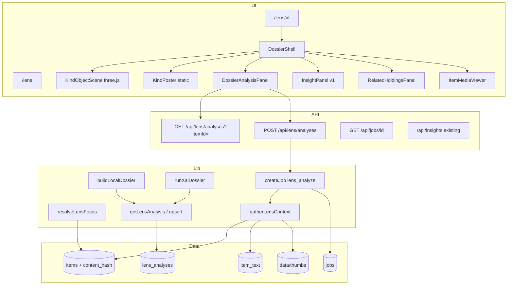
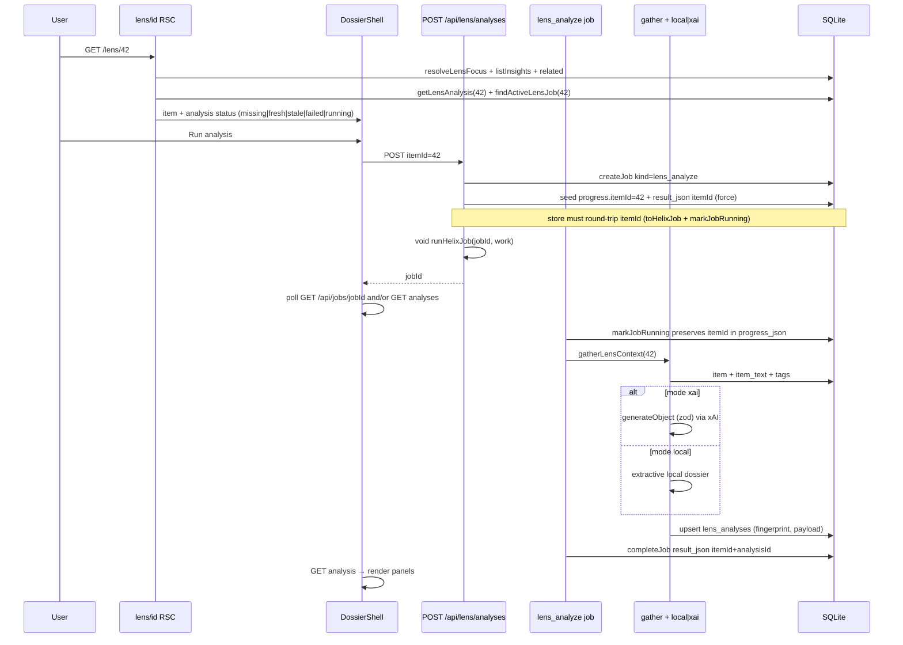

# Season Design: Deep Lens Season 2 — Futuristic Dossier, 3D Kind-Objects & AI Analysis Cache

| Field | Value |
| --- | --- |
| **Document** | Season design — Deep Lens dossier + 3D kind-objects + AI analysis cache |
| **Author** | Helix owner + design loop |
| **Date** | 2026-08-13 |
| **Status** | **Implemented** (2026-08-13) |
| **Approval** | Owner accepted defaults; shipped on main |
| **Workspace** | `/home/brandon/Projects/non-os` (package `helix-library`) |
| **Baseline tip** | `aa40ce9` on `main` (Deep Lens v1 shipped; **167** tests pass) |
| **Prior seasons** | [Curation & intake](./2026-08-curation-intake.md) · [Discovery depth & reading room](./2026-08-discovery-reading.md) · [Acquire depth](./2026-08-acquire-depth.md) — all **Implemented** |
| **v1 baseline** | Deep Lens routes `/lens`, `/lens/[id]`; user `insights` table; `resolveLensFocus`; `DeepLensWorkspace` |
| **Audience** | Senior engineers implementing on `main` (Grok Build incremental PRs) |
| **Revision** | rev 3 (2026-08-13) — re-review: mandatory jobs store `progress.itemId` round-trip (`toHelixJob` / `markJobRunning`); InsightPanel title consistency |

---

## Overview

Helix Library is a localhost personal OPAC: Next.js 15 App Router + SQLite FTS5 over explicit scan roots, hybrid catalog search, media preview, collections/tags/smart shelves, reading room, 2D/3D knowledge graph, Ask the Librarian (Grok/local), Acquire desk, and **Deep Lens v1** — a one-surface focus mode that composes reading room, related holdings, Ask-with-holding, and **user-authored** durable insights (human quotes/notes).

**Deep Lens Season 2** turns that focus surface into a **futuristic dossier**: the holding appears as a slowly spinning **3D kind-object** (VHS for video, cassette for audio, paper stack for documents, …) while an **AI analysis pipeline** (local heuristics or Grok when keyed) builds a structured, **content-hash-cached dossier** (summary, key points, themes, suggested tags) about the holding. User-authored v1 insights remain a separate concept and UI panel (“Your insights”).

**Season thesis:** **Deep Lens as dossier.** Select any indexed holding, see it as a kind-metaphor 3D object, and get durable machine analysis that invalidates when the file content changes — without shell, without inventing paths, without colliding with human-saved quotes.

Success looks like: open `/lens/{id}` and immediately see a spinning VHS/cassette/paper/etc.; click **Run analysis** (or auto-run when cache miss and mode allows); read summary, themes, entities, suggested tags (propose only), and content facts drawn only from `item_text` / metadata / gated media; re-open later and get the same dossier until reindex changes the content fingerprint; on phone or `prefers-reduced-motion`, get a static kind poster instead of WebGL thrash. Human **Your insights** stay available beside the dossier for quotes you save yourself.

---

## Background & Motivation

### What Deep Lens v1 already shipped (baseline — extend, do not replace)

| Area | Reality in tree |
| --- | --- |
| Routes | `/lens` index; `/lens/[id]` focus (`src/app/lens/`) |
| Focus resolution | `resolveLensFocus` → `ok \| invalid_id \| not_found \| disabled_location \| missing` (`src/lib/lens/focus.ts`) |
| User insights | SQLite `insights` — quote + optional body, offsets; API `GET/POST /api/insights`, `DELETE /api/insights/[id]` (`src/lib/lens/insights.ts`) |
| Workspace | `DeepLensWorkspace` composes `ItemMediaViewer` / reading room + `RelatedHoldingsPanel` + Ask link + `InsightPanel` (`src/components/lens/`) |
| Gating | Media gated on enabled location + not missing; **related + insights always load** when item exists |
| Nav | PRIMARY_NAV “Deep Lens”; home tile; catalog item-detail button; `/docs#deep-lens` |
| Tests | `tests/lens.test.ts` — focus + insight round-trip |

**Critical naming distinction (Season 2):**

| Term | Meaning | Storage |
| --- | --- | --- |
| **Insight** (v1) | Human-saved quote / note on a holding | `insights` table |
| **Dossier analysis** / **lens analysis** | Model- or heuristic-generated structured analysis | **New** `lens_analyses` table |
| **Dossier UI** | Futuristic presentation shell (3D object + analysis panels + human insights) | React components |

Do **not** overload `insights` for AI output. Mixing sources would break trust (“did I write this?”) and cache invalidation.

### Product today (anchors relevant to Season 2)

| Area | Reality |
| --- | --- |
| Item kinds | `ITEM_KINDS`: `text \| image \| video \| audio \| archive \| code \| document \| other` (`src/lib/types.ts`); `classifyKind` in `src/lib/indexer/classify.ts` |
| Content body | `item_text.body` at reindex; `getItemText(id)` (`src/lib/catalog/query.ts`); agent `catalog_read` caps **24k** chars via private `BODY_MAX_CHARS` in `src/lib/agent/tools.ts` — Season 2 **exports** a shared constant (see KD8) |
| Content identity | `items.content_hash` (sha via `src/lib/indexer/hash.ts`); null possible for some rows until rehash |
| Thumbs | `data/thumbs/{itemId}.webp`; `hasThumb` / `thumbPathForItem` (`src/lib/media/thumbs.ts`); serve `GET /api/thumbs/[id]` |
| Media jail | `resolveMediaItem` / `/api/media/[id]` (`src/lib/media/serve.ts`) — enabled roots only |
| Agent modes | `local \| xai \| auto` via `resolveAgentMode()` (`src/lib/agent/mode.ts`); Grok = `XAI_API_KEY` developer API, **not** SuperGrok |
| Ask path | `POST /api/ask` — `streamText` + `createXai` + tools; holding appendix via `holdingSystemAppendix` (`src/lib/agent/holding-context.ts`) |
| Local path | `localLibrarianReply` + `localHoldingReadReply` — metadata + truncated body sample; **no LLM** |
| Jobs | Unified `jobs` table; `HelixJobKind` = reindex \| backup \| acquire kinds (`src/lib/jobs/types.ts`); `createJob` / progress / cancel (`src/lib/jobs/store.ts`) |
| 3D stack | `three@^0.185`, `3d-force-graph`, `force-graph` in `transpilePackages` (`next.config.ts`); client-only `next/dynamic({ ssr: false })` in `KnowledgeGraphLoader.tsx` |
| Mobile / a11y | Graph defaults 2D on mobile; reading room / PDF via dynamic import |

### Pain points (post–Deep Lens v1)

1. **v1 is a composition surface, not a “lens.”** Read + related + Ask + human notes are useful, but there is no dedicated analysis product that *gathers understanding* of a holding into a durable dossier.
2. **Ask is ephemeral.** Holding-context chat does not cache structured analysis keyed to content; re-opening the same PDF re-asks the model.
3. **No kind metaphor.** Catalog kind badges are flat; the owner vision is a tangible dossier centerpiece (VHS, cassette, paper stack).
4. **Human insights ≠ machine dossier.** Without a separate table and language, implementers will collide with `insights` and break the quote-note mental model.
5. **Local mode must stay useful.** Many sessions run without `XAI_API_KEY`; analysis must degrade to honest metadata + extractive summary, never invent body text.

### Constraints (non-negotiable)

From `AGENTS.md` / product hard rules:

1. **Localhost by default** — loopback bind; LAN only with password + explicit env.
2. **Explicit scan roots** — never default-scan `$HOME`.
3. **Librarian mutations approval-gated** — no shell, no unsolicited writes, no deleting project source.
4. **SuperGrok ≠ developer API** — in-app Grok needs `XAI_API_KEY` from console.x.ai.
5. **Paths from tools only** — agent / analysis must not invent file paths.
6. **Media serve gated** — `/api/media/[id]` and thumbs only under enabled location roots.
7. **Do not commit** `library.config.json`, `data/`, personal `archive/**`, secrets.

Additional season constraints:

- Prefer **editing existing modules** over new frameworks (no R3F / no Babylon / no new CMS).
- Pure analysis **reads do not require approve**; writing tags/collections from analysis **does**.
- Analysis body input comes from catalog APIs (`getItemById`, `getItemText`, metadata, optional vision of thumb/media) — never client-supplied “document body.”
- Cache invalidation is fingerprint-based (`content_hash` or mtime+size), not wall-clock TTL alone.
- Mobile: reduced-motion / static poster fallback mandatory.

---

## Goals & Non-Goals

### Goals (season)

| # | Theme | Outcome |
| --- | --- | --- |
| **G1** | Analysis cache | SQLite `lens_analyses` one row per item; freshness via **fingerprint** (`content_hash` or mtime+size fallback); get-or-stale API; cascade delete with items |
| **G2** | Analyze pipeline | Server pipeline: resolve focus → gather context (metadata + capped `item_text`) → local or xAI structured dossier → persist; job kind `lens_analyze` for long runs |
| **G3** | Kind → 3D object | three.js kind-objects with slow axis spin; label art from thumbs/title; static CSS poster fallback |
| **G4** | Dossier UI | Futuristic shell on `/lens/[id]`: center object, analysis panels, keep human `InsightPanel` + related + act links |
| **G5** | Mode parity | Grok when keyed (`resolveAgentMode` / `xaiCloudAllowed`); local extractive dossier always; honest empty states for media-without-text |
| **G6** | Propose-only enrichment | Dossier may **suggest** tags / collections; applying them uses existing approve / direct UI patterns — no silent writes |
| **G7** | Polish | a11y (reduced-motion, focus, ARIA), `/docs#deep-lens` update, SESSION-HANDOFF + tests |

### Non-goals (this season)

| Out of scope | Why |
| --- | --- |
| Vector embeddings as primary retrieval / “similar by embedding” | Product non-goal; structural related stays |
| Full Zotero / PDF ink annotation geometry | Weight; Discovery deferred annotations |
| Multi-user SaaS / auth beyond localhost | Hard boundary |
| Arbitrary shell / unsolicited disk writes | Hard constraint |
| Replacing Catalog / Graph / Ask as routes | Deep Lens composes; does not absorb |
| Real-time video transcription / full speech-to-text pipeline | Host cost; optional later if ffmpeg+Whisper host tool |
| Shipping heavy GLTF market packs / commercial 3D assets | Prefer procedural three.js primitives + textures from thumbs |
| Auto-applying AI tags without user action | Approval / direct UI only |
| Batch “analyze entire library” | Single-item focus first; no background thrash of API budget |
| Replacing v1 human `insights` | Keep and display beside dossier |

---

## Key Decisions

| ID | Decision | Rationale |
| --- | --- | --- |
| **KD1** | Separate **`lens_analyses`** from **`insights`** | Human quotes must never look like model output; different lifecycle (cache vs manual CRUD) |
| **KD2** | Unique active row per **`item_id`**; stored `content_hash` is a snapshot for display/debug | One upsert row; history not retained this season |
| **KD3** | **Fingerprint is always the freshness key** — never “always stale.” `fingerprint = contentHash ?? \`mtime:${mtimeMs}:size:${sizeBytes}\``. GET `fresh` iff row exists, `status === completed`, and stored fingerprint matches current item. When `content_hash` is null, still cache on mtime+size fingerprint; set `sources.contentHashMissing: true` (and optional contentFact) so UI can show weaker confidence without forcing re-run every open | Null hash is real in indexer (preserves existing hash when size/mtime unchanged — including null). Dual “always stale” + “fresh when fingerprint matches” was contradictory |
| **KD4** | Analysis is **opt-in button** by default; optional “auto-analyze on open if miss” behind local preference `helix-lens-auto` (default **off**). Privacy chip **always visible** when `agentMode === xai` (before first run). Enabling auto while mode is xAI requires a **one-time confirm** in the preference UI | Avoid surprise xAI spend; disclosure before any auto send |
| **KD5** | **No approval** for pure analysis; **approval required** to apply suggested tags/collections | Matches AGENTS librarian mutation rules |
| **KD6** | Job kind **`lens_analyze`** in unified `jobs` table for async; short local analyses may complete inline in request if &lt; ~2s. Fire-and-forget via **`runHelixJob`** (same pattern as `src/app/api/backup/route.ts`). **Per-itemId** single-flight, not global `isKindBusy("lens_analyze")` | Aligns with jobs UX; parallel analyzes on different holdings OK |
| **KD7** | Structured dossier JSON schema versioned (`schemaVersion: 1`) in `payload_json` | UI + migrations can evolve fields without new columns per analysis field |
| **KD8** | Input body cap **24k** chars via **shared export** `CATALOG_READ_BODY_MAX` (or export existing `BODY_MAX_CHARS`) from `src/lib/agent/tools.ts` or tiny `src/lib/agent/limits.ts`; lens `gatherLensContext` imports it — **no second magic number** | Token cost + drift prevention; PDF/text from `item_text` only; no live re-extract on open |
| **KD9** | **Vision is stretch within season** — not required for PR2/DoD. When implemented: only xAI + key + cloud allowed + kind `image` (or video with thumb); server-read thumb via `thumbPathForItem`; on failure fall back to metadata-only with caveat. Text path ships first | Images often lack `item_text`; multimodal shape for `grok-4.3` is external/unverified in-repo |
| **KD10** | 3D via **raw three.js** in a client-only component (same dynamic-import pattern as graph); **no React Three Fiber** | Already depend on `three`; R3F is new framework weight. Note: graph uses `3d-force-graph`, not hand meshes — KindObjectScene is new surface area |
| **KD11** | Kind → object mapping is a pure lib table `kindObjectSpec(kind)` for tests + UI | Single source of truth for metaphor labels and mesh builders |
| **KD12** | Mobile / `prefers-reduced-motion`: **static KindPoster** (2D CSS/SVG), not spinning WebGL. On small viewports, **do not** mount WebGL + PDF.js page viewer simultaneously | Matches graph 2D default (`graph-mode.ts` ~1024px + reduced-motion); battery + a11y |
| **KD13** | Local dossier is **extractive** (title, kind, size, first N sentences / headings, path parent, tag list, duration) — never generative prose claiming unread content. Local path always sets **`entities: []`**; only xAI may fill entities | Honesty when offline; avoid false-positive token entities in tests |
| **KD14** | xAI prefers **`generateObject` + zod** schema for `LensDossierV1` (minus server-stamped `sources`); `generateText` + JSON parse is fallback only. Model `NON_OS_MODEL` default `grok-4.3`. Non-streaming is fine for cache fill | `ai@^7` exports `generateObject`; better than freeform JSON; Ask still uses tools+stream for chat |
| **KD15** | Domain language: **Dossier** (UI product), **Lens analysis** / **analysis** (row + machine output), **Insight** remains human-only | Copy: “Dossier”, “Run analysis”, “Your insights” — never call machine output “insights” |
| **KD16** | Prefer extend `src/lib/lens/*`, `DeepLensWorkspace`, jobs types — not a parallel microservice | Project convention |
| **KD17** | Durable per-item job binding requires a **mandatory jobs store round-trip fix**, not seed-only. Extend `HelixJobProgress` with optional `itemId?: number`. **`toHelixJob` today rebuilds only `{ stage, percent, detail }`** (`src/lib/jobs/store.ts` ~93–113) — any extra field is dropped on read; `updateJobProgress` then **persists the wipe**. `runHelixJob` always calls `markJobRunning` first, which forces progress rewrite without `itemId`. Therefore PR1 **must**: (1) preserve `itemId` in `toHelixJob`; (2) preserve `itemId` when `markJobRunning` / `completeJob` / `failJob` / cancel rewrite `progressJson`; (3) **require** early `result_json` seed `{ itemId }` (dual binding) so `findActiveLensJob` can match even if progress is briefly incomplete; (4) unit-test create → seed → `markJobRunning` → progress still has `itemId`. After create: seed progress + result, then `void runHelixJob`. In-process Map is optional hot cache only | Without store fix, documented sequence clears binding on first line of job runner |

---

## Proposed Design

### Architecture (season delta)



### Sequence: open focus + analyze (cache miss)



### Naming & product copy

| UI string | Meaning |
| --- | --- |
| **Dossier** | The Season 2 presentation (3D + analysis + human notes) |
| **Analysis** / **Run analysis** | Generate or refresh AI/local dossier |
| **Your insights** | v1 human quotes — InsightPanel title becomes **“Your insights”** in PR4 (not plain “Insights”) |
| **Suggested tags** | From analysis; Apply requires user action |

Internal module names:

```text
src/lib/lens/
  focus.ts          # existing
  insights.ts       # existing human insights
  analyses.ts       # NEW cache CRUD
  context.ts        # NEW gatherLensContext
  dossier.ts        # NEW types + schemaVersion + validators
  local-dossier.ts  # NEW extractive builder
  xai-dossier.ts    # NEW Grok structured call
  kind-object.ts    # NEW kind → metaphor + texture hints
  index.ts          # re-exports
```

### Dossier payload schema (`schemaVersion: 1`)

Persisted as JSON text in `lens_analyses.payload_json`. Validate on write and read (soft-fail to “corrupt cache → re-run”).

```ts
/** Versioned dossier document — keep fields additive across versions. */
export type LensDossierV1 = {
  schemaVersion: 1;
  /** One-paragraph overview; local may be extractive first lines. */
  summary: string;
  /** Short bullets (max ~12). */
  keyPoints: string[];
  /** Topics / themes (free strings, max ~16). */
  themes: string[];
  /** Named entities if detectable; empty when unknown. */
  entities: Array<{ name: string; kind?: string }>;
  /** Content signals derived from metadata + body. */
  contentFacts: Array<{ label: string; value: string }>;
  /** Proposed tags only — never auto-applied. */
  suggestedTags: string[];
  /** Optional shelf name suggestions. */
  suggestedCollections: string[];
  /** Limitations of this analysis (honest). */
  caveats: string[];
  /** Which inputs were used. */
  sources: {
    usedItemText: boolean;
    itemTextChars: number;
    truncated: boolean;
    usedVision: boolean;
    usedMetadataOnly: boolean;
    /** True when items.content_hash was null; fingerprint used mtime+size. */
    contentHashMissing: boolean;
  };
};
```

**Field caps (enforced in `dossier.ts`):**

| Field | Cap |
| --- | --- |
| `summary` | 2_000 chars |
| `keyPoints` | 12 items × 400 chars |
| `themes` | 16 × 64 chars |
| `entities` | 24 |
| `contentFacts` | 20 |
| `suggestedTags` | 12 (normalized like existing tag normalize) |
| `suggestedCollections` | 6 |
| `caveats` | 8 × 240 chars |
| Full payload JSON | ~48 KB (reject oversize) |

### Kind → 3D object metaphor

| `ItemKind` | Object | Label / texture source | Notes |
| --- | --- | --- | --- |
| `video` | VHS cassette shell | Thumb/poster on spine label (`/api/thumbs/{id}` if `hasThumb`) | Slow Y-axis spin |
| `audio` | Compact cassette | Title text texture on label | No audio playback in mesh |
| `text` | Single sheet / folded note | First line of title; faint ruled lines | “notes” metaphor |
| `document` | Stack of papers / manila folder | Title + “PDF” badge if mime/pdf | Slight thickness |
| `image` | **Photo print** in thin frame (or 35mm slide mount if landscape ratio extreme) | Full thumb as print face | Prefer print over “floating image plane” for dossier feel |
| `code` | **3.5″ floppy** (default) | Title / language-ish ext on label | Alternative punched-card deferred |
| `archive` | Sealed crate / banker’s box | Kind + ext | Generic container |
| `other` | Sealed crate (muted) | “Unknown format” | Same geometry as archive, different material |

**Implementation approach (procedural, not asset packs):**

- `KindObjectScene` builds meshes from `THREE.BoxGeometry` / cylinders / planes + `MeshStandardMaterial`.
- Label textures: canvas 2D → `CanvasTexture` (title truncated), or load thumb image when available.
- Lights: soft key + rim (space UI phosphor-adjacent, theme-aware via CSS vars sampled once at mount).
- Animation: `requestAnimationFrame` rotate Y ≈ 0.15–0.35 rad/s; pause when tab hidden (`document.visibilityState`).
- **Fixed aspect container** (e.g. `aspect-square` or 4:3 box with max height) so layout thrash with media viewer is bounded; `ResizeObserver` on that box only; DPR capped at 1.5.
- Dispose geometries/materials/renderer/textures on unmount; handle WebGL context loss → swap to KindPoster.
- Unit-test `kindObjectSpec` for **all** `ITEM_KINDS` (PR3).

**Fallback `KindPoster`:**

- CSS/SVG illustration of the same metaphor; shows title + kind badge.
- Used when: `matchMedia('(prefers-reduced-motion: reduce)')`, coarse pointer + narrow viewport (reuse graph mobile heuristic ~max-width 1024px from `graph-mode.ts`), WebGL context failure, user toggle “Static object,” or **mobile when reading room / PDF.js is expanded** (PR4: never mount spin + PDF page viewer together on small viewports).

### Context gathering (`gatherLensContext`)

Pure server lib — no React. Inputs only from catalog + disk thumbs via existing helpers.

```ts
export type LensContext = {
  item: CatalogItemRow;
  title: string;
  contentHash: string | null;
  fingerprint: string; // contentHash ?? `mtime:${mtimeMs}:size:${sizeBytes}`
  body: string | null; // capped
  bodyTruncated: boolean;
  tags: string[];
  collectionNames: string[];
  hasThumb: boolean;
  /** Absolute path only for server-side thumb read — never send raw path to model as authority for FS traversal */
  thumbRelHint: string | null; // e.g. thumbs serve URL path only
};
```

Rules:

1. Resolve item via `getItemById` (not client path).
2. Body via `getItemText` — slice to shared **`CATALOG_READ_BODY_MAX`** (24_000), imported from agent limits — **not** a private duplicate constant.
3. Tags via existing collection/tag query helpers (prefer non-hidden tags for “user facing”; include source counts only if useful).
4. **Never** pass absolute filesystem paths into model prompts as “open this file”; use catalog id + display title + relPath as metadata only (stricter than `summarizeItem` in `tools.ts`, which still exposes absolute `path` — analyze path must not).
5. Missing/disabled location: still allow analysis from **indexed** metadata + `item_text` (like related); set caveat “media unavailable.”
6. Vision (stretch): if eligible, read thumb file from `thumbPathForItem` server-side into base64 for xAI multimodal message; if no thumb or vision fails, skip with caveat. **PR2 ships text/metadata path only.**

**Fingerprint helper** (pure, tested in PR1):

```ts
export function lensFingerprint(item: {
  contentHash: string | null;
  mtimeMs: number;
  sizeBytes: number;
}): string {
  if (item.contentHash && item.contentHash.length > 0) return item.contentHash;
  return `mtime:${item.mtimeMs}:size:${item.sizeBytes}`;
}
```

### Local dossier (`buildLocalDossier`)

No LLM. Deterministic enough for tests on fixtures.

Suggested extractive algorithm:

1. `summary`: first ~400 chars of body (sentence-trimmed) or “No indexed text; metadata-only dossier for {title} ({kind}).”
2. `keyPoints`: up to 5 non-empty lines/headings from body; else size, mime, duration, dimensions.
3. `themes`: kind + ext + parent folder segment of `relPath`.
4. **`entities`: always `[]` on local path** (xAI may fill; no Capitalized-token heuristic — low value / false positives).
5. `contentFacts`: kind, size (`formatBytes`), mime, dimensions, duration, location name, indexedAt, hash prefix or “hash missing.”
6. `suggestedTags`: folder segment + kind + ext (filtered through tag normalize; drop stopwords).
7. `caveats`: always list mode local; truncation; missing body; missing media; contentHashMissing when applicable.
8. Stamp `sources` server-side including `contentHashMissing`, `usedVision: false`.

### xAI dossier (`runXaiDossier`)

1. `resolveAgentMode()` must be `xai`; else fall back to local.
2. Enforce `hasXaiApiKey() && xaiCloudAllowed()`.
3. System prompt: librarian honesty rules subset — **do not invent body**, paths only from provided context; no tools.
4. User message: JSON blob of metadata + body sample; vision image parts only if stretch path enabled.
5. **Prefer `generateObject`** from `ai` + zod schema for model-facing fields of `LensDossierV1` (exclude server-stamped `sources`; pipeline merges). On schema failure: one retry, then fall back to local + caveat “model schema failed.” **`generateText` + JSON.parse only as last-resort fallback** if `generateObject` unavailable for the model.
6. Model: `process.env.NON_OS_MODEL?.trim() || "grok-4.3"`.
7. Temperature low (0.2–0.3). Timeout: align with route/job (e.g. 120s); mark job failed with clear error.
8. **Do not** attach full agent tool surface (`catalog_search`, acquire, etc.) — analysis is single-holding, context pre-gathered.

### Job integration

#### Kind registration and acquire side effects

```ts
// src/lib/jobs/types.ts
export type HelixJobKind =
  | "reindex"
  | "backup"
  | "lens_analyze"  // NEW
  | /* acquire kinds… */;

export function isHelixJobKind(k: string): k is HelixJobKind {
  return k === "reindex" || k === "backup" || k === "lens_analyze" || isAcquireJobKind(k);
}
```

**Must** update `isHelixJobKind` before any writer — today `toHelixJob` collapses unknown kinds to `"reindex"` (`src/lib/jobs/store.ts`).

**Acquire filter safety (PR1/PR2):** `getAcquireJob` / `cancelAcquireJob` currently accept any non-`reindex` job (`src/lib/acquire/jobs.ts` — `if (job.kind === "reindex") return null`). After adding `lens_analyze`, tighten to **`isAcquireJobKind(job.kind)` only** so acquire cancel/get never mutates lens jobs.

**JobsPanel:** add `kindLabel` case → `"Deep Lens"` (else raw kind string is acceptable but polish in PR2/PR6).

**Rescue / home:** `listJobs` will surface failed/running `lens_analyze` rows — **desired** (user sees stuck analyzes). Analysis durability remains `lens_analyses`, not job history.

**Retention:** `RETENTION = 50` completed/old rows pruned in `store.ts`. Rapid analyze+acquire can drop finished job rows while a slow UI still polls — existing system risk; client should treat missing job + fresh analysis as success, missing job + no row as re-check GET analyses. Do not rely on jobs table as long-term log.

#### Progress type extension

```ts
// src/lib/jobs/types.ts — extend HelixJobProgress
export type HelixJobProgress = {
  stage: string;
  percent: number | null;
  detail?: string;
  /** Durable binding for lens_analyze (and future kinds). */
  itemId?: number;
};
```

#### Store round-trip fix (**mandatory in PR1** — blocking for KD17)

Verified against `src/lib/jobs/store.ts` on `aa40ce9`:

| Code path | Behavior today | Failure mode for `itemId` |
| --- | --- | --- |
| `toHelixJob` (~L93–113) | Rebuilds progress as **only** `{ stage, percent, detail }` | Extra JSON fields dropped on every read |
| `updateJobProgress` | `next = { ...current.progress, ...progress }` then writes JSON | After strip, updates **without** `itemId` persist the wipe |
| `markJobRunning` | Calls `updateJobProgress({ stage: "starting", percent: 1, detail: "Starting…" })` | **No `itemId`** — first line of `runHelixJob` clears binding |
| `completeJob` / `failJob` | Hard-code new `progressJson` object | Drops `itemId` (less critical for active find, but must preserve if status still pending/running paths hit fail mid-flight) |
| `requestCancel` (pending) | Rewrites progress to cancelled | Same — preserve if present |

**Required store changes (PR1, not optional comments):**

1. **`toHelixJob`:** if `progressParsed.itemId` is a finite positive number, set `progress.itemId = Math.floor(progressParsed.itemId)`.
2. **`markJobRunning` / `completeJob` / `failJob` / cancel progress rewrites:** when building the next progress object, **carry forward** prior `itemId` (via fixed `toHelixJob` or raw parse) unless the caller explicitly clears it.
3. **`seedJobResult(jobId, { itemId })` (required helper, not optional):** write `result_json` early to `{ itemId }` (merge if row already has result). Dual binding: `findActiveLensJob` accepts `progress_json.itemId` **or** `result_json.itemId`.
4. **Unit test (PR1, fail CI if missing):**
   ```ts
   // createJob → updateJobProgress({ itemId, stage: "queued" }) → seedJobResult
   // → markJobRunning(id) → updateJobProgress({ stage: "gather" })
   // assert: raw progress_json still has itemId
   // assert: getJob(id).progress.itemId === itemId
   // assert: findActiveLensJob(itemId)?.id === id  (when kind lens_analyze + pending/running)
   ```
5. Callers must **not** assume “preserve itemId on report()” alone fixes this — `runHelixJob` never lets the worker control `markJobRunning`’s payload.

Without (1)+(2), the sequence `createJob → seed itemId → void runHelixJob` **clears the binding on the first line of the job runner**, so mid-run GET `running`, single-flight, and post-restart reattach all break.

#### Create + single-flight (concrete)

`createJob` accepts only `{ kind, label, status? }` today — **no itemId column**. Binding procedure (**after** store fix above):

```ts
const job = createJob({
  kind: "lens_analyze",
  label: `Deep Lens · ${title.slice(0, 80)}`,
});
// Dual seed — progress + result_json (both required)
updateJobProgress(
  job.id,
  { stage: "queued", percent: 0, detail: `item ${itemId}`, itemId },
  { force: true },
);
seedJobResult(job.id, { itemId }); // REQUIRED — not optional
void runHelixJob(job.id, async (report) => {
  // report() may omit itemId; store must retain it via toHelixJob merge
  report({ stage: "gather", percent: 10, detail: "Gathering…" });
  ...
  return { itemId, analysisId, contentHash, fingerprint, mode };
});
```

**Find active job for item** (`findActiveLensJob(itemId)`):

```sql
SELECT id, progress_json, result_json, status FROM jobs
WHERE kind = 'lens_analyze' AND status IN ('pending', 'running')
ORDER BY created_at DESC
```

Parse each row’s `progress_json.itemId` **or** `result_json.itemId` (finite positive); return first match. Prefer reading via `getJob` / `listJobs` **after** `toHelixJob` fix so `job.progress.itemId` is trustworthy; raw SQL parse is fine for belt-and-suspenders. Optional in-process `Map<itemId, jobId>` for hot path — **must rehydrate from SQL** on miss (server restart).

**Do not** use `isKindBusy("lens_analyze")` as a global mutex — that would serialize all holdings. Busy is **per itemId** only. (Backup correctly uses global busy for `backup` kind; lens must not copy that.)

Template: fire-and-forget `void runHelixJob(...)` from `src/app/api/backup/route.ts` — cleaner than acquire wrappers for non-acquire kinds. **Only safe after** store round-trip fix.

#### Job payload conventions

| Field | Usage |
| --- | --- |
| `label` | `Deep Lens · {title slice}` (human only; **not** the binding key) |
| `progress.itemId` | **Primary binding** — seeded on create; **must survive** `toHelixJob` + `markJobRunning` + subsequent progress updates |
| `result_json.itemId` | **Secondary binding** — required early seed via `seedJobResult`; completeJob merges full result |
| `progress.stage` | `queued` → `starting` → `gather` → `model` → `persist` → `done` |
| `result_json` (complete) | `{ itemId, analysisId, contentHash, fingerprint, mode }` |
| `cancelRequested` | Honor between stages |

**Single-flight:** at most one pending/running `lens_analyze` per `itemId`. Second POST returns existing `{ jobId, status: "running" }` without starting another worker.

**Inline fast path:** if `resolveAgentMode() === "local"` and gather is cheap, `POST` may complete synchronously and return `{ ok, analysis, jobId: null }` — still write `lens_analyses`. xAI always async job (latency + cancel).

#### Concurrent reindex vs analyze

**Allow** analyze while reindex runs (`isReindexRunning()`). SQLite WAL keeps readers/writers workable on a personal library. Worst case: analyze reads mid-rewrite body or stamps a fingerprint reindex is about to change → next open reports **stale** (correct). Soft rule: if reindex is running, stamp caveat “reindex in progress; dossier may go stale soon.” **Do not** refuse analyze.

### UI composition on `/lens/[id]`

Evolve `DeepLensWorkspace` into a dossier layout without deleting v1 capabilities:

```text
┌─────────────────────────────────────────────────────────────┐
│ Deep Lens / Catalog record          [Ask] [Item] [Graph]    │
│ Title · KindBadge · id · path                               │
├───────────────────────────┬─────────────────────────────────┤
│                           │  Dossier analysis               │
│     KindObject / Poster   │  status: fresh|stale|missing|   │
│     (center stage)        │    running|failed               │
│                           │  [Run analysis] [Refresh]       │
│     [Open media / room]   │  summary · key points · themes  │
│                           │  suggested tags (Apply…)        │
│                           │  caveats · mode + privacy chip  │
├───────────────────────────┤─────────────────────────────────┤
│  ItemMediaViewer / room   │  Your insights (v1 InsightPanel)│
│  Related holdings         │  Act links                      │
└───────────────────────────┴─────────────────────────────────┘
```

- Desktop (`lg+`): two-column; object stage sticky-ish in left top; fixed aspect box for 3D.
- Mobile: object stage collapsed height (~200px) **static poster by default**; analysis accordion sections; if user expands PDF/reading room, keep poster (do not spin WebGL).
- InsightPanel heading **must** be **“Your insights”** in PR4 (replace plain “Insights”).
- Keep `contentBlockedReason` banners for disabled/missing.
- Analysis available even when media blocked (indexed knowledge).
- When `agentMode === xai`, privacy chip is always visible (even before first Run analysis).

### Client state

| Key | Storage | Purpose |
| --- | --- | --- |
| `helix-lens-auto` | localStorage | Auto-run analysis on cache miss (default **false** for all modes). Enabling while mode is xAI requires one-time confirm. |
| `helix-lens-object` | localStorage | `spin` \| `static` preference override |

Mirror patterns in `src/lib/client/graph-mode.ts` / `open-history.ts`.

---

## API / Interface Changes

### New: `GET /api/lens/analyses?itemId=N`

Response:

```json
{
  "ok": true,
  "status": "fresh" | "stale" | "missing" | "running" | "failed",
  "analysis": {
    "id": 1,
    "itemId": 42,
    "contentHash": "abc…",
    "fingerprint": "abc…",
    "mode": "local" | "xai",
    "model": "local" | "grok-4.3",
    "status": "completed" | "failed",
    "payload": { "schemaVersion": 1, "...": "..." },
    "error": null,
    "createdAt": 0,
    "updatedAt": 0
  } | null,
  "jobId": null,
  "agentMode": "local" | "xai"
}
```

#### Top-level `status` precedence (evaluate in order)

| Order | Condition | Top-level `status` | Notes |
| --- | --- | --- | --- |
| 1 | Active `lens_analyze` job for this `itemId` (`pending`/`running`) | **`running`** | Always set `jobId`. Still return last `analysis` row if any (completed or failed) so UI can show previous dossier under a spinner |
| 2 | No `lens_analyses` row | **`missing`** | `analysis: null` |
| 3 | Row exists, fingerprint **≠** current item fingerprint | **`stale`** | Regardless of row `status` (completed or failed). Show old payload if present + “Outdated” badge |
| 4 | Row `status === "failed"` and fingerprint matches | **`failed`** | `payload` may be null; surface `error` |
| 5 | Row `status === "completed"`, fingerprint matches, payload validates | **`fresh`** | Happy path |
| 6 | Row completed but payload corrupt / schema invalid | treat as **`failed`** (or force re-run UX) | Soft-fail corrupt cache |

**Not** using a separate `stale_failed` enum — fingerprint mismatch collapses to `stale` (order 3 before failed-match). UI can still show last error text from the row when present.

#### When Run analysis is allowed without `force`

| Top-level status | POST without `force` | POST with `force: true` |
| --- | --- | --- |
| `missing` | Starts analyze | Starts analyze |
| `failed` | Starts analyze (retry) | Starts analyze |
| `stale` | Starts analyze (refresh) | Starts analyze |
| `running` | **No-op** — returns existing `jobId` | **No-op** — same (do not double-start) |
| `fresh` | **No-op** — returns current analysis | Starts analyze (recompute) |

### New: `POST /api/lens/analyses`

Body: `{ "itemId": number, "force"?: boolean }`

- Validates item exists (invalid id → 400; not found → 404).
- Disabled/missing location: still allowed (analysis on indexed data).
- Honors table above for force / single-flight.
- Returns `{ ok, jobId?, analysis?, status }`.
- Disabled entirely when `NON_OS_LENS_ANALYZE=0` → 503 with clear message; GET still works.

### Existing (unchanged contract)

| Route | Notes |
| --- | --- |
| `/api/insights` | Human only |
| `/api/jobs/[id]` | Poll `lens_analyze` |
| `/api/thumbs/[id]` | Label textures |
| `/api/media/[id]` | Media viewer only |

### Lib exports (`src/lib/lens/index.ts`)

Add re-exports for analyses + dossier types + kind-object specs + fingerprint + status resolver. Keep `createInsight` etc.

### Optional stretch (not required)

- `DELETE /api/lens/analyses?itemId=N` — clear cache for item (debug / privacy).
- Agent tool `lens_analyze` propose-only that creates job after approve — **out of scope** unless cheap follow-on; desk/button first.

### Owner debug without DELETE API

```sql
-- Clear one holding's dossier cache (library.db)
DELETE FROM lens_analyses WHERE item_id = ?;
```

Or weed/recreate item (CASCADE). Stretch DELETE route is nicer UX but not season-blocking.

---

## Data Model Changes

### New table `lens_analyses`

Drizzle + `migrate.ts` `CREATE TABLE IF NOT EXISTS` (same pattern as `insights`).

```sql
CREATE TABLE IF NOT EXISTS lens_analyses (
  id INTEGER PRIMARY KEY AUTOINCREMENT,
  item_id INTEGER NOT NULL REFERENCES items(id) ON DELETE CASCADE,
  content_hash TEXT,                 -- snapshot of items.content_hash at analyze time (nullable)
  fingerprint TEXT NOT NULL,         -- freshness key: content_hash OR mtime:size (see KD3)
  mode TEXT NOT NULL,                 -- local | xai
  model TEXT,                        -- e.g. grok-4.3 or 'local'
  status TEXT NOT NULL DEFAULT 'completed',  -- completed | failed
  payload_json TEXT,                 -- LensDossierV1 JSON; null if failed
  error TEXT,
  schema_version INTEGER NOT NULL DEFAULT 1,
  created_at INTEGER NOT NULL,
  updated_at INTEGER NOT NULL
);
CREATE UNIQUE INDEX IF NOT EXISTS lens_analyses_item_uq ON lens_analyses(item_id);
CREATE INDEX IF NOT EXISTS lens_analyses_fp_idx ON lens_analyses(fingerprint);
```

**One row per item** (upsert on re-analyze). History of past analyses is **not** retained this season (simpler; non-goal: analysis version history).

**Freshness rule (single place):** compare `lens_analyses.fingerprint` to `lensFingerprint(item)` on every GET. Do **not** special-case null `content_hash` as always-stale.

### Schema.ts

Add `lensAnalyses` table + `LensAnalysisRow` type next to `insights`.

### Migration notes

- No drizzle-kit runtime migrate — bootstrap in `src/lib/db/migrate.ts` only.
- CASCADE from `items` means weeding a holding drops dossier cache (correct).
- Jobs rows for `lens_analyze` are ephemeral progress (retention 50); analysis durability is `lens_analyses`.

### Jobs kind migration

Code-only: extend `HelixJobKind` + `isHelixJobKind`; extend `HelixJobProgress` with optional `itemId`; **fix `toHelixJob` + progress rewrites in `store.ts` (KD17)**; add `seedJobResult`; tighten acquire get/cancel filters. No SQL enum (kind is free text already).

---

## Alternatives Considered

### A1. Store AI output in `insights` with `source='ai'`

| Pros | Cons |
| --- | --- |
| No new table | Collides UX; human CRUD DELETE would delete AI rows; cache invalidation awkward; quote_text required field is wrong shape |

**Rejected** — KD1.

### A2. Always stream analysis through Ask `/api/ask` + thread

| Pros | Cons |
| --- | --- |
| Reuse chat UI | Ephemeral; hard to structure panels; tools may wander; no content_hash cache; confuses chat history with dossier |

**Rejected** for primary path; Ask remains for freeform Q&A. Dossier is structured cache. (Structured fill uses `generateObject` on a dedicated path — not Ask tools.)

### A2b. `generateText` + “JSON only” vs `generateObject` + zod

| Approach | Pros | Cons |
| --- | --- | --- |
| `generateText` + parse | Familiar from freeform chat | Brittle fences/trailing text; more retry logic |
| **`generateObject` + zod** (chosen) | Schema-enforced; `ai@^7` already depends | Need model support; fallback path still useful |

**Chosen:** `generateObject` primary (KD14); `generateText` last-resort fallback.

### A3. React Three Fiber + drei asset library

| Pros | Cons |
| --- | --- |
| Nice DX for scenes | New major deps; bundle size; project prefers raw three already used by graph |

**Rejected** this season (KD10). Revisit only if procedural meshes prove inadequate.

### A4. Synchronous only (no job)

| Pros | Cons |
| --- | --- |
| Simpler API | xAI latency blocks HTTP; no cancel; worse UX on large PDFs |

**Hybrid chosen:** local may sync; xAI async job (KD6).

### A5. Embeddings / local GGUF summarizer

| Pros | Cons |
| --- | --- |
| Offline generative | Heavy; product non-goal for vectors; host ML ops out of scope |

**Rejected** — local stays extractive; generative only via xAI developer API.

### A6. Auto-analyze every catalog open

| Pros | Cons |
| --- | --- |
| Magical | Surprise API cost; job spam; battery |

**Rejected** as default; opt-in preference only (KD4).

### A7. Filesystem JSON cache under `data/analyses/{itemId}.json`

| Pros | Cons |
| --- | --- |
| Easy to open in an editor; no migration | No CASCADE on item weed; harder to query; splits truth from SQLite `insights`/jobs neighborhood; path jail / backup complexity |

**Rejected** — SQLite `lens_analyses` matches project patterns (insights, jobs, WAL, weed cascade).

### A8. Wall-clock TTL + content_hash hybrid

| Pros | Cons |
| --- | --- |
| Forces periodic re-think | Re-spends xAI tokens without content change; noise for personal library |

**Rejected** — fingerprint-only freshness (KD3); user can force refresh.

---

## Security & Privacy Considerations

| Threat | Severity | Mitigation |
| --- | --- | --- |
| Path traversal / reading outside roots | High | Never open paths from model output; gather only via `getItemById` / `getItemText` / `thumbPathForItem` / gated media resolve |
| Prompt injection from document body | Medium | Body is untrusted content; system prompt treats body as data; no tool calls in xAI dossier path; do not execute “ignore instructions” from body |
| Leak of holdings to xAI cloud | Medium (by design when keyed) | Only when mode xAI + key + `xaiCloudAllowed`; document in UI “Sends sample to xAI”; local default offline |
| SuperGrok confusion | Low | Mode chip + existing subscription note patterns |
| Auto tag writes | Medium | Suggestions only; apply via existing tag APIs / approve |
| SSRF via analysis | Low | No URL fetch in pipeline this season |
| Cache poison via oversized payload | Low | Cap payload size; validate schema |
| LAN exposure | High if misconfigured | Unchanged localhost default; analysis APIs same bind |

Privacy copy in dossier panel — **required whenever `agentMode === xai`**, including before the first Run analysis and when configuring auto-analyze:

> Analysis uses the xAI developer API (`XAI_API_KEY`). Indexed text sample (and optional thumb for images) is sent to generate this dossier. SuperGrok chat subscription is not used.

Enabling **auto-analyze** while mode is xAI: show a **one-time confirm** dialog that repeats the privacy sentence; store the preference only after accept.

---

## Observability

| Signal | How |
| --- | --- |
| Job progress | `jobs.progress_json` stages: gather / model / persist |
| Failures | `jobs.error` + `lens_analyses.error` when status failed |
| Mode | Response `agentMode`; payload `sources` |
| Logging | Server `console.error` on pipeline exceptions (match acquire patterns); no PII beyond paths already in local logs |
| Metrics | Not a multi-tenant service — no Prometheus. Optional: count analyses in Services later (stretch) |
| User-visible | Status chip maps 1:1 from GET top-level status: Fresh / Outdated / Missing / Running / Failed |

Latency targets (single-user localhost):

| Path | Target |
| --- | --- |
| GET analysis (hit) | &lt; 50 ms SQLite |
| Local analyze | &lt; 500 ms typical |
| xAI analyze | 5–60 s depending on model/body; async job |
| 3D scene first paint | &lt; 1 s after client hydrate on desktop |

Storage estimate: dossier JSON ~2–10 KB/item; 10k holdings ≈ &lt; 100 MB worst case if all analyzed (personal library likely hundreds).

---

## Rollout Plan

### Feature readiness

No remote feature flag service. Ship behind:

1. **Code complete per PR** with tests.
2. Optional env **`NON_OS_LENS_ANALYZE=0`** to disable POST pipeline (GET still returns cache) if needed mid-season — default allow.
3. UI always shows dossier shell; analysis button respects env + mode.

### Staged implementation

Follow **PR Plan** below (PR1 → PR6). Each PR mergeable alone with green `typecheck` / `test` / `build`.

### Rollback

| Layer | Rollback |
| --- | --- |
| UI | Revert components; `/lens/[id]` can fall back to v1 workspace layout |
| Table | `lens_analyses` is additive; unused table is harmless |
| Jobs | Unknown kind already risky — ensure `isHelixJobKind` updated before writing jobs |
| API | Remove routes; no clients outside app |

---

## Open Questions

| # | Question | Default if owner silent |
| --- | --- | --- |
| Q1 | Auto-analyze on open for local mode? | **Off** by default; preference toggle |
| Q2 | Vision for images in season? | **Stretch** — text/metadata path is DoD; vision if cheap after PR2 |
| Q3 | Apply suggested tags inline with one click? | **Yes** via existing item tag API (manual source), not agent approve — same as reading-room select→tag |
| Q4 | Keep media viewer below object or tabbed? | **Below** on desktop (scroll); mobile accordion |
| Q5 | Floppy vs terminal slab for code? | **Floppy** (KD table); terminal as easter-egg later |
| Q6 | Analysis history versions? | **No** this season (upsert one row) |

No blockers for implementation if defaults accepted.

---

## Risks

| Risk | Likelihood | Impact | Mitigation |
| --- | --- | --- | --- |
| three.js scene blank without transpile / SSR | Medium | High | `next/dynamic({ ssr: false })`; already in `transpilePackages` |
| Job kind collapsed to reindex | High if forgotten | High | Update `isHelixJobKind` + tests first (PR1) |
| Acquire get/cancel accepts lens jobs | Medium | Medium | Tighten `getAcquireJob` / `cancelAcquireJob` to `isAcquireJobKind` |
| Binding lost on first progress write (`toHelixJob` strip + `markJobRunning`) | **High** if store fix skipped | High | **Mandatory PR1**: round-trip `itemId` in `toHelixJob` + rewrite helpers; dual `result_json` seed; unit test through `markJobRunning` (KD17) |
| Job binding lost on restart | Low (after store fix) | High | Dual progress+result seed; SQL `findActiveLensJob` |
| Jobs retention prunes poll target | Low | Medium | Client falls back to GET analyses; durability in `lens_analyses` |
| Concurrent reindex mid-analyze | Low | Low | Allow; caveat optional; stale after reindex |
| xAI schema / parse flake | Medium | Medium | `generateObject` + one retry + local fallback + caveat |
| API cost surprise | Medium | Medium | Opt-in analyze; auto default off; privacy + confirm for auto+xAI |
| Mobile GPU thrash | Medium | Medium | Static poster default; fixed aspect; DPR cap; no WebGL+PDF together |
| Scope creep (transcription, embeddings, vision) | Medium | High | Non-goals; vision stretch; PR plan freeze |
| Naming collision in docs/UI | Medium | Medium | KD15; “Your insights” only for humans |
| Large `item_text` memory | Low | Medium | Shared 24k cap export |
| WebGL + PDF.js both heavy | Medium | Medium | PR4: poster when room expanded on small viewports |

---

## Testing Strategy

| Layer | Coverage |
| --- | --- |
| Pure unit | `kindObjectSpec` for all kinds; dossier validate/caps; `lensFingerprint`; status precedence (running > missing > stale > failed > fresh) |
| Integration (node:test harness) | upsert analysis; fingerprint mismatch → stale; null content_hash still fresh when mtime/size match; focus + analysis coexistence; `isHelixJobKind('lens_analyze')`; **jobs store: seed itemId → markJobRunning → progress_json still has itemId**; `findActiveLensJob` hits |
| Local pipeline | Fixture `welcome.txt` / `stem-lesson.md` produce non-empty summary, `entities: []`, without network |
| API | GET missing/fresh/stale/failed/running; POST creates row (local); force on fresh; no double-start when running |
| UI | Manual smoke: spin object desktop; static mobile; reduced-motion; disabled location still shows analysis |
| Regression | Existing `tests/lens.test.ts` human insights unchanged |

Do **not** call live xAI in CI; mock `runXaiDossier` or skip when no key.

---

## References

### In-repo anchors

| Path | Role |
| --- | --- |
| `AGENTS.md` | Hard constraints, runbook, env |
| `docs/SESSION-HANDOFF.md` | Current shipped surface |
| `docs/ARCHITECTURE.md` | Layers, FTS, media gate |
| `docs/PRODUCT.md` | Metaphor / non-goals |
| `docs/designs/2026-08-discovery-reading.md` | Holding bridge, related, graph 3D patterns |
| `docs/designs/2026-08-acquire-depth.md` | Jobs kinds footgun, xAI cloud gate |
| `src/lib/lens/focus.ts` | Focus resolution |
| `src/lib/lens/insights.ts` | Human insights CRUD |
| `src/components/lens/DeepLensWorkspace.tsx` | v1 composition |
| `src/components/lens/InsightPanel.tsx` | Human insights UI |
| `src/lib/db/schema.ts` / `migrate.ts` | Schema bootstrap |
| `src/lib/agent/mode.ts` | local / xai / auto |
| `src/lib/agent/tools.ts` | `catalog_read`, private `BODY_MAX_CHARS` → export as shared limit |
| `src/lib/agent/holding-context.ts` | Holding honesty rules |
| `src/app/api/ask/route.ts` | `createXai`, `NON_OS_MODEL` |
| `src/lib/jobs/types.ts` / `store.ts` | Unified jobs; `createJob`, `runHelixJob`, `RETENTION=50`, `isKindBusy` |
| `src/app/api/backup/route.ts` | Fire-and-forget `void runHelixJob` template |
| `src/lib/acquire/jobs.ts` | `getAcquireJob` — tighten to acquire kinds only |
| `src/lib/media/thumbs.ts` / `api/thumbs/[id]` | Label art |
| `src/lib/media/serve.ts` | Media jail |
| `src/components/KnowledgeGraphLoader.tsx` | Client-only three pattern |
| `next.config.ts` | `transpilePackages` for three |
| `tests/lens.test.ts` | v1 tests to extend |

### Prior art / inspiration (do not copy assets)

- Public-library “special collections dossier” / finding-aid metaphor  
- Retro media physicality (VHS / cassette / floppy) as UI chrome  
- Helix graph’s phosphor space aesthetic (theme-aware materials)

---

## PR Plan

Mergeable slices for Grok Build. Prefer this order; PR3 and PR4 can partially parallelize after PR1 types exist.

### PR1 — Schema, cache lib, kind-object specs, job kind safety (no UI flash)

| Field | Value |
| --- | --- |
| **Title** | Deep Lens S2: `lens_analyses` schema + cache lib + kind specs |
| **Depends on** | None (v1 already on main) |
| **Files / components** | `src/lib/db/schema.ts`, `src/lib/db/migrate.ts`, `src/lib/lens/analyses.ts`, `src/lib/lens/dossier.ts` (types + validate + caps + `sources.contentHashMissing`), `src/lib/lens/kind-object.ts`, `src/lib/lens/index.ts`, `src/lib/jobs/types.ts` (`lens_analyze`, `isHelixJobKind`, `progress.itemId`), **`src/lib/jobs/store.ts` (mandatory: `toHelixJob` itemId round-trip; preserve itemId in `markJobRunning` / `completeJob` / `failJob` / cancel progress rewrites; `seedJobResult`)**, `src/lib/agent/limits.ts` **or** export body max from `tools.ts`, `src/lib/acquire/jobs.ts` (optional same-PR tighten to `isAcquireJobKind`), `tests/lens-analyses.test.ts`, **`tests/jobs-progress-itemid.test.ts` (or co-located)** |
| **Description** | Add `lens_analyses` table + Drizzle model; pure CRUD; **`lensFingerprint` + status-precedence pure helpers**; dossier validators; `kindObjectSpec(kind)` for all kinds; teach jobs about `lens_analyze` **before any writer**. **Blocking store fix (KD17):** `toHelixJob` must not strip `itemId`; progress rewrites must carry it forward; `seedJobResult` required. No React UI. |
| **Verify** | Fingerprint fresh/stale including null `content_hash`; upsert round-trip; `isHelixJobKind('lens_analyze')`; **create→seed itemId→markJobRunning→updateJobProgress(gather) still has itemId in raw JSON + getJob**; typecheck |

### PR2 — Context gather + local/xAI analyze pipeline + API + jobs

| Field | Value |
| --- | --- |
| **Title** | Deep Lens S2: analyze pipeline + `/api/lens/analyses` |
| **Depends on** | PR1 |
| **Files / components** | `src/lib/lens/context.ts`, `local-dossier.ts`, `xai-dossier.ts` (optional module), `run-analyze.ts`, `find-active-job.ts`, `src/lib/jobs/store.ts` only if `seedJobResult` needed, `src/app/api/lens/analyses/route.ts`, JobsPanel label, tests (local + status + single-flight) |
| **Description** | Implement `gatherLensContext` (shared body max), `buildLocalDossier` (`entities: []`), `runLensAnalyze` with **per-itemId single-flight**, dual-seed progress+result `itemId`, **`void runHelixJob`** (backup template; depends on PR1 store fix). GET/POST with full status model. Local may inline. xAI async + `generateObject`. Honor `NON_OS_LENS_ANALYZE=0`. **Defer vision** (stretch). **If PR2 balloons:** land **PR2a** = local pipeline + API + jobs plumbing (CI green without network); **PR2b** = xAI `generateObject` module + async path — same season DoD, no renumber. |
| **Verify** | Local POST → GET `fresh`; hash/fingerprint change → `stale`; failed row → `failed` + retry without force; running single-flight while job is mid-`runHelixJob` (itemId still findable); no live xAI in CI; media-missing still analyzes metadata |

### PR3 — 3D kind-object scene + static poster

| Field | Value |
| --- | --- |
| **Title** | Deep Lens S2: KindObjectScene (three.js) + KindPoster fallback |
| **Depends on** | PR1 (`kind-object.ts` specs); can land before PR2 |
| **Files / components** | `KindObjectScene.tsx`, `KindPoster.tsx`, `KindObjectStage.tsx` (`dynamic` ssr:false + reduced-motion), `src/lib/client/lens-object-mode.ts`, CSS as needed, unit tests for mode + `kindObjectSpec` all kinds |
| **Description** | Client-only three.js procedural meshes; fixed aspect box; slow spin; thumb/title textures; dispose on unmount; DPR cap; visibility pause; WebGL fail → KindPoster; static for mobile/reduced-motion. Visual smoke via DesignAssetsLab or minimal `/lens/[id]` stub. |
| **Verify** | Desktop spin by kind; reduced-motion poster; no SSR crash; typecheck/build |

### PR4 — Dossier UI shell on Deep Lens workspace

| Field | Value |
| --- | --- |
| **Title** | Deep Lens S2: DossierShell layout (object + panels) |
| **Depends on** | PR3 for object stage; PR1 for analysis types (mock empty analysis OK) |
| **Files / components** | `DossierShell.tsx` or expand `DeepLensWorkspace.tsx`, presentational `DossierAnalysisPanel.tsx`, `lens/[id]/page.tsx`, InsightPanel title → “Your insights”, related + media |
| **Description** | Futuristic dossier layout: center KindObject stage, analysis chrome for all statuses (skeleton OK if PR2 not merged). Responsive stacking. **Mobile: static poster; never mount WebGL + PDF.js page viewer together.** Prefer PR2 before full button enablement when serial. |
| **Verify** | Layout smoke; v1 Your insights CRUD; related under disabled location |

### PR5 — Wire AI cache + refresh UX + suggested tags apply

| Field | Value |
| --- | --- |
| **Title** | Deep Lens S2: wire analyze API, job poll, suggestions apply |
| **Depends on** | PR2 (+ PR2b if split) + PR4 |
| **Files / components** | Client `DossierAnalysisPanel` / `useLensAnalysis`, tag apply via `POST /api/items/[id]/tags` (manual source), privacy chip always for xAI, auto-analyze confirm, force refresh |
| **Description** | Connect Run / Refresh to POST+poll; render dossier; caveats/sources; Apply suggested tag; poll fallback if job row pruned; stale badge on fingerprint mismatch. |
| **Verify** | E2E local analyze; stale after content change; tag apply; xAI manual only if key present; privacy chip before first run when xAI |

### PR6 — Polish, a11y, docs, handoff

| Field | Value |
| --- | --- |
| **Title** | Deep Lens S2: a11y, docs, SESSION-HANDOFF |
| **Depends on** | PR5 (or document gap if analyze deferred) |
| **Files / components** | `/docs` Deep Lens section, SESSION-HANDOFF, AGENTS test count, PRODUCT brief, design status → Implemented, ARIA/focus, reduced-motion QA, JobsPanel label if not in PR2 |
| **Description** | Docs + a11y pass; dossier vs insights language; no new product scope. |
| **Verify** | `typecheck` && `test` && `build`; docs language; manual a11y |

### Suggested merge order rationale

1. **PR1 first** — schema + job kind + **store `itemId` round-trip** + fingerprint/status pure helpers before any writer.  
2. **PR2 (or 2a→2b)** — backend value without 3D; local-first CI.  
3. **PR3** can parallel with PR2 after PR1.  
4. **PR4** needs PR3 for hero visual; can mock analysis.  
5. **PR5** integration when API + shell exist.  
6. **PR6** last so docs match shipped behavior.

### Definition of done (season)

- [ ] `lens_analyses` persists dossier; unique per item; cascade on item delete  
- [ ] Cache fresh/stale/failed/running/missing by **fingerprint** + status precedence  
- [ ] Null `content_hash` still caches via mtime+size fingerprint (not always-stale)  
- [ ] Local analyze works without `XAI_API_KEY`; `entities: []`; never invents body text  
- [ ] xAI analyze works when keyed + cloud allowed; privacy note always visible in xAI mode  
- [ ] Pure analysis does not require approval; tag apply is explicit user action  
- [ ] Kind objects for all `ITEM_KINDS` with static fallback; mobile no WebGL+PDF co-mount  
- [ ] `/lens/[id]` dossier UI: object + analysis + Your insights + related  
- [ ] `lens_analyze` jobs pollable; durable `progress.itemId` **survives `markJobRunning`** (store round-trip); dual `result_json` seed; **per-item** single-flight via `runHelixJob`  
- [ ] Shared body-max export used by gather + catalog_read  
- [ ] `npm run typecheck` && `npm test` && `npm run build` green  
- [ ] `/docs`, SESSION-HANDOFF, design status updated  

### Explicitly not required for season done

- Batch analyze library  
- Analysis version history  
- Video transcription  
- R3F / GLTF market assets  
- Agent tool to trigger analyze  
- Embeddings-based related  
- Auto-apply collections  
- Vision / multimodal image analysis (stretch)  
- DELETE analyses API (SQL one-liner sufficient)  

---

*End of design rev 3 — Deep Lens Season 2 (dossier + 3D kind-objects + AI analysis cache). Re-review: store `progress.itemId` round-trip mandatory. Implementation may proceed after owner approval (PR1 first — include jobs store fix + unit test).*
