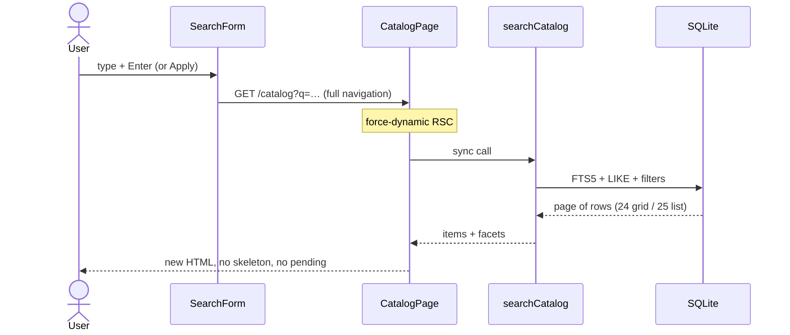
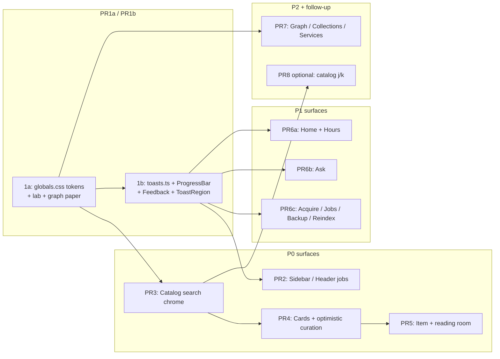

# Helix Library — Look, Feel, and Feedback Craft

| Field | Value |
| --- | --- |
| **Document** | Season design — Look, feel, and feedback craft |
| **Author** | Helix owner + design loop |
| **Date** | 2026-08-15 |
| **Status** | Draft (rev 4) — owner resolved Open Questions 2026-08-15 |
| **Approval** | Owner decided OQ1–OQ4 (2026-08-15). PR plan unchanged. |
| **Workspace** | `/home/brandon/Projects/non-os` (package `helix-library`) |
| **Audience** | Senior engineers implementing on `main` |
| **Baseline** | Daily-usable OPAC; left sidebar landed; `npm test` green; Discovery PR6 `item_events` is a separate track |
| **Related** | [PRODUCT.md](../PRODUCT.md), [SESSION-HANDOFF.md](../SESSION-HANDOFF.md), [AGENTS.md](../../AGENTS.md), [2026-08-discovery-reading.md](./2026-08-discovery-reading.md) |
| **Revision** | rev 4 — owner-resolved OQs (starlight+kind+lamp; object-like cards at current density; `/design` stays in Library ops; j/k remains optional PR8) |

---

## Overview

Helix Library already works. It finds holdings, shelves them, reads them, asks about them, and acquires more of them. The visual system is cohesive — dark-first space chrome, library-native language, a real H+helix mark — and that cohesion is an asset, not a problem to replace.

The problem is that cohesion flattened into sameness. Almost every desk is the same `eyebrow` / `page-title` / `page-sub` / `surface-flat` slab. The accent is starlight gray (`#c8d0e0`). Kind color exists but is quarantined to 2px hairlines and chips. Motion tokens exist and are barely spent. Curator actions report back as paragraphs. Search is a GET form that redraws the page. The system is honest and dull.

This season is a **craft program**, not a rebrand and not a feature dump. Raise material hierarchy, give the library a chromatic point of view that is still library + space, and — more important — make the system *answer immediately and honestly*. Pleasure here is felt speed and tactile confirmation, not decoration.

Work stays inside Next.js 15 + React 19 + Tailwind v4 + `globals.css`. No new CSS framework. No Framer Motion. No shadcn wholesale. No search-ranking rewrite. No embeddings. Discovery PR6 (`item_events`) may run in parallel and must not be blocked.

---

## Background & Motivation

### What already works (do not throw away)

The product is a personal OPAC. The metaphor is right. Several surfaces already have craft and should be treated as the quality bar, not as one-offs:

| Island of craft | Where | Why it works |
| --- | --- | --- |
| Hours due-slip | `HoursDesk` + `.due-slip` in `globals.css` | Object, not chrome. Perforation, stamp, 0.25° hover. Library-native. |
| Helix spinner | `HelixSpinner` + `.helix-spinner-*` | Brand motion with `prefers-reduced-motion` off-ramp. |
| Selection callout | `.sel-callout` / `.sel-sheet` | Press, confirm, blur, caret. Physical. |
| Mini player | `.mini-player-*` | Persistent, press-scale on play, progress fill. |
| Deep Lens terminal | `.lens-term` | Distinct register: grid, scanlines, drop-cap, kind-tinted chrome. |
| Acquire / Backup / Restore bars | `AcquireDesk` `ProgressPanel` (~1580), `BackupPanel` (~211), `RestorePanel` `ProgressBlock` (~720) | Three copies of the same widget. Percent + stage. The tactile job UI — extract once. |
| Holding kind edge | `.holding-card::before` | Quiet identity. The right idea, underplayed. |
| ThemeScript | `ThemeScript.tsx` | Theme + sidebar set before paint. Protect this. |
| Media theater | `.media-theater` | Always-dark preview chrome. Correct. |

The rest of the app does not live at this bar. Home service tiles, catalog filters, item metadata grids, Ask chrome, Collections, Services, and Graph page chrome all share one gray slab recipe.

### Why it feels dull (diagnosis, not a mood)

This is not “add more color.” It is five structural problems that compound.

#### 1. Chromatic identity was deliberately starved, then never given a second job

`src/app/globals.css` is explicit:

```css
/* Sparse starlight accent — cool, desaturated */
--accent: #c8d0e0;
```

Light theme inverts that into near-black ink (`--accent: #1a1d26`). The only chromatic system in the product is **kind** (`--kind-text` … `--kind-document`), and it is used as chip paint plus a 2px card hairline. Graph has a richer phosphor palette in `src/lib/graph/colors.ts` (`#c9a227` amber tags, `#2a9a82` teal locations) that the rest of the UI never borrowed.

Result: the library has no temperature. Night stacks and day reading room are the same gray, inverted.

#### 2. One page recipe, every desk

`PageHeader` exists (`src/components/ui/PageHeader.tsx`) and is **completely unused** — no page imports it. Catalog, Acquire, Ask, Graph, Collections, Locations, Services, Design, and Docs all inline:

```text
p.eyebrow → h1.page-title → p.page-sub → surface / surface-flat
```

`.page-title` is one size (1.375rem / 1.625rem). `.page-sub` is always 0.875rem muted. There is no typographic distinction between a dense catalog, a reading room, and a working desk.

`Surface` (`src/components/ui/Surface.tsx`) already has `raised | flat | inset`. Most pages ignore the stack and put everything on `--surface` over `--paper`. `--surface` (`#111318`) and `--surface-raised` (`#161920`) are 5 RGB values apart. `--paper` (`#08090c`) and `--paper-deep` (`#0c0e13`) are 4. Hierarchy is theoretical.

#### 3. Motion tokens exist; almost nothing spends them

```css
--ease: cubic-bezier(0.22, 1, 0.36, 1);
--dur: 160ms;
```

Global use is a 0.5px button press, 1px card press, 0.5px nav-icon lift, and a 0.2s theme color fade. Everything else that feels alive is one of the islands above (due-slip rotate, helix spinner, sel-callout, mini-player, lens, job bars).

The reduced-motion rule in `globals.css` (~2429) is nuclear — it zeroes *all* transitions. That is correct policy. New motion must ride the same off-ramp, not fight it.

#### 4. Feedback is informational, not tactile

There is **no toast primitive**. Confirmation is:

| Action | Today | Felt as |
| --- | --- | --- |
| Copy path | `CopyPathButton` swaps label 1.4s | Good. Local tick. |
| Tag / shelf (item) | `ItemCuration` `useTransition` + `router.refresh()` + `feedback-err` | Wait, then the chip is just there. No success tick. |
| Bulk shelf / tag / weed | `BulkCurationBar` `busy` + `message` string | Informational paragraph. |
| Reindex | `ReindexButton` `StatusLine` pulse + `feedback-ok` stats | Honest spinner. **No percent exists** — `startReindexAsync` writes `percent: null` and never updates it (`src/lib/indexer/run.ts` ~158–160). `/api/reindex` `serializeJob` also omits `progress`. |
| Header jobs | `HeaderJobsStrip` polls **12s**, types only `{ id, kind, status, label }`, ignores `progress` even though `GET /api/jobs` returns full `HelixJob`s | Easy to miss; stale. |
| Jobs panel | `JobsPanel` text `stage · 42%` | Data without a bar — **for jobs that actually have percent** (acquire / backup / restore). Reindex stays `…`. |
| Ask approve | `proposeBusy` → “Working…” then `proposeNote` | Correct gate; visually a string. |
| Dismiss failed job | Wait for POST, then remove (`RescuePanel`) | Almost optimistic; still waits. |
| Catalog search | Full RSC navigation via GET form | Blank-then-replace. |

`.feedback-ok` / `.feedback-err` are static bordered paragraphs. `StatusLine` is a colored dot. Both are documented in `/design` and then copy-pasted ad hoc.

#### 5. Light theme is an inversion, not a second voice

```css
html[data-theme="light"] {
  --paper: #f4f5f7;
  --accent: #1a1d26;
  --accent-fg: #f4f5f7;
}
```

Cool gray paper + black buttons. Kind chips become saturated pastels on white (the one place light is actually designed). Two other “light papers” disagree: `graphBackground("light")` is `#f0f1f4` (`src/lib/graph/colors.ts`); `.helix-mark-well` in light is `#eef0f3`. There is no day-reading-room paper, no warm lamp, no designed ink accent. Switching theme feels like inverting a screenshot.

`layout.tsx` `viewport.themeColor` uses `prefers-color-scheme`, **not** `html[data-theme]`. An in-app toggle does not update the browser chrome color today.

### Current search path (felt performance)



Server work is cheap (localhost SQLite; `pageSize` 24/25, hard cap 100). **Perceived** latency is the navigation: the grid vanishes, the page remounts, thumbs refetch. Filter chips (`ActiveFilters`, kind/tag facet `Link`s) already do client-side Next navigation; the search box and the `.toolstrip` fields do not — they wait for a submit.

`/` focuses the first `input[name=q]` (`SearchHotkey`). Esc blurs. There is no j/k browse, no stale-while-revalidate, no highlight entrance.

`hrefFor` is a **closure inside** `src/app/catalog/page.tsx` (lines 150–182). No shared URL builder exists. The toolstrip is not only `<select>`s — `under` is an uncontrolled text input.

This is the highest-leverage feel bug in the product. The engine is already fast. The chrome lies about it.

---

## Goals & Non-Goals

### Goals

| # | Goal | Done looks like |
| --- | --- | --- |
| G1 | Material hierarchy | Paper / stack / raised / overlay read as four layers on every P0 surface. Pages stop looking like one slab. |
| G2 | Chromatic point of view | Starlight remains chrome. Kind color becomes holding identity. A single warm **lamp** token is reserved for circulation (hours, reading, due). Not rainbow. |
| G3 | Light as a designed mode | Day reading room: warm paper, designed ink accent, kind chips that still belong. Not an inversion. |
| G4 | One feedback system | Press / pending / success / fail / progress / empty / stale exist as primitives and are used by the surfaces this season touches (catalog, item curation, jobs, acquire, ask, home rescue). |
| G5 | Catalog feels instant | Filter click or query keystroke shows a **defined pending state** in < 100ms perceived (stale dim *or* skeletons — see client contract). Hits flash once. |
| G6 | Optimistic where safe | Tag, shelf, select, dismiss-job update the UI first, with the call-site contracts below. Disk-touching and approval-gated actions never do. |
| G7 | Motion as confirmation | One easing family. Durations by intent. Nothing decorative on idle hover except the few objects that already earn it (due-slip, card press). Logo does not scale. |
| G8 | `/design` is the living spec | Lab shows tokens, motion, feedback, materials, both themes. Internal, not a marketing page. |

### Non-goals (this season)

| Out of scope | Why |
| --- | --- |
| Rebrand / new metaphor / mascot | Helix Library stays Helix Library |
| New CSS framework, shadcn wholesale, Framer Motion, anime.js | Stack lock; CSS + existing `HelixSpinner` is enough |
| Sound by default; notification center | One user, localhost; audio is opt-in or not at all |
| Onboarding carousel | Owner already lives here |
| Rewrite search ranking / embeddings | Discovery track; explicit non-goal |
| Discovery PR6 `item_events` | Parallel product track — do not block or rewrite |
| 3D everywhere / graph physics changes | Graph chrome only |
| Logo hover scale | SESSION-HANDOFF lock |
| Public `/design` marketing page | Stays internal lab |
| Multi-tenant polish, auth chrome, marketing landing | Personal use |
| Changing domain language | Item, Location, Collection, holdings, shelves, reading room |
| Determinate reindex percent | Indexer never writes `percent`; out of season |
| Drive-by `PageHeader` migrations | Only listed pages; see typography |
| Related rail rebuilt as `ItemCard` grid | Stays a text list |
| Keyboard j/k on catalog | Follow-up PR8; not in PR3 Done |

---

## Craft principles

A future PR is in-scope if it can be judged against these. If it fails them, it is decoration.

1. **Objects over chrome.** A holding is a thing in a collection. A due-slip is a thing. A job is a thing with a fill. A page header is not a thing. Prefer mass, edge, and kind-tint on objects; keep chrome quiet.

2. **Feedback before decoration.** If a control mutates state, it must have pending and terminal states before it gets a hover gradient. Unanswered clicks are the main source of dullness.

3. **Density with air.** Catalog is dense and scannable. Reading room is comfortable. Desks (Acquire, Ask, Services) are utilitarian. Do not apply one padding recipe to all three.

4. **One accent voice, kind as identity.** Starlight (`--accent`) is chrome: focus, primary buttons, selection. Kind color is the holding. Lamp (`--lamp`) is circulation only (hours, reading warmth). Never paint the shell in kind rainbows.

5. **Motion as confirmation.** Motion tells you the system heard you. It does not entertain you while you wait. Micro for press, UI for state change, scene only for room/graph/lightbox.

6. **Librarian-calm, not startup-hype.** No confetti, no bounce-in dashboards, no “you’re on fire 🔥”. A completed reindex is a quiet ok. A failed restore is a clear danger. The tone is a good reference desk.

7. **Two voices, one system.** Dark is night stacks (cool paper, starlight chrome). Light is day reading room (warm paper, ink accent). Same components, different designed tokens — not `invert()`.

8. **Instant honesty.** Show the next state immediately when it is local and reversible. Show progress when work is real. Never fake a disk write. Never invent a path.

---

## Proposed Design

### Architecture (season delta)



No new runtime dependencies. All of this is CSS tokens + a few existing-module components.

### Visual system upgrades

#### Material stack

Today: `--paper` / `--surface` / `--surface-raised` / `--surface-hover` are too close, and `--shadow-soft` is a faint inset hairline.

Introduce an explicit four-layer model. Keep existing class names; retune values and add two.

| Layer | Token / class | Role | Dark (after) | Light (after) |
| --- | --- | --- | --- | --- |
| Paper | `--paper` | App ground | `#08090c` (keep) | `#f3efe6` warm ivory |
| Paper deep | `--paper-deep` | Inset wells, empty media | `#0b0d12` | `#e8e2d6` |
| Stack | `--surface` + `.surface-flat` | Recessed lists, filter wells | `#0e1015` | `#faf7f0` |
| Raised | `--surface-raised` + `.surface` | Cards, desks, toolstrips | `#141821` | `#fffdf8` |
| Overlay | **new** `--surface-overlay` | Solid mix color for toast / callout / bulk bar | `#1a1f2a` | `#fffdf8` |
| Hover | `--surface-hover` | Interactive wash | `#1c212c` | `#efe8da` |

`--surface-overlay` is the **solid hex**. Translucency and blur live on the class, not in the variable (so `/design` swatches stay opaque and readable):

```css
.surface-overlay {
  background: color-mix(in srgb, var(--surface-overlay) 92%, transparent);
  backdrop-filter: blur(14px) saturate(1.2);
  -webkit-backdrop-filter: blur(14px) saturate(1.2);
  border: 1px solid var(--line-strong);
  border-radius: var(--radius);
  box-shadow: var(--shadow-lift);
}
html[data-theme="light"] .surface-overlay {
  background: color-mix(in srgb, var(--surface-overlay) 94%, transparent);
}
```

Same blur recipe as `.bulk-bar` (14px). Add `overlay` to `Surface`’s variant union. Existing `.bulk-bar` / `.sel-callout` can migrate to this class in the PR that touches them; not a drive-by.

`--shadow-soft` / `--shadow-lift` stay. Raised objects pick up a **kind-aware** hairline (already started on `.holding-card`).

#### Chromatic point of view

**Do not replace starlight.** Do not introduce a SaaS purple.

| Voice | Token | Job | Dark | Light |
| --- | --- | --- | --- | --- |
| Chrome | `--accent` | Buttons, focus, selection, search submit | `#c8d0e0` (keep) | `#243044` designed ink-slate, **not** `#1a1d26` |
| Chrome hover | `--accent-hover` | | `#e8ecf4` | `#161b26` |
| Circulation | **new** `--lamp` | Hours, due, reading-room warmth, dawn hero | `#d4a574` | `#825530` |
| Circulation soft | **new** `--lamp-soft` | | `rgb(212 165 116 / 0.14)` | `#f0e2cf` |

`--lamp` light is `#825530` (not `#9a6b3a`) so contrast on `#f3efe6` is ~5.6:1 (AA for small text). Dark `#d4a574` on `#08090c` is ~8.7:1.

**Lamp allowlist (closed):**

- `.due-slip` border / stamp (replace the current `color-mix(accent, danger)` hack)
- `.hero-dawn` (drive the existing sepia filter from `--lamp`)
- Reading-room focus ring when `?room=1` (today `ring-[var(--accent)]/40`)

**Not lamp:** sidebar, primary buttons, Ask streaming caret (use `--accent`), toasts, focus rings, service tiles.

Kind usage upgrade (identity, not rainbow):

- Facet chips for format use `--kind-*-bg` + kind ink when active (`chip` + `kind-*`), not generic `chip-active`.
- Empty card media already has a radial kind wash — keep, raise opacity from 14% to 22%.
- Selected card keeps starlight ring; kind hairline thickens (already). Do not fill the card with kind.
- Home stat chips for kind stay `chip-stat`; optional 3px kind underline, not a colored tile.

#### Token tables (before → after)

Every token `DesignAssetsLab` `COLOR_TOKENS` lists is in this table. Kind chips and overlay follow.

**Dark (default) — keep the night, add lamp + overlay**

| Token | Before | After | Why |
| --- | --- | --- | --- |
| `--ink` | `#eef0f4` | `#eef0f4` | Keep |
| `--ink-soft` | `#c4c9d4` | `#c4c9d4` | Keep |
| `--muted` | `#8b929e` | `#8b929e` | Keep |
| `--muted-faint` | `#6b7280` | `#6b7280` | Keep |
| `--line` | `rgb(255 255 255 / 0.08)` | `rgb(255 255 255 / 0.08)` | Keep |
| `--line-strong` | `rgb(255 255 255 / 0.14)` | `rgb(255 255 255 / 0.14)` | Keep |
| `--paper` | `#08090c` | `#08090c` | Ground is correct |
| `--paper-deep` | `#0c0e13` | `#0b0d12` | Slightly deeper well |
| `--surface` | `#111318` | `#0e1015` | Stack recedes from raised |
| `--surface-raised` | `#161920` | `#141821` | Cards lift |
| `--surface-hover` | `#1a1e27` | `#1c212c` | Clearer hover |
| `--surface-overlay` | — | `#1a1f2a` | Solid; class adds 92% + blur |
| `--accent` | `#c8d0e0` | `#c8d0e0` | Starlight stays |
| `--accent-hover` | `#e8ecf4` | `#e8ecf4` | Keep |
| `--accent-fg` | `#0a0b0f` | `#0a0b0f` | Keep |
| `--accent-soft` | `rgb(200 208 224 / 0.1)` | same | Keep |
| `--accent-muted` | `rgb(200 208 224 / 0.14)` | same | Keep |
| `--accent-ring` | `rgb(200 208 224 / 0.28)` | same | Keep |
| `--accent-glow` | `rgb(140 160 220 / 0.07)` | same | Keep |
| `--ok` | `#6ee7b7` | `#6ee7b7` | Status stays |
| `--ok-soft` | `rgb(110 231 183 / 0.12)` | same | Keep |
| `--warn` | `#fbbf24` | `#fbbf24` | Keep |
| `--warn-soft` | `rgb(251 191 36 / 0.12)` | same | Keep |
| `--danger` | `#f87171` | `#f87171` | Keep |
| `--danger-soft` | `rgb(248 113 113 / 0.12)` | same | Keep |
| `--lamp` | — | `#d4a574` | Circulation only |
| `--lamp-soft` | — | `rgb(212 165 116 / 0.14)` | |
| `--header-bg` | `rgb(8 9 12 / 0.82)` | same | Keep |
| `--dur` | `160ms` | `180ms` | UI intent |
| `--dur-micro` | — | `90ms` | Press |
| `--dur-scene` | — | `320ms` | Room / lightbox |
| `--ease` | `cubic-bezier(0.22, 1, 0.36, 1)` | same | Keep |
| `--ease-out` | — | `cubic-bezier(0.4, 0, 1, 1)` | Exits |

Dark kind tokens **keep current values** (already muted: fg hex + 10–12% alpha bg). Empty-media wash is a separate opacity bump on `.holding-card__media-empty` (14% → 22%), not a token change.

| Kind | `--kind-*` (keep) | `--kind-*-bg` (keep) |
| --- | --- | --- |
| text | `#7dd3fc` | `rgb(125 211 252 / 0.1)` |
| image | `#c4b5fd` | `rgb(196 181 253 / 0.1)` |
| video | `#f9a8d4` | `rgb(249 168 212 / 0.1)` |
| audio | `#fcd34d` | `rgb(252 211 77 / 0.1)` |
| archive | `#a8a29e` | `rgb(168 162 158 / 0.12)` |
| code | `#6ee7b7` | `rgb(110 231 183 / 0.1)` |
| document | `#93c5fd` | `rgb(147 197 253 / 0.1)` |
| other | `#9ca3af` | `rgb(156 163 175 / 0.1)` |

**Light — designed day, not invert**

| Token | Before | After | Why |
| --- | --- | --- | --- |
| `--ink` | `#0c0e12` | `#1a1712` | Book ink |
| `--ink-soft` | `#2a2f3a` | `#2c2820` | Warm, not cool slate |
| `--muted` | `#6b7280` | `#6f675c` | Warm gray |
| `--muted-faint` | `#9ca3af` | `#9a9286` | Warm faint |
| `--line` | `rgb(12 14 18 / 0.09)` | `rgb(26 23 18 / 0.10)` | Warm hairline |
| `--line-strong` | `rgb(12 14 18 / 0.14)` | `rgb(26 23 18 / 0.16)` | |
| `--paper` | `#f4f5f7` | `#f3efe6` | Book paper |
| `--paper-deep` | `#e8eaef` | `#e8e2d6` | Warm well |
| `--surface` | `#ffffff` | `#faf7f0` | Stack ≠ raised |
| `--surface-raised` | `#ffffff` | `#fffdf8` | Card is the page-in-sun |
| `--surface-hover` | `#f0f1f4` | `#efe8da` | Warm hover |
| `--surface-overlay` | — | `#fffdf8` | Class adds 94% + blur |
| `--accent` | `#1a1d26` | `#243044` | Designed slate |
| `--accent-hover` | `#0c0e12` | `#161b26` | |
| `--accent-fg` | `#f4f5f7` | `#f6f1e8` | Matches paper |
| `--accent-soft` | `rgb(26 29 38 / 0.06)` | `rgb(36 48 68 / 0.08)` | Follows new accent |
| `--accent-muted` | `rgb(26 29 38 / 0.1)` | `rgb(36 48 68 / 0.12)` | |
| `--accent-ring` | `rgb(26 29 38 / 0.22)` | `rgb(36 48 68 / 0.28)` | |
| `--accent-glow` | `rgb(100 120 180 / 0.06)` | `rgb(154 107 58 / 0.08)` | Warm glow, not cool |
| `--ok` | `#059669` | `#047857` | Slightly deeper on ivory |
| `--ok-soft` | `#ecfdf5` | `#e6f4ec` | Less mint-on-gray |
| `--warn` | `#d97706` | `#d97706` | Already warm |
| `--warn-soft` | `#fffbeb` | `#f8efd8` | Warm wash |
| `--danger` | `#dc2626` | `#dc2626` | Keep readable |
| `--danger-soft` | `#fef2f2` | `#f8e8e6` | Warm wash |
| `--lamp` | — | `#825530` | ≥4.5:1 on ivory |
| `--lamp-soft` | — | `#f0e2cf` | |
| `--header-bg` | `rgb(244 245 247 / 0.86)` | `rgb(243 239 230 / 0.88)` | Matches paper |
| `--shadow-soft` | cool black 4%/6% | `0 1px 2px rgb(26 23 18 / 0.05), 0 8px 28px rgb(26 23 18 / 0.07)` | Warm shadow |
| `--shadow-lift` | cool | `0 2px 4px rgb(26 23 18 / 0.06), 0 16px 40px rgb(26 23 18 / 0.11)` | |

Light kind **foregrounds keep** (already designed inks). Light kind **backgrounds** drop ~10% chroma (HSL S −10):

| Kind | `--kind-*` (keep) | `--kind-*-bg` before | `--kind-*-bg` after |
| --- | --- | --- | --- |
| text | `#0369a1` | `#e0f2fe` | `#e2f0fa` |
| image | `#6d28d9` | `#ede9fe` | `#eeeafc` |
| video | `#be185d` | `#fce7f3` | `#fbe9f3` |
| audio | `#b45309` | `#fef3c7` | `#fdf3cb` |
| archive | `#57534e` | `#f5f5f4` | `#f3efe8` |
| code | `#047857` | `#d1fae5` | `#d4f6e4` |
| document | `#1d4ed8` | `#dbeafe` | `#dce8fb` |
| other | `#4b5563` | `#f3f4f6` | `#f1eee8` |

**Coupled light papers (same PR1a — do not leave them cool):**

| Surface | Before | After |
| --- | --- | --- |
| `html[data-theme="light"] .helix-mark-well` | `#eef0f3` | `#ebe6db` |
| `graphBackground("light")` in `src/lib/graph/colors.ts` | `#f0f1f4` | `#e8e2d6` (`--paper-deep`) |
| `html[data-theme="light"] .graph-shell` override `#eef0f3` | `#eef0f3` | **keep the rule**; set `background: var(--paper-deep)` (do not delete — Tailwind `bg-[var(--paper)]` on the three shells would otherwise paint ivory around a `--paper-deep` canvas) |
| `layout.tsx` `themeColor` light entry | `#f4f5f7` | `#f3efe6` (OS-light users) |
| In-app toggle | does not update meta | `ThemeToggle.applyTheme` sets `meta[name="theme-color"]` to `--paper` |

`viewport.themeColor` in `layout.tsx` still keys off `prefers-color-scheme`. That is the OS default before JS. The toggle must write the meta tag so a dark-OS user who switches to day reading room gets ivory browser chrome.

Contrast notes (checked):

- Dark `--lamp` `#d4a574` on `--paper` `#08090c`: ~8.7:1
- Light `--lamp` `#825530` on `--paper` `#f3efe6`: ~5.6:1
- Light `--accent` `#243044` on `--surface-raised` `#fffdf8`: ~16:1
- Light `--accent-fg` `#f6f1e8` on `--accent` `#243044`: ~13:1

#### Typography

Keep Geist Sans + Geist Mono (`layout.tsx`). Do not add a display face.

Add registers as utility classes in `globals.css`, consumed by `PageHeader` via a `register` prop:

| Register | Class | Use | Spec |
| --- | --- | --- | --- |
| Desk | `.type-desk` (current `page-title`) | Default `PageHeader` | 1.375 / 1.625rem, weight 600, tracking −0.025em |
| Catalog | `.type-catalog` | Catalog, Graph title | 1.25 / 1.375rem — slightly smaller, more scannable |
| Room | `.type-room` | Item title | 1.5 / 1.875rem, tracking −0.03em |
| Home | existing hero h1 | Home only | keep 1.65 / 2.15rem |

**Who migrates to `PageHeader` this season:** Catalog (PR3), Item title block (PR5), Graph (PR7). **Desks not listed keep current hand-rolled titles until a later cleanup; no drive-by PageHeader migrations.** That includes Acquire, Ask, Services, Locations, Docs, Design, Collections.

Reading-room body: `.reading-room-text` in CSS **only styles `::selection`**. Font size lives on Tailwind in `DocumentReadingRoom.tsx` (`font-mono text-xs … sm:text-sm`). Comfort bump is a **component class change**, not a ghost CSS rule: `text-xs sm:text-sm` → `text-sm leading-relaxed sm:text-[0.9375rem]`. Stay mono. Do not invent a serif prose room. Theater stays dark.

#### Holding cards as objects

`.holding-card` is close. Changes, all in CSS + `ItemCard.tsx` (PR4, after PR3 skeletons match current geometry):

1. **Geometry.** Keep 4:3 (phone) / square (sm+). Do not go cinematic 16:9.
2. **Empty media.** Raise kind radial from 14% to 22%. Drop the centered `KindBadge` + filename stack so the card reads as a folio; filename lives only in `__meta`.
3. **Thumb load.** Wrap `` in a same-geometry placeholder (`bg-[var(--paper-deep)]` + kind wash). `onLoad` adds `.is-loaded` → opacity 0→1 in `--dur`. No blur-up library. No `next/image`.
4. **Hover.** Keep border/shadow lift. Keep `group-hover:scale-[1.03]` on the **image only**. Do not scale the card.
5. **Press.** Keep 1px translateY. Add shadow compression so it feels like a tap.
6. **List rows.** `.holding-row` thumb well gets the same kind wash when there is no preview.

### Motion language

One family. Three durations. No motion library.

```css
--ease: cubic-bezier(0.22, 1, 0.36, 1);      /* existing — keep */
--ease-out: cubic-bezier(0.4, 0, 1, 1);
--dur-micro: 90ms;   /* press, checkbox, icon swap */
--dur: 180ms;        /* was 160 — hover, focus, chip, toast in */
--dur-scene: 320ms;  /* lightbox, reading-room expand */
```

| Intent | Duration | Examples |
| --- | --- | --- |
| Press | `--dur-micro` | `.btn:active`, card tap, play button |
| UI | `--dur` | Chip appear, toast, pending opacity, search-hit flash, accordion chevron |
| Scene | `--dur-scene` | Lightbox, reading-room expand |

**Do not animate:** Helix mark, sidebar width beyond the existing `--dur` width/margin, theme background beyond the existing 0.2s color fade, graph physics, graph fullscreen (already `position: fixed`).

**Reduced motion.** Keep the nuclear rule. New keyframes (`search-hit-flash`, `toast-in`, `chip-in`, `progress-indeterminate`) each have an explicit `prefers-reduced-motion` disable.

**Logo lock.** `HelixMark` does not scale, rotate, or glow on hover. `.app-sidebar-brand:hover` already washes with `--surface-hover` — leave that. Do not add tracking/copy changes to the brand lockup.

### Feedback system

#### Runtime homes

Two modules. Do not add `sonner` / `react-hot-toast`.

**1. `src/lib/client/toasts.ts`** — subscribe/publish store, same pattern as `src/lib/client/sidebar.ts` (module state, no React in the store). Must be importable from Node tests (no `window` at module scope).

```ts
export type FeedbackTone = "ok" | "warn" | "danger" | "info";

export type Toast = {
  id: string;
  tone: FeedbackTone;
  title: string;
  detail?: string;
  href?: string;
  timeoutMs: number; // 0 = sticky
};

export function subscribeToasts(cb: () => void): () => void;
export function getToastSnapshot(): readonly Toast[];
export function toast(t: Omit<Toast, "id" | "timeoutMs"> & { timeoutMs?: number }): string;
export function dismissToast(id: string): void;
```

Store rules:

- Max **3** visible. Push newest at index 0; drop the tail.
- Default `timeoutMs`: `3200` for `ok`/`info`/`warn`; `0` (sticky) for `danger`.
- `href` sanitizer: allow only same-origin **relative** paths matching `^/(catalog|services|acquire|collections)(/[0-9]+)?(\?.*)?$`. Drop anything else (absolute `file:` / POSIX paths / `http:`). Toasts never include filesystem paths in `title`/`detail` either — callers pass catalog titles, not `item.path`.
- Ids: `t-${++seq}` (monotonic, not `Date.now()`, so tests are deterministic).

**2. `src/components/ui/Feedback.tsx`**

```tsx
export function toast(...): string;        // re-export of store.toast
export function dismissToast(id: string): void;
export function ToastRegion(): JSX.Element; // useSyncExternalStore(getToastSnapshot)
export function InlineStatus(props: {
  tone: FeedbackTone;
  children: React.ReactNode;
  className?: string;
}): JSX.Element;
```

`InlineStatus` **wraps** `.feedback-ok` / `.feedback-err` (plus new `.feedback-warn` / `.feedback-info`). Do **not** delete the CSS classes this season. `/design` keeps showing both the classes and `<InlineStatus>`. Migration is opportunistic: a file that already touches a `feedback-ok` paragraph switches to `InlineStatus`.

`ToastRegion` mounts once in `AppShell` (inside the sidebar provider, sibling of `.app-frame` so it is not clipped by `overflow-x: clip` on `body` — if clipping wins, portal to `document.body`). CSS:

```css
.helix-toast-region {
  position: fixed;
  right: max(0.75rem, env(safe-area-inset-right, 0px));
  bottom: calc(0.75rem + var(--mini-player-h, 0px) + env(safe-area-inset-bottom, 0px));
  z-index: 85;
  display: flex;
  flex-direction: column;
  gap: 0.5rem;
  width: min(22rem, calc(100vw - 1.5rem));
  pointer-events: none;
}
.helix-toast-region > * { pointer-events: auto; }
```

z-index map (do not invent new layers above 100):

| Layer | z |
| --- | --- |
| Skip-link | 100 |
| `.tip` | 90–100 |
| **Toasts** | **85** |
| Mini player / lightbox / `.sel-callout` | 80 |
| Sidebar / scrim | 54–55 |
| Header | 50 |
| `.bulk-bar` | 30 |

Newest on top = first child (store prepends). Collision with `.bulk-bar`: toasts sit higher and to the right; bulk bar is bottom-center. If both show, toast stays above the player offset, not above the bulk bar — acceptable.

**3. `src/components/ui/ProgressBar.tsx`**

```tsx
export function ProgressBar(props: {
  percent: number | null; // null = indeterminate
  active: boolean;
  label?: string;
  detail?: string;
  size?: "compact" | "default"; // default "default"
}): JSX.Element;
```

- `default`: copy Acquire `ProgressPanel` (`AcquireDesk.tsx` ~1608–1620) — **`h-1.5` (6px / 0.375rem) track**, label row, optional detail. Not `h-6` / 1.5rem.
- `compact`: **4px** track, no detail, label optional (header chip).
- `aria-valuemin={0}` `aria-valuemax={100}` `aria-valuenow={percent}` when `percent != null`; omit `valuenow` when indeterminate.
- Indeterminate: existing `w-1/3 animate-pulse` (respect reduced-motion).

**Extract targets (not all in one PR):**

| Widget | File | Lands |
| --- | --- | --- |
| `ProgressPanel` | `AcquireDesk.tsx` ~1580 | PR6c |
| Backup progress block | `BackupPanel.tsx` ~211 | PR6c |
| `ProgressBlock` | `RestorePanel.tsx` ~720 | PR7 |
| Jobs list percent | `JobsPanel.tsx` | PR6c |
| Header compact | `HeaderJobsStrip.tsx` | PR2 (uses compact; reindex will be indeterminate) |
| ReindexButton | `ReindexButton.tsx` | PR6c — **indeterminate only** unless `percent != null` |

PR1b ships the primitive + a `/design` demo. No production extract in 1b.

#### When to toast vs inline

| Situation | Channel |
| --- | --- |
| User is looking at the control (tag add on item, bulk bar, acquire card) | Inline (`InlineStatus` / existing `ResultPanel`) |
| User may have navigated or the control is off-screen (reindex completed, acquire finished while module collapsed or `document.visibilityState === "hidden"`) | Toast |
| Copy / tiny reversible | Control tick (`CopyPathButton` pattern) — no toast |
| Approval-gated librarian mutation | Stay on the Ask transcript (`proposeNote`) — no toast stealing the gate |

#### State map

| State | Visual | a11y | Used by |
| --- | --- | --- | --- |
| **Press** | 0.5–1px translateY, shadow compress | n/a | `.btn`, `.holding-card`, play |
| **Pending** | HelixSpinner in the button; `aria-busy`; disable only that control | `aria-busy="true"` | Mutating buttons this season touches |
| **Success** | Check swap 1.2–1.6s **or** `InlineStatus` ok **or** toast | `role="status"` | Tag, shelf, copy, acquire result |
| **Fail** | `InlineStatus` danger + keep the control enabled | `role="alert"` | All mutations |
| **Progress** | `ProgressBar` from job `percent` / stage | `aria-valuenow` when determinate | Acquire, backup, restore, header (when percent set) |
| **Empty** | `.empty-state` with one next action | heading + link | Catalog, home |
| **Stale** | Previous results stay at `opacity: 0.72`; **no** skeletons | `aria-busy` on results | Catalog refine (see contract) |

#### Optimistic + reversible (call-site contracts)

**Forbidden (never optimistic) — unchanged:**

- Reindex, backup, restore
- Any Acquire job (writes files under a location root)
- Location add/update/remove (rewrites `library.config.json`)
- Librarian `[[action:…]]` until Approve
- Weeding `purge_missing` (confirm + wait for POST)
- Deep Lens analysis run

**Allowed — implement exactly as follows.**

**A. `ItemCuration` tags (add + remove)**

Chips become local overlay state seeded from props:

```ts
type Chip = { id: number; name: string; temp?: boolean };
// id < 0 ⇒ client temp
```

- **Add:** `normalizeTagName` first (`src/lib/client/tag-normalize.ts`). If null, no-op. Append `{ id: -Date.now(), name, temp: true }`. POST `/api/items/:id/tags` `{ name }`. Today the route returns `{ ok: true }` only (`addTagToItem` is `void`) — **do not require an API change**. On `!ok`: drop the temp chip, `setError`. On ok: keep the temp chip; `router.refresh()`. Reconcile: whenever `itemTags` props contain that `name`, drop temps with that name (prevents duplicate after refresh).
- **Remove:** snapshot chips, drop immediately, DELETE `{ tagId }`. On fail: restore snapshot + error. On ok: `router.refresh()`.
- Collections add/remove on the same component: same snapshot/rollback on the `itemCollections` list (ids are real).

**B. `BulkCurationBar`**

There are no per-item chips on the bar. Optimism = **instant `InlineStatus`** (“Shelving…”, then the existing success sentence). Do **not** mutate `CatalogResults` cards. `router.refresh()` updates the grid. Weeding stays confirm + wait.

**C. `RescuePanel` + `JobsPanel` dismiss**

True remove-first:

```ts
const snapshot = failedJobs;
setFailedJobs((prev) => prev.filter(...)); // or [] for allFailed
POST /api/jobs/dismiss
on fail: setFailedJobs(snapshot); setError(...)
```

`dismiss({ allFailed: true })` rollbacks to the full snapshot array. Include **both** `RescuePanel` and `JobsPanel` in PR4.

**D. Select / deselect**

Already local in `CatalogResults`. No change.

**E. `ItemTitleEditor`**

**Pending only** (already has `busy`). Not optimistic — the page `<h1>` is server-rendered. Do not invent a local title overlay.

**P2+ mutating leftovers (not G4 this season):** `LocationAdmin`, `TagHygienePanel`, `CreateCollectionForm`, `EditCollectionForm`, `DeleteCollectionButton`. They keep current pending/error strings. Locations is a config-writing desk and is **not** on the P0/P1/P2 craft map — leave it alone.

#### Jobs / header feel

`HeaderJobsStrip` polling at **12s** is why the header feels dead. Change:

- Poll 12s when idle (keep — protects `next dev` compile).
- Poll **1.2s** while any job is `running`/`pending` (same as `JobsPanel`).
- Widen the fetched type to `HelixJob` (or `{ …, progress: HelixJobProgress }`). `GET /api/jobs` already returns full jobs via `toHelixJob`.
- Render compact `ProgressBar` when `progress.percent != null`; **else** spinner + label (current). Reindex will always take the else branch this season.
- On transition to `completed`, flash the chip to `--ok` for 1.6s, then hide. Optional toast: “Reindex done — +N added” with `href: "/services"` (no filesystem paths).

`JobsPanel` uses `ProgressBar` in PR6c. That is the text-vs-bar bug (acquire/backup/restore). Reindex stays indeterminate there too.

### Search / filter feel — client contract

Do **not** change `searchCatalog`, FTS5, ranking, or snippet logic.

#### Shared URL builder

Extract the closure at `src/app/catalog/page.tsx` lines 150–182 to:

`src/lib/catalog/href.ts`

```ts
export type CatalogHrefState = {
  q?: string;
  kind?: string;
  location?: string;
  collection?: string;
  tag?: string;
  under?: string;
  missing?: string;
  untagged?: string;
  sort?: string;
  dir?: string;
  view?: string;
  /** True when the URL already had `?view=grid` (user clicked Grid). */
  viewExplicit?: boolean;
  page?: string | number;
};

export function catalogHref(state: CatalogHrefState): string;
```

`catalogHref` is a **pure function of `state`**. It encodes the **full** live `hrefFor` default-omission table (`src/app/catalog/page.tsx` 150–182), not “drop empties” alone. FormData from `.catalog-filters` always has `sort=mtime` and `dir=desc` selected — without this table every Format change would emit `?sort=mtime&dir=desc` and smart-shelf seeds would drift.

| Key | Omit when |
| --- | --- |
| any | value is `undefined`, `null`, or `""` |
| `page` | `"1"` or `1` |
| `sort` | `"mtime"` (the default) |
| `dir` | default for the **effective** sort: `asc` when `sort === "name"`, `desc` otherwise (`sort` empty/`mtime` ⇒ treat as `mtime` ⇒ omit `dir` when `desc`) |
| `view` | `"grid"` **unless** `viewExplicit === true`. Always emit `view=list`. |

Effective sort for the dir rule is `state.sort` if it is a non-empty non-default value, else `"mtime"`. Do **not** replicate hrefFor’s two-phase “compute dir from page sort, then spread overrides” — omit from the **result** state so `catalogHref({ sort: "name" })` does not emit a leftover `dir=desc`.

CatalogSearch / FormData: pass the select values through as-is (`mtime`/`desc` included). `catalogHref` strips them. For `viewExplicit`, read the current URL (`sp.view === "grid"`) or a hidden field; do not invent `?view=grid` on inferred grid.

`smartQueryToCatalogHref` in `src/lib/collections/manage.ts` (~126–139) already builds `/catalog?…` and already omits `sort === "mtime"`, but always emits `dir` when `sortDir` is set. **Rewrite it as a thin wrapper** that maps `SmartShelfQuery` → `CatalogHrefState` and returns `catalogHref(...)`. `src/lib/catalog/href.ts` stays a leaf (no `manage.ts` import). PR3 files include `manage.ts`.

Add `tests/catalog-href.test.ts`:

| Input | Output |
| --- | --- |
| `{}` | `/catalog` |
| `{ sort: "mtime", dir: "desc" }` | `/catalog` (FormData default — **required**) |
| `{ sort: "name" }` | `/catalog?sort=name` (default dir `asc` omitted) |
| `{ sort: "name", dir: "asc" }` | `/catalog?sort=name` |
| `{ sort: "name", dir: "desc" }` | `/catalog?sort=name&dir=desc` |
| `{ sort: "mtime", dir: "asc" }` | `/catalog?dir=asc` (non-default dir on default sort) |
| `{ q: "mars", kind: "image" }` | `/catalog?q=mars&kind=image` |
| `{ page: 1 }` | `/catalog` |
| `{ view: "grid" }` | `/catalog` |
| `{ view: "grid", viewExplicit: true }` | `/catalog?view=grid` |
| `{ view: "list" }` | `/catalog?view=list` |
| `{ missing: "1" }` | `/catalog?missing=1` |

Also assert `smartQueryToCatalogHref({ sort: "mtime", sortDir: "desc" }) === "/catalog"` so the wrapper cannot drift.

#### History + scroll

| Event | History | `scroll` |
| --- | --- | --- |
| Typing `q` or `under` (debounced 180ms) | `router.replace` | `false` |
| Enter in search (flush debounce) | `router.push` | `false` |
| Select change (kind / location / collection / tag / sort / dir) | `router.push` | `false` |
| Facet chip, `ActiveFilters` clear, Clear all | `router.push` | `false` |
| Pagination Previous / Next | `router.push` | `false`, then scroll the results heading into view (`block: "start"`) — not the document top |

Never `push` per keystroke. Back button returns to the last **committed** query (Enter / select / chip), not `?q=f` → `?q=fo`.

#### `under`

Debounce **180ms**, same as `q`, `replace` + `scroll: false`. Serialize the whole `.catalog-filters` form via `FormData` so a half-typed `under` and the current selects stay in sync. Do not leave `under` Apply-only.

#### Apply button (progressive enhancement)

Keep `<button type="submit">Apply</button>` in the GET form (no-js works). After hydrate (`useEffect` → `setHydrated(true)`), add `.sr-only` to Apply so it is not a second visual control. Do not `display: none` (still submittable). No `<noscript>` needed if the button stays in the DOM.

#### Pending paint (never both stale and skeletons)

`CatalogResultsShell` (client) wraps the results region. `isPending` from `useTransition`. Compare previous vs next URL:

| Situation | Show |
| --- | --- |
| Refine: previous `items.length > 0` and `page` unchanged | Previous cards at `opacity: 0.72`, `aria-busy`. **No skeletons.** |
| Empty → first results (previous `items.length === 0`) | `ItemCardSkeleton` × pageSize (24/25) |
| Page change (`page` param changed) | Skeletons × pageSize (do not flash page 1 while loading page 2) |
| View change (grid ↔ list) | Skeletons in the **target** geometry |

App Router already keeps the previous RSC UI during `useTransition`. The shell applies the dim **on top of that**, or swaps to skeletons for empty/page/view. Never render stale cards *and* a skeleton grid.

#### In-flight races

```ts
let navGen = 0;
function navigate(href: string, opts: { history: "replace" | "push"; scroll: boolean }) {
  const my = ++navGen;
  startTransition(() => {
    if (my !== navGen) return; // a newer keystroke/select won
    if (opts.history === "replace") router.replace(href, { scroll: false });
    else router.push(href, { scroll: opts.scroll });
  });
}
```

Debounce timer is cleared and reset on every `q`/`under` keystroke. Enter flushes immediately (`clearTimeout` + `navigate` push). “Ignore stale renders” is this generation counter — not a hand-wave around RSC.

#### Facet / ActiveFilters client boundary

`ActiveFilters` is currently a server component of `<Link>`s. Give it an optional `onNavigate?: (href: string) => void`. When provided (catalog page, from the client shell), render `<button>`/`<a onClick>` that `preventDefault` and call `onNavigate` (push + scroll false + transition). When omitted (any other caller), keep `<Link>`. Same optional callback on the facet chip list in the catalog page (or a tiny `CatalogNavLink` client component).

#### Keyboard (not PR3)

`/` and Esc stay (`SearchHotkey`). **j / k browse is PR8**, not PR3 Done. Spec for PR8 (so it is implementable when/if shipped):

- Class: `.is-browse` on the card/row — **not** `.is-active` (that is nav/segment) and **not** `.is-selected` (bulk).
- Roving `tabIndex={i === browseIndex ? 0 : -1}` + `element.focus()`.
- `preventDefault` on j/k so Firefox does not scroll.
- Enter: native on focused `<button>` / `<a>` — focusing the row is enough.
- `x` toggles select **only** when `selectMode`; otherwise no-op.
- Skip when `lightboxId != null`, focus is in `input/textarea/select/[contenteditable]`, or a dialog (`.sel-callout`, `.sel-sheet`) is open.

#### Collections detail

`src/app/collections/[id]/page.tsx` reuses `CatalogResults` but has **no** `SearchForm` / toolstrip. Search chrome (debounce, `catalogHref`, stale dim) is **catalog-page only**. Card geometry from PR4 applies automatically. No pending/skeleton wrapper on collections this season.

#### Felt path after this season

```mermaid
sequenceDiagram
  actor User
  participant CatalogSearch
  participant NextRouter
  participant CatalogPage
  participant searchCatalog

  User->>CatalogSearch: type q / change select / click chip
  CatalogSearch->>CatalogSearch: pending paint (dim or skeletons)
  Note over CatalogSearch: replace if typing; push if commit
  CatalogSearch->>NextRouter: router.replace/push href, scroll false, startTransition
  NextRouter->>CatalogPage: RSC refetch
  CatalogPage->>searchCatalog: unchanged hybrid FTS
  searchCatalog-->>CatalogPage: items
  CatalogPage-->>CatalogSearch: new rows
  CatalogSearch->>User: swap, mark.search-hit flashes once
```

Latency budget (localhost):

| Step | Budget |
| --- | --- |
| Click / key → pending paint | < 50ms (sync React) |
| Perceived “the system heard me” | < 100ms |
| RSC + SQLite + paint | usually 50–200ms already |
| Thumb fade | `--dur` after `onLoad` |

If a future collection is huge, do not add embeddings. Cap and paginate stay.

### Surface-by-surface treatment

#### P0 — Shell (`AppShell`, `AppSidebar`, `Header`)

- Sidebar after token retune should read as a distinct rail. Active item: keep `--accent-soft` fill; add a 2px starlight bar on the left of `.app-sidebar-item.is-active`.
- Collapse: keep width transition at `--dur`. Keep `[` shortcut. Keep `data-sidebar` in ThemeScript.
- Brand: no mark motion. No copy/tracking changes.
- Header stays quiet (jobs + theme + hamburger). Do not put search in the header.
- Jobs chip: compact bar when `percent != null`, else spinner. Adaptive poll.
- Theme toggle: 90ms icon crossfade; write `theme-color` meta.
- `:focus-visible` stays `2px solid var(--accent)`. After light accent becomes slate, contrast on ivory improves.

#### P0 — Catalog

Highest leverage. See client contract + card objects.

- Weeding / untagged keep list default. Don’t paint the page red.
- “Save filters as smart shelf” `<details>` uses `surface-flat`.
- Pagination uses the history/scroll table above.

#### P0 — Item / reading room

- Title uses `.type-room` (via `PageHeader` or the class). Path line stays mono muted.
- Metadata grid stays `surface-inset` cells (card catalog). Tighten contrast: label `muted-faint`, value `ink`.
- Curation rail: optimistic tags/shelves per contract A.
- Reading room: keep always-dark `.media-theater`. Focus mode (`?room=1`) uses `--lamp` ring. Selection toolbar stays; route success through control tick.
- Related holdings: **stays a text list** (`RelatedHoldingsPanel` = label + `KindBadge`). PR5 only retunes hover wash / type contrast. Do not rebuild as `ItemCard`.

#### P1 — Home (PR6a)

- Hero stays. Drive `.hero-dawn` from `--lamp`. Due-slip is the quality bar — retoken to `--lamp`.
- Service tiles: starlight icon hover, not kind rainbow.
- Rescue: optimistic dismiss (contract C).

#### P1 — Ask (PR6b)

- Keep viewport chat. Do not turn it into iMessage.
- User bubbles: `surface-raised`. Assistant: `surface-flat`.
- Approve stays `btn-primary`. Pending = HelixSpinner + “Working…”. Success stays in-transcript (`proposeNote` as `InlineStatus`).
- Holding chip: kind hairline if kind is known.
- Streaming caret: **`--accent`**, not lamp.

#### P1 — Acquire + jobs (PR6c)

- Closed `AcquireModuleCard`: `surface-flat`. Open: `surface` raised.
- Replace local `ProgressPanel` with `ProgressBar`. Same for `BackupPanel` and `JobsPanel`.
- Result panel stays inline. Toast on completion only if the module is collapsed **or** `document.visibilityState === "hidden"`.
- ReindexButton: `ProgressBar` indeterminate (percent is always null).
- Do not optimistic-complete an acquire.

#### P2 — Graph chrome (PR7, not physics)

- Page title → `PageHeader` register=catalog.
- `graphBackground("light")` already moved in PR1a. Light `.graph-shell` override already points at `var(--paper-deep)` in PR1a (rule kept). PR7 does **not** retune `colors.ts` unless a leftover contrast bug remains.
- Loading shell already uses HelixSpinner — keep.
- Do not touch forces, caps, or `HARD_MAX_ITEMS`.

#### P2 — Collections, Services, Deep Lens, `/design`

- Collections: `.shelf-card` after material retune. Smart vs manual: one quiet badge.
- Services: Restore typed-`RESTORE` stays ugly-on-purpose. Swap `ProgressBlock` to `ProgressBar`. Do not beautify the confirm.
- Deep Lens: do **not** normalize it to the slab. Document it in `/design` as a deliberate exception.
- `/design`: living spec. Stays under Library ops.
- **Locations:** no craft PR this season (config writes).

---

## API / Interface Changes

No schema changes. No new env vars. No search-ranking change.

| Module | Change |
| --- | --- |
| `src/lib/catalog/href.ts` | **New.** Extracted `catalogHref` (full omission table) + tests. |
| `src/lib/collections/manage.ts` | `smartQueryToCatalogHref` wraps `catalogHref`. |
| `src/lib/client/toasts.ts` | **New.** Store + sanitizer + tests. |
| `src/components/ui/ProgressBar.tsx` | **New.** `size?: "compact" \| "default"`. |
| `src/components/ui/Feedback.tsx` | **New.** `toast`, `InlineStatus`, `ToastRegion`. |
| `src/components/ui/Surface.tsx` | Add `overlay` variant. |
| `src/components/ui/PageHeader.tsx` | Add `register?: "desk" \| "catalog" \| "room"`. Unused until listed pages migrate. |
| `src/components/CatalogSearch.tsx` | **New** client wrapper (PR3). |
| `src/components/CatalogResultsShell.tsx` | **New** pending region (PR3). |
| `src/components/ItemCardSkeleton.tsx` | **New** (PR3). |
| `src/components/AppShell.tsx` | Mount `ToastRegion` (PR1b). |
| `src/components/HeaderJobsStrip.tsx` | Adaptive poll; read `progress`; compact bar (PR2). |
| `src/components/ThemeToggle.tsx` | Write `meta[name=theme-color]` (PR1a). |
| `src/lib/graph/colors.ts` | `graphBackground("light")` → `#e8e2d6` (PR1a). |
| `src/app/globals.css` | Tokens, motion, toast, skeleton, search-hit flash, lamp. |
| `src/app/layout.tsx` | Light `themeColor` hex → `#f3efe6`. |

`SearchForm` remains a GET form. `CatalogSearch` enhances it when JS is on.

`POST /api/items/:id/tags` stays `{ ok: true }`. Reconcile optimistic chips by **name**. Do not block the season on a response-shape change.

Librarian tools, media serve, jobs API, acquire jobs, restore phrase — **untouched**.

---

## Data Model Changes

None. No migrations. No `item_events`. No new SQLite tables for toasts or UI prefs.

Prefs stay in existing `localStorage` keys (`helix-theme`, `helix-sidebar`, `helix-graph-mode`, `helix-acquire-open-v1`, `helix-read-position`). Use `prefers-reduced-motion` only — no motion-preference override.

---

## Alternatives Considered

### A. Adopt a component library (shadcn / Radix / Ariakit wholesale)

**Reject.** The stack lock is explicit. Helix already has `.btn`, `.field`, `.chip`, `.segment`, `.surface`, `.tip`. A library would restyle everything to look like every other 2025 app and fight the OPAC metaphor.

### B. Framer Motion / motion one for “feel”

**Reject.** Maintenance and reduced-motion, not bundle size. CSS covers press, fade, flash, and progress. A motion library would encourage decorating hovers.

### C. Invert the accent to a saturated “brand blue/purple”

**Reject.** Starlight is the correct chrome for a space library. Kind + lamp is enough. If after PR1a the owner still wants a stronger chrome accent, that is Open Question 1.

### D. Client-side catalog cache / mini-FTS for instant search

**Reject this season.** Felt slowness is the navigation chrome, not the query. Debounced `replace` + pending paint is the honest fix.

### E. Sound pack (soft ticks on save / job done)

**Reject as default.** Visual ticks are enough. If ever added: `localStorage` opt-in, never on hover. Not in this season’s PRs.

---

## Security & Privacy Considerations

Craft work does not change the threat model.

| Constraint | Craft implication |
| --- | --- |
| Localhost by default | No CDN webfonts, no telemetry, no external icon kit |
| Explicit scan roots | Empty states must not suggest “scan home” |
| Approval-gated librarian | Toasts must not auto-approve or hide Approve |
| Media serve gated | Thumb skeleton still loads `/api/thumbs/{id}` only |
| Paths from tools only | Toast `href` sanitizer; never put `item.path` in a toast |
| Do not commit config / data / secrets | `/design` lab uses tokens, not live holdings |

---

## Observability

Single-user, localhost. No metrics pipeline.

- Keep `role="status"` / `role="alert"` on feedback.
- Jobs already persist in SQLite; do not dual-write UI events.
- Tests that *will* have bugs: `catalogHref`, toast store (max 3, timeout default, href sanitizer), not visual snapshots.

---

## Rollout Plan

No feature flags. Personal app; ship incremental PRs to `main`.

1. **PR1a lands tokens + lab first**, dark-first, light retune included, `colors.ts` graph paper in the same commit. Owner eyeballs `/` `/catalog` `/design` both themes.
2. **PR1b** lands unused primitives + `ToastRegion` + lab demos. Nothing production-calls `toast()` yet.
3. Surface PRs follow. Each is independently revertable.
4. **Rollback:** revert the PR. Tokens are CSS; no migration. ThemeScript stays.
5. **Do not** couple this season to Discovery PR6.

---

## Risks

| Risk | Severity | Mitigation |
| --- | --- | --- |
| Light theme retune makes every screen “wrong” at once | Med | PR1a is tokens + lab only. Owner reviews both themes before 1b/2. |
| Kind-color enthusiasm paints the chrome | Med | Principle 4 + closed lamp allowlist. |
| Debounced search pollutes history | High if ignored | Contract: `replace` while typing, `push` on commit. Tested in `catalog-href` + manual Back. |
| Stale+skeleton double grid | High if ignored | Explicit either/or table. |
| Next scroll-to-top on searchParams | Med | Always pass `{ scroll: false }` except pagination’s targeted scroll. |
| Faster header poll hammers `next dev` | Low | Idle 12s remains; 1.2s only while active; keep abort + 4s timeout. |
| Toast noise on every tag | Med | Tag/shelf stay inline. Toast only for off-screen job completion. |
| Determinate reindex bar that never fills | Med | Do not claim a fill. Indeterminate spinner is correct. |
| Logo motion regression | Low | Explicit lock. No `HelixMark` motion CSS. |

---

## Success criteria (testable)

1. **Catalog filter click** (facet chip or select-with-JS) shows the **pending paint defined in the client contract** (dim existing results, or skeletons if empty/page/view change) in **< 100ms** on localhost. Measure with Performance panel: the opacity/skeleton commit is a sync React update, not the RSC response.
2. **Every mutating button this season touches** (item tag/shelf, bulk bar, rescue/jobs dismiss, acquire start, reindex start, ask approve, copy path) has a pending path and a success or error path.
3. **No new motion** without a `prefers-reduced-motion` disable. Nuclear rule remains.
4. **HelixMark** does not scale/rotate/glow on hover.
5. **No layout shift** on theme or sidebar (ThemeScript still first in `<head>`). Do **not** gate on Lighthouse/INP — no recorded baseline, localhost, no harness. Optional: note Interaction to Next Paint in the PR1a description if the owner happens to look; not a merge blocker.
6. **`npm run typecheck` and `npm test` pass.** New: `tests/catalog-href.test.ts`, `tests/toasts.test.ts`. Do not pin a test count.
7. **Light theme** reviewed on Home, Catalog, Item reading room, Ask, `/design` — paper is warm ivory, accent is slate, mark well is `#ebe6db`, graph chrome/canvas are `--paper-deep` (`#e8e2d6`) via the **kept** `.graph-shell` override — not leftover `#eef0f3` / `#f0f1f4`.
8. **Domain language** unchanged in UI copy.
9. **No new npm dependency** without a written exception in the PR.
10. **Typing in catalog search** does not add a history entry per keystroke. Back from a committed search returns to the previous committed URL.

---

## Open Questions

Owner resolved 2026-08-15. No remaining product forks. PR8 is still optional after living with PR3 (see OQ4).

1. **How far to push chromatic identity?** **Decided (2026-08-15):** starlight chrome + kind-as-holding + lamp-for-circulation (the spec default). Not a warmer starlight and no lamp.

2. **Catalog cards: denser or more object-like?** **Decided (2026-08-15):** more object-like at **current** grid density (2/3/4/5/6 cols). Not fewer/larger columns, not denser.

3. **Does `/design` stay under Library ops?** **Decided (2026-08-15):** yes. Keep it in `SECONDARY_NAV`. Do not drop to URL-only. Do not promote to Stacks.

4. **Keyboard browse (j/k)?** **Decided (2026-08-15):** defer to optional **PR8**. Do not fold j/k into PR3. **Contingent:** skip PR8 later only if Select mode fights it after living with PR3.

---

## Key Decisions

1. **Craft program, not a rebrand.** Keep Helix Library, OPAC metaphor, H+helix mark, dark-first, Geist, Tailwind v4, `globals.css` as the system.

2. **Starlight stays the chrome accent.** Chromatic identity is starlight chrome + kind-as-holding + lamp-for-circulation (due-slip, hero-dawn, `?room=1` ring). Ask caret uses `--accent`. No SaaS purple. **Owner, 2026-08-15 (OQ1).**

3. **Light theme is a designed day reading room.** Warm ivory paper, book ink, slate accent, warm muted/line, retuned mark well + `graphBackground("light")` in the **same** token PR.

4. **No new CSS/motion/component framework.** CSS tokens + `src/lib/client/toasts.ts` + `ProgressBar` / `Feedback`.

5. **One feedback system, two channels.** Inline when the user is looking at the control; toast only for off-screen job completion. Copy stays a control tick. `.feedback-ok` / `.feedback-err` stay as the styled primitive under `InlineStatus`.

6. **Optimistic only for reversible catalog metadata, with call-site contracts.** Item tags/shelves (temp id + name reconcile), bulk = instant status text only, dismiss-job = remove-first + snapshot rollback. Title editor pending-only. Never for acquire, restore, reindex, location config, unapproved librarian actions, or `purge_missing`.

7. **Search feel is chrome, not ranking.** Keep hybrid FTS + GET URLs. Extract `catalogHref` with the **full** `hrefFor` omission table (empties, `page=1`, default grid view, **`sort=mtime`, default `dir`**). `smartQueryToCatalogHref` wraps `catalogHref`. **`replace` + `{ scroll: false }` while typing; `push` on Enter / selects / chips.** Pending = previous results at 0.72 **or** skeletons on empty/page/view change, never both. Latest-URL generation counter. Do not add a client index. Do not start embeddings.

8. **Reindex progress is indeterminate.** The indexer writes `percent: null` and never updates it. Header/Jobs/ReindexButton show spinner+label, not a fake fill. Determinate bars are for acquire / backup / restore only.

9. **Logo hover-scale lock stands.** Any mark motion is a wontfix unless the owner explicitly lifts SESSION-HANDOFF.

10. **Sound stays off.** Visual ticks only.

11. **`/design` becomes the living spec and stays internal under Library ops.** Keep it in `SECONDARY_NAV`. Do not drop to URL-only. Do not promote to Stacks. Every new token and primitive is shown there in the same PR that adds it. **Owner, 2026-08-15 (OQ3).**

12. **Discovery PR6 and this season are parallel.** This work must not touch `item_events`, open-history serverization, or catalog ranking.

13. **Nuclear `prefers-reduced-motion` stays.** New keyframes also self-disable.

14. **`PageHeader.register` exists; only Catalog, Item, and Graph migrate this season.** Other desks stay hand-rolled. No drive-by migrations.

15. **j/k browse is optional PR8, not PR3.** Uses `.is-browse`, not `.is-active`. Skip later only if Select mode fights after living with PR3. **Owner, 2026-08-15 (OQ4).**

16. **Catalog cards stay current grid density (2/3/4/5/6), more object-like.** Not fewer/larger columns, not denser. **Owner, 2026-08-15 (OQ2).**

---

## What we will not do

- No 3D anywhere except the existing graph / Deep Lens kind-object.
- No mascot, no onboarding carousel, no notification center.
- No rewriting search ranking, no embeddings, no client FTS clone.
- No new product metaphor, no “workspace OS” chrome, no command-palette product.
- No Framer Motion, no shadcn import, no new icon set (Lucide + Helix mark stay).
- No logo hover scale.
- No default sound.
- No beautifying Restore’s typed `RESTORE` confirm.
- No scanning `$HOME`, no public bind, no ungated media.
- No determinate reindex percent this season.
- No rebuilding Related holdings as a card grid.

---

## References

- `src/app/globals.css` — tokens, surfaces, cards, motion, reduced-motion (~2429), theater
- `src/app/layout.tsx` — Geist, ThemeScript slot, `themeColor` (OS `prefers-color-scheme`)
- `src/components/ThemeScript.tsx` — pre-paint theme + sidebar
- `src/components/AppShell.tsx`, `AppSidebar.tsx`, `Header.tsx`, `HeaderJobsStrip.tsx`
- `src/components/ItemCard.tsx`, `ItemRow.tsx`, `CatalogResults.tsx`, `SearchForm.tsx`
- `src/app/catalog/page.tsx` (`hrefFor` closure ~150–182), `src/lib/catalog/query.ts` (`searchCatalog`)
- `src/lib/collections/manage.ts` `smartQueryToCatalogHref` (~126) — wrap `catalogHref` in PR3
- `src/app/collections/[id]/page.tsx` — second `CatalogResults` consumer (no search chrome)
- `src/components/ItemCuration.tsx`, `BulkCurationBar.tsx`, `CopyPathButton.tsx`, `ItemTitleEditor.tsx`
- `src/components/AcquireDesk.tsx` `ProgressPanel` ~1580, `BackupPanel.tsx` ~211, `RestorePanel.tsx` `ProgressBlock` ~720
- `src/components/JobsPanel.tsx`, `ReindexButton.tsx`
- `src/lib/indexer/run.ts` ~158 — reindex `percent: null`
- `src/lib/jobs/types.ts` — `HelixJob` / `HelixJobProgress`
- `src/components/LibrarianChat.tsx`, `src/app/ask/page.tsx`
- `src/components/DocumentReadingRoom.tsx` — Tailwind type, not `.reading-room-text`
- `src/components/RelatedHoldingsPanel.tsx` — text list
- `src/components/HoursDesk.tsx`, `src/app/page.tsx`
- `src/components/DesignAssetsLab.tsx` `COLOR_TOKENS`, `src/app/design/page.tsx`
- `src/lib/graph/colors.ts` — `graphBackground("light")` is `#f0f1f4` today
- `src/lib/client/sidebar.ts` — store pattern toasts copy
- `src/lib/client/tag-normalize.ts` — optimistic tag names
- `docs/PRODUCT.md`, `docs/SESSION-HANDOFF.md`, `AGENTS.md`

---

## PR Plan

Incremental, independently reviewable. PR1 is split so tokens can be eyeballed before any behavior change. PR6 is split so each desk is one session. j/k is a follow-up. Realistic for a solo owner + agent implementers.

### PR1a — Tokens, material stack, lamp, living spec

- **Title:** `craft: dark/light token retune, lamp, overlay, /design swatches`
- **Depends on:** nothing
- **Files / components:**
  - `src/app/globals.css` (complete token tables above, `--lamp`, `--surface-overlay`, motion durations, `.surface-overlay`, kind-bg light hexes, mark-well light `#ebe6db`; **keep** `html[data-theme="light"] .graph-shell` and set `background: var(--paper-deep)` — do not delete the override)
  - `src/app/layout.tsx` (light `themeColor` → `#f3efe6`)
  - `src/components/ThemeToggle.tsx` (set `meta[name=theme-color]` to computed `--paper` on toggle)
  - `src/lib/graph/colors.ts` (`graphBackground("light")` → `#e8e2d6`)
  - `src/components/ui/Surface.tsx` (`overlay` variant)
  - `src/components/ui/PageHeader.tsx` (`register` prop; **no page migrations**)
  - `src/components/DesignAssetsLab.tsx` + `src/app/design/page.tsx` (document every `COLOR_TOKENS` row, lamp, overlay, motion, both themes)
- **Done:** `/design` shows the new tokens; Home/Catalog/Ask are not broken in dark or light; mark well + graph chrome/canvas match `--paper-deep` in light (override kept); ThemeScript behavior unchanged; no logo motion; typecheck + `npm test` pass. **No** `toast()`, **no** Acquire edit. Do **not** retarget the three `bg-[var(--paper)]` graph-shell classes this PR — dark canvas is `--paper` (`#08090c`); the light CSS override is what retunes chrome.

### PR1b — Feedback primitives (unused in production)

- **Title:** `craft: toasts store, ProgressBar, InlineStatus, ToastRegion`
- **Depends on:** PR1a (overlay tokens, durations)
- **Files / components:**
  - `src/lib/client/toasts.ts` (**new**)
  - `tests/toasts.test.ts` (**new** — max 3, prepend, default timeouts, href sanitizer drops paths)
  - `src/components/ui/ProgressBar.tsx` (**new**, `size` compact|default)
  - `src/components/ui/Feedback.tsx` (**new**)
  - `src/components/AppShell.tsx` (mount `ToastRegion`)
  - `src/components/DesignAssetsLab.tsx` (demo `ProgressBar`, `InlineStatus`, a “push demo toast” button; keep `.feedback-ok` / `.feedback-err` samples)
- **Done:** `/design` can push a toast and show both bar sizes; no production caller yet; `.feedback-ok` CSS remains; tests cover the store.

### PR2 — Shell: sidebar, header jobs, theme toggle

- **Title:** `craft: sidebar active bar, header job progress, adaptive poll`
- **Depends on:** PR1b (`ProgressBar` compact)
- **Files / components:**
  - `src/app/globals.css` (`.app-sidebar-item.is-active` 2px starlight bar)
  - `src/components/AppSidebar.tsx` (class only if needed)
  - `src/components/HeaderJobsStrip.tsx` (widen type to read `progress`; 1.2s poll when active; compact bar **only if** `percent != null`; else spinner+label; completion flash + optional toast to `/services`)
  - `src/components/ThemeToggle.tsx` (micro icon swap if not already in 1a)
- **Done:** Running **acquire/backup/restore** can show a fill in the header within ~1.2s when the job reports percent. Running **reindex** shows spinner+label, not an empty bar. Idle poll stays 12s. Sidebar collapse + `[` + ThemeScript FOUC protection unchanged. Mark does not scale.

### PR3 — Catalog feel: href extract, debounce, pending paint

- **Title:** `craft: catalogHref, replace-while-typing, pending dim/skeletons`
- **Depends on:** PR1a
- **Files / components:**
  - `src/lib/catalog/href.ts` (**new** — full default-omission table including `sort=mtime` and default `dir`)
  - `tests/catalog-href.test.ts` (**new** — includes FormData default `mtime`/`desc` → `/catalog`, `sort=name` without default `dir`, `missing=1`)
  - `src/lib/collections/manage.ts` (`smartQueryToCatalogHref` becomes a thin `catalogHref` wrapper)
  - `src/components/CatalogSearch.tsx` (**new** — debounce q+under, FormData serialize, history table, generation counter, Apply `.sr-only` after hydrate)
  - `src/components/CatalogResultsShell.tsx` (**new** — stale-vs-skeleton rule, `aria-busy`)
  - `src/components/SearchForm.tsx` (stays GET; enhanced by wrapper)
  - `src/app/catalog/page.tsx` (use `catalogHref`; wire wrapper; empty-state copy trim; `PageHeader` register=catalog)
  - `src/components/CatalogResults.tsx` (accept pending/stale props)
  - `src/components/ItemCardSkeleton.tsx` (**new** — **current** card geometry)
  - `src/components/ActiveFilters.tsx` (optional `onNavigate`)
  - `src/app/globals.css` (`mark.search-hit` flash)
- **Done:** Format select updates results without clicking Apply (JS on). Typing `q` uses `replace` (Back does not walk prefixes). Changing Format does **not** add `?sort=mtime&dir=desc`. Filter click shows pending paint < 100ms. Empty states have one action. `/` still focuses search. `searchCatalog` untouched. `smartQueryToCatalogHref` shares `catalogHref` (default mtime/desc still `/catalog`). **j/k is not in this PR.** Collections detail is not wrapped.

### PR4 — Holding objects + optimistic curation

- **Title:** `craft: holding folios, thumb fade, optimistic tags/dismiss`
- **Depends on:** **PR3** (skeletons must match the pre-object geometry first; do not land in parallel)
- **Files / components:**
  - `src/app/globals.css` (`.holding-card` / `.holding-row` empty wash 22%, press)
  - `src/components/ItemCard.tsx`, `ItemRow.tsx` (thumb `onLoad`, empty folio)
  - `src/components/ItemCardSkeleton.tsx` (update to match new empty folio)
  - `src/components/ItemCuration.tsx` (contract A)
  - `src/components/BulkCurationBar.tsx` (contract B + `InlineStatus`)
  - `src/components/SelectionToolbar.tsx` (control tick on tag/copy)
  - `src/components/RescuePanel.tsx` (contract C)
  - `src/components/JobsPanel.tsx` (contract C dismiss only — bar extract stays PR6c)
- **Done:** Cards feel like objects; tag add appears immediately and rolls back on error; refresh does not duplicate chips; bulk does not mutate cards; weeding / acquire / restore still wait; reduced-motion kills thumb fade.

### PR5 — Item detail + reading room

- **Title:** `craft: item room register, metadata contrast, lamp focus ring`
- **Depends on:** PR1a, PR4
- **Files / components:**
  - `src/app/catalog/[id]/page.tsx` (`.type-room` / `PageHeader`, metadata contrast)
  - `src/components/DocumentReadingRoom.tsx` (`--lamp` focus ring; Tailwind type bump `text-sm leading-relaxed sm:text-[0.9375rem]`)
  - `src/components/RelatedHoldingsPanel.tsx` (**list** hover/contrast only — not cards)
  - `src/components/CopyPathButton.tsx` (tick uses `--dur-micro` if not already)
  - `src/components/ItemTitleEditor.tsx` (leave pending-only)
- **Done:** Focus room reads as a room; theater stays dark in light theme; related rail is still a text list; no PDF.js / position-memory changes.

### PR6a — Home + Hours

- **Title:** `craft: home lamp, due-slip, service-tile hover`
- **Depends on:** PR1a; PR4 if Rescue optimism should land first (Rescue is in PR4)
- **Files / components:**
  - `src/app/page.tsx` (service-tile hover stays starlight)
  - `src/components/HoursDesk.tsx` + `.due-slip` / `.hero-dawn` → `--lamp`
- **Done:** Due-slip is still itself, lamp-colored. Hero dawn uses `--lamp`. No Ask/Acquire edits.

### PR6b — Ask

- **Title:** `craft: Ask bubble materials, InlineStatus proposeNote`
- **Depends on:** PR1b
- **Files / components:**
  - `src/app/ask/page.tsx`
  - `src/components/LibrarianChat.tsx`
  - `src/components/AskChatClient.tsx`
- **Done:** Approve still gated and in-transcript. Streaming caret is `--accent`. Holding chip may have a kind hairline. No toast on approve.

### PR6c — Jobs parity (Acquire / Backup / Jobs / Reindex)

- **Title:** `craft: shared ProgressBar on acquire, backup, jobs, reindex`
- **Depends on:** PR1b, PR2
- **Files / components:**
  - `src/components/AcquireDesk.tsx` (delete local `ProgressPanel`; toast if collapsed or hidden)
  - `src/components/AcquireModuleCard.tsx` (flat closed / raised open)
  - `src/components/BackupPanel.tsx` (delete local bar)
  - `src/components/JobsPanel.tsx` (`ProgressBar` instead of text percent)
  - `src/components/ReindexButton.tsx` (`ProgressBar` indeterminate)
- **Done:** One bar component. Acquire/backup/restore can be determinate. Reindex is indeterminate. No acquire optimism. Restore panel still local until PR7.

### PR7 — P2 chrome: Graph, Collections, Services

- **Title:** `craft: graph/collections/services chrome; /design notes Lens exception`
- **Depends on:** PR1a; PR6c for Services progress language
- **Files / components:**
  - `src/app/graph/page.tsx` (`PageHeader` register=catalog)
  - `src/components/KnowledgeGraphLoader.tsx` (loading shell tokens only)
  - `src/lib/graph/colors.ts` — **do not change** (paper already moved in PR1a)
  - `src/app/collections/page.tsx`, `src/app/collections/[id]/page.tsx`, `.shelf-card`
  - `src/app/services/page.tsx`, `src/components/RestorePanel.tsx` (`ProgressBar`; do not pretty-fy `RESTORE`)
  - `src/components/DesignAssetsLab.tsx` (Lens exception note)
- **Done:** Graph physics/caps unchanged; restore still requires typed `RESTORE`; `/design` lists every primitive shipped this season; Locations untouched; typecheck + `npm test` pass.

### PR8 — Optional: catalog keyboard browse

- **Title:** `craft: catalog j/k browse ring`
- **Depends on:** PR3 (and PR4 if cards moved)
- **Files / components:**
  - `src/components/CatalogResults.tsx` (`.is-browse`, roving tabindex, preventDefault, skip lightbox/dialog/inputs)
  - `src/app/globals.css` (browse ring)
- **Done:** j/k moves a browse ring; Enter opens the focused holding; `x` toggles select only in Select mode; no collision with `.is-active` nav. **Skip later only if Select mode fights after living with PR3.**

**Out of season / explicit non-PRs:** embeddings, `item_events`, sound pack, shadcn, Framer Motion, logo animation, public marketing `/design`, determinate reindex percent, LocationAdmin restyle, Related-as-cards, drive-by PageHeader on Acquire/Ask/Services/Locations/Docs/Design.
