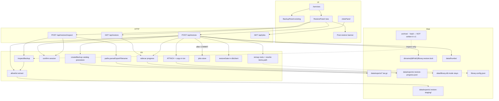

# Season Design: Restore UI — Return a snapshot — Helix Library

| Field | Value |
| --- | --- |
| **Document** | Season design — Restore UI (one-click / in-app restore) |
| **Author** | Helix owner + design loop |
| **Date** | 2026-08-15 |
| **Status** | **Implemented** (PR1–PR6, 2026-08-15) |
| **Approval** | Owner approved design + PR plan + Q1–Q4 (2026-08-15) |
| **Workspace** | `/home/brandon/Projects/non-os` (package `helix-library`) |
| **Baseline tip** | `origin/main` after Deep Lens S2 + hours-desk (`1aae6bc` era); tests **183** pass |
| **Prior seasons** | [Curation & intake](../designs/2026-08-curation-intake.md) · [Discovery depth & reading room](../designs/2026-08-discovery-reading.md) · [Acquire depth](../designs/2026-08-acquire-depth.md) · [Deep Lens dossier](../designs/2026-08-deep-lens-dossier.md) — all **Implemented**. Export/backup shipped 2026-08-08 (no season design; code is the spec). |
| **Audience** | Senior engineers implementing on `main` |
| **Revision** | rev 3 (2026-08-15) — review: restoreGate owner / no spin in `getSqlite()`; lockfile sibling-of-DB; stage order; pragma `try/finally`. Owner locked Q1–Q4 2026-08-15. |

---

## Overview

Helix Library already snapshots itself. `createBackup` in `src/lib/backup/create.ts` writes `helix-backup-{catalog\|full}-*.tar.gz` under `data/exports/`, the Services **Export / backup** panel (`BackupPanel.tsx`) can create / download / delete those archives, and `npm run backup` exists. What is missing is the other half of the circulation loop: **return a snapshot to the live catalog**.

Today restore is a markdown file. `restoreDoc()` packs `RESTORE.md` that says *stop Helix, `tar -xzf`, `cp` the DB, maybe copy thumbs and holdings, start Helix, reindex if paths changed*. The create-path note is explicit: `"Restore is manual — see RESTORE.md inside the archive."` That is not a desk. It is a runbook, and it assumes a stopped process — which an in-app button cannot assume.

**Season thesis:** **Restore as stack maintenance.** A Services-desk action, library-native (not “disaster recovery”), that inspects a `helix-backup-v1` archive, demands a hard typed confirm, takes an automatic pre-restore catalog snapshot, then copies the snapshot into the **still-open** live SQLite connection (`ATTACH` + one transaction — not a file rename of `library.db`). Thumbs may be swapped as a directory. Holdings overwrite is **out of v1**. The Librarian does **not** get a restore action.

Success looks like: open Services, pick a local archive, read the MANIFEST (mode, when, which machine, which roots, what is inside), type `RESTORE`, watch a job finish, and have the previous catalog sitting next to it as an undo snapshot. A botched restore is recoverable. A LAN guest, a tar-slip archive, a `$HOME` scan-root, or an Ask “approve” cannot do this.

---

## Background & Motivation

### What already shipped (export / backup — 2026-08-08)

| Area | Reality in tree |
| --- | --- |
| Create | `createBackup` in `src/lib/backup/create.ts` — staging dir under `data/exports/.staging/`, `tar -czf`, prune keep-10 |
| SQLite snapshot | `snapshotSqlite()` prefers `better-sqlite3` `Database#backup`; fallback is `wal_checkpoint(PASSIVE)` + copy `library.db` + `-wal`/`-shm` |
| List / delete | `src/lib/backup/list.ts` → `listBackups` / `deleteBackup` |
| Jail | `src/lib/backup/paths.ts` — `parseExportFilename`, `assertUnderExports`, `BACKUP_NAME_RE` |
| Types | `src/lib/backup/types.ts` — `BackupMode`, `BackupManifest` (`format: "helix-backup-v1"`) |
| CLI | `scripts/backup.ts` → `npm run backup` / `npm run backup -- --full` |
| HTTP | `GET/POST /api/backup`, `DELETE /api/backup/[name]`, `GET /api/backup/download/[name]` |
| Job | kind `backup` via `createJob` + `void runHelixJob` (`src/app/api/backup/route.ts`, `maxDuration = 900`) |
| UI | `BackupPanel` on `/services` (`src/app/services/page.tsx`) |
| Tests | `tests/backup.test.ts` — filename + traversal only (no pack/unpack) |
| Docs | `/docs#services` says restore is not mentioned; panel copy still says “Restore is manual” |

**Archive layout (`helix-backup-v1`)** — written by `createBackup`, documented in `restoreDoc()`:

| Member | When | Role |
| --- | --- | --- |
| `MANIFEST.json` | always | Machine-readable inventory |
| `RESTORE.md` | always | Manual instructions |
| `library.config.json` | always | Scan roots + settings (paths may be machine-specific) |
| `library.db` | always | Catalog snapshot (items, tags, collections, FTS, jobs, threads, insights, lens_analyses) |
| `thumbs/*.webp` | if packed | Posters keyed by **item id** |
| `holdings/<safe-name>/` | **full** mode only | Copy of each **enabled** location tree |

**Never packed:** `.env.local`, `XAI_API_KEY`, OpenAlex keys, disabled locations, app source.

### Live machine numbers (this workspace, 2026-08-15)

These are the sizing assumptions the design is calibrated against — not product limits.

| Object | Size / count |
| --- | --- |
| `data/library.db` | **1.2 MB** (154 items) |
| WAL / SHM | 676 KB / 32 KB (live writes) |
| `data/thumbs/` | **1.4 MB** |
| Existing catalog archive | `helix-backup-catalog-2026-08-08T13-34-08-337Z.tar.gz` — **1.5 MB** |
| `archive/` (primary holdings) | **6.1 GB** |
| Second location | `Vault` → `/media/brandon/Vault/helix` (external; may be unmounted) |
| Config | `dbPath: ./data/library.db`; bind loopback |

**Implication:** catalog restore is a few megabytes and should feel instant. Full holdings restore is gigabytes, touches a removable disk, and can destroy the live Archive. Those are not the same product action.

### Pain points

1. **The backup story is one-way.** A user who takes a catalog snapshot before weeding or a bad reindex still has to stop the app and `cp` by hand. The Services desk can create the parachute but cannot pull the ripcord.
2. **Manual restore is process-hostile.** `RESTORE.md` requires stopping Helix. The live catalog is a WAL-mode `better-sqlite3` singleton (`src/lib/db/client.ts` → `globalThis.__nonOsSqlite`). Copying over `library.db` while the handle is open is how you get a torn catalog plus a WAL that applies to the *wrong* file.
3. **Config is machine-specific.** Archived `library.config.json` can point at another hostname’s paths, at Vault when the drive is unplugged, or (if we ever accepted a foreign archive) at `$HOME`. Blindly writing it back violates “explicit scan roots.”
4. **Holdings overwrite is a different threat class.** `cp -a holdings/Archive/. ./archive/` is not “restore the card catalog.” It is “replace the stacks.” The live Archive is 6.1 GB and is the user’s files, not an index.
5. **Job rows live inside the catalog we overwrite.** `createJob` writes to `jobs` in `library.db`. Copying the snapshot’s `jobs` table mid-flight deletes the row the UI is polling — even if the inode never moves.
6. **Confirm UX is `confirm()` / `window.confirm`.** Delete-backup uses bare `confirm(...)` (`BackupPanel.tsx` L122). Weeding uses `window.confirm` (`BulkCurationBar.tsx`). Same gravity, wrong for overwriting the catalog.
7. **Ask already has an approve path.** If restore were added as a `LibrarianAction`, a sloppy “yes” in chat could fire it. Agent comments in `src/lib/agent/actions.ts` already forbid “wiping the DB.”

### Constraints (non-negotiable)

From `AGENTS.md` / product hard rules:

1. **Localhost by default** — loopback bind; LAN only with password + explicit env (`NON_OS_LAN=1` + `NON_OS_ACCESS_PASSWORD`).
2. **Explicit scan roots** — never default-scan `$HOME`.
3. **Librarian mutations approval-gated** — no shell, no unsolicited writes, no deleting project source. Restore is a **new mutation class**, more dangerous than reindex / acquire / location edits.
4. **SuperGrok ≠ developer API** — irrelevant except: **never restore or overwrite `.env.local` / `XAI_API_KEY`.**
5. **Paths from tools only** — agent must not invent file paths. Restore is not an agent tool.
6. **Media serve gated** — `/api/media/[id]` only under enabled location roots (`src/lib/media/serve.ts`).
7. **Do not commit** `library.config.json`, `data/`, personal `archive/**`, secrets.

Additional restore-specific constraints (handoff + this design):

- Hard confirm required (overwrites live `library.db` / optional thumbs).
- Stay inside configured / archive-jail semantics — no arbitrary filesystem writes.
- Verify paths before overwriting a live catalog.
- Prefer editing existing modules (`src/lib/backup/*`, Services panel, jobs types) over new frameworks.
- In-app restore **cannot** assume a stopped Next process.
- Personal use only. Next is a single process (`next dev` / `next start` — no cluster), but **`npm run watch` is a second Node** (`scripts/watch-reindex.ts`) that can hold the same `library.db`. Restore must detect that, not assume it is alone.

---

## Goals & Non-Goals

### Goals (season)

| # | Theme | Outcome |
| --- | --- | --- |
| **G1** | Inspect before write | From Services, open any jail-safe `data/exports/*.tar.gz`, read `MANIFEST.json` + member inventory, show mode / created-at / hostname / location roots / sizes. Reject unknown format, path-escape, symlink, or missing `library.db`. **No live catalog / config / holdings writes** on inspect (session JSON under `data/exports/` is allowed). |
| **G2** | Hard confirm | Apply requires a server-issued one-time token **and** the user typing `RESTORE` (not `confirm()` / `window.confirm`). Scope checkboxes distinguish catalog vs thumbs vs config. Holdings checkbox is disabled in v1. |
| **G3** | Live catalog restore | Copy the snapshot into the open live connection (`ATTACH` + one transaction). Live `library.db` inode and WAL stay put. Failure rolls the transaction back. Never `renameSync` the live DB out from under `getSqlite()`. |
| **G4** | Pre-restore safety net | Every apply extracts+pins the source first, then writes a catalog-mode snapshot of the *current* live catalog, so a botched restore has an undo sitting in `data/exports/`. Prune must not delete the archive being restored. |
| **G5** | Config is not a blind write | Never apply `bind` / `port` / `dbPath` from the archive. Location roots default **keep-live**. Remap also rewrites `items.path` from `rel_path`. `$HOME` / `$HOME` children / `/` cannot become newly enabled scan roots. |
| **G6** | Job + CLI parity | New job kind `restore`. Apply HTTP is **synchronous**. Sidecar progress exists because the snapshot’s `jobs` table overwrites live rows. `npm run restore` inspects by default; `--phrase RESTORE` applies. Same lib as the UI. |
| **G7** | Docs + honesty | `/docs`, PRODUCT, SESSION-HANDOFF, AGENTS, Services copy, and future `RESTORE.md` all describe the in-app path and the holdings non-goal. |

### Non-goals (this season)

| Out of scope | Why |
| --- | --- |
| Overwriting live holdings (`archive/`, Vault, any location root) | Different threat class; 6.1 GB+; external disk; see Q1 |
| Upload-a-tarball desk | Multipart of multi-GB archives; jail copy is enough (`cp` into `data/exports/`) |
| Partial / merge restore (collections only, tags only, one item) | Gold-plating; v1 is whole-catalog snapshot replace |
| Ask / Librarian `restore_*` action | Too dangerous for chat-approve (KD10) |
| Restore on LAN / non-loopback | Password leak + CSRF would be catastrophic (KD11) |
| Format `helix-backup-v2` reader | Reject unknown; add a reader when v2 exists |
| Automatic reindex after restore | Restored catalog may mark everything missing if roots differ; human reviews remap first |
| Restoring `.env.local` / API keys | Secrets are intentionally absent from archives |
| Multi-process / clustered Next workers | Current bind is a single process; document the assumption |
| Embeddings, batch-analyze, auto-apply AI tags | Product-wide non-goal |
| Discovery PR6 `item_events` | Separate slice; only note browser-local desync |
| New `/restore` route or nav item | Restore is rare stack maintenance, not a daily desk like `/acquire` |

---

## Locked product decisions

Decisions already made by product / handoff, this design, or **owner lock of Q1–Q4 (2026-08-15)**. Implementers should not re-litigate these.

| Decision | Choice |
| --- | --- |
| Product name / metaphor | **Helix Library** OPAC. Restore = **return a snapshot** / **stack maintenance**, not DR / disaster recovery. |
| Where it lives | **Services desk**, sibling panel under Export / backup. No new primary nav. No `/restore` route in v1. |
| Sources | **Local `data/exports/*.tar.gz` only** (jail via `parseExportFilename` + `assertUnderExports`). No upload. CLI uses the same jail. |
| Format | **`helix-backup-v1` only.** Anything else is a hard reject. |
| v1 write set | **`library.db` (required) + `thumbs/` (default on if present) + location remap (default off).** Not holdings. Not `.env*`. Not `bind`/`port`/`dbPath`. |
| Holdings later (Q1) | **Never in-app this season.** Least-bad follow-up: sibling `archive.restored-<stamp>/` + Locations remap. Live-root overwrite needs another design. |
| Location roots (Q2) | **keep-live** when a live name match exists, else **disable**. Do not auto-use archived roots. |
| Prerestore prune (Q3) | Protect `-prerestore-` archives for **7 days**, then they enter keep-10. |
| Kill switch (Q4) | **`NON_OS_RESTORE=0`** disables apply (inspect may still run). Default **allow**. |
| Confirm | Typed phrase **`RESTORE`** + server `confirmToken` + “replaces the live catalog” checkbox. |
| Pre-restore snapshot | **Always**, catalog-mode, after the source archive is extracted+pinned. |
| Live process | **Online logical restore** (do not require restart; do not rename `library.db`). |
| Agent | **No** restore action, tool, or local-NLP intent in v1. |
| LAN | Restore HTTP **refused when `lanModeEnabled()`** unless `NON_OS_RESTORE_OK=1`. Host header is a hint, not a peer-IP gate. |
| Reindex after | **Offer**, do not auto-run. |
| Jobs | New kind **`restore`**. Apply is **synchronous**. Sidecar covers the window where snapshot `jobs` overwrite live rows. |
| Partial merge | **No.** Whole catalog snapshot. |
| Browser local state | `helix-open-history` / `helix-read-position` are **not** cleared. Post-restore banner warns they may desync. |

---

## Key Decisions

| ID | Decision | Choice | Rationale |
| --- | --- | --- | --- |
| **KD1** | OPAC placement | Sibling **Restore from snapshot** panel on `/services`, composed next to `BackupPanel`. Domain copy: “Return a snapshot,” “live catalog,” “stacks” (holdings). Not “disaster recovery,” not a new route. | Restore is rare and dangerous (like a closed-stacks procedure), not a daily desk. Acquire earned `/acquire` because it is intake. Mirrors how backup already lives on Services. |
| **KD2** | Restore sources | **Exports jail only.** Any `*.tar.gz` basename under `exportsRoot()` that passes `parseExportFilename`. Do not require `BACKUP_NAME_RE` (an existing archive is named `…T13-34-08-337Z.tar.gz` and would **fail** that regex because of millis). | `parseExportFilename` already rejects `..` and path separators. Filename regex is a hint, not a security boundary. |
| **KD3** | Inspect is a separate call | `POST /api/restore/inspect` streams `tar -tzf` (member cap), reads `MANIFEST.json` on stdout, mints a session file. **No catalog/config/holdings writes.** Returns `{ ok, preview, confirmToken, live }`. | Matches “inspect-before-overwrite.” Session file under `data/exports/` is not a live-catalog write. |
| **KD4** | Hard confirm | Server token (10 min, single use) bound to **`name + previewHash` only** — not thumbs/roots checkboxes. Apply sends current scope; server validates against the preview (`hasThumbs`, remap jail). Typed `RESTORE` + required checkbox. `confirm()` is **not** sufficient. Token is consumed **atomically when apply is accepted** (sidecar `status=running`); reuse → 409. | Inspect happens before the user toggles scope. Binding scope at mint time makes every checkbox change a 400. Token + phrase stop CSRF/replay/misclick. |
| **KD5** | Logical in-place restore, not file-swap | `ATTACH` the extracted snapshot on the **existing** `getSqlite()` handle and copy application tables inside one `BEGIN IMMEDIATE` transaction. Live inode + WAL stay put. `ROLLBACK` on failure. **Do not** `resetDbConnection()` + `renameSync` the live DB in v1. | Physical replace lets any concurrent `getSqlite()` (`new Database(dbPath)` with no `fileMustExist` in `src/lib/db/client.ts`) **create an empty catalog** during the rename gap (`HeaderJobsStrip` → `GET /api/jobs` every 12s; almost every RSC page calls `ensureLocationsSynced()`). Catalog is 1.2 MB (ceiling ~500 MB) — copy-in is the obvious v1. Manual `RESTORE.md` remains the offline file-copy fallback. See A9. |
| **KD6** | Sidecar progress + sync apply | Apply HTTP **holds until COMMIT** (not `void runHelixJob`). Still write `data/exports/.restore-progress.json` so a dropped connection / CLI can poll `GET /api/restore`. After COMMIT + thumbs, set the gate idle, then `createJob({ kind: "restore", status: "completed" })` via normal `getDb()`. Snapshot `jobs` are sanitized **inside** the txn before COMMIT. | Snapshot copy **replaces** the `jobs` table, so a pre-copy job row disappears even without a file-swap. Sync POST removes the backup-style fire-and-forget race. Catalog restore target is &lt; 15 s typical — unlike full backup. |
| **KD7** | Pre-restore snapshot | **Extract + pin the source first**, then `createPreRestoreBackup`. `pruneOldExports` must skip (1) `*-prerestore-*` younger than 7 days **and** (2) the restore source `session.name`. Filename `helix-backup-catalog-prerestore-{stamp}.tar.gz`; teach `BACKUP_NAME_RE` / `modeFromFilename` the optional infix so the chip is not `unknown`. | `createBackup` always ends with `pruneOldExports(10)` (`create.ts` L380, L406–414). Restoring the oldest of 10 archives would delete the source before extract if prerestore ran first. |
| **KD8** | Holdings policy (v1) | **Do not extract `holdings/`.** Inspect lists them as “present, not applied.” UI checkbox disabled with a one-line reason. **Owner 2026-08-15:** never in-app this season (Q1a). Follow-up, if any: sibling `archive.restored-<stamp>/` + Locations remap — not live-root overwrite. | Overwriting `archive/` is destructive file-manager work. Live Archive is 6.1 GB; Vault may be unmounted. |
| **KD9** | Config + path rewrite | **Never write `bind`, `port`, `dbPath` from the archive.** Location defaults: **keep-live** when a live location of the same **name** exists, else **disable**. `use-archived` / `remap` only if the user picks it **and** the path passes `assertRestorableRoot` (same jail as `remapTo`: exists, directory, not `$HOME` / `$HOME` child unless that exact path is already a live configured root, not `/` or system prefixes). Match by name first; if names collide (name is **not** UNIQUE in `schema.ts` / `migrate.ts`), fall back to `root_path`. After updating `locations.root_path`, **rewrite every `items.path` for that location**: `path.join(newRoot, rel_path)` (POSIX), collision-check UNIQUE `items.path`. Do this **before** any `ensureLocationsSynced()`. | `items.path` is an absolute path (indexer `eq(items.path, file.absPath)` in `src/lib/indexer/run.ts` ~L227–231; media jail `path.resolve(item.path)` under `loc.rootPath` in `src/lib/media/serve.ts` L46–49). Remapping the branch without rewriting holdings paths orphans `/api/media/[id]` and makes the next reindex `added`+`missing`, leaving tags/insights on the old ids. |
| **KD10** | Ask the Librarian | **No** `restore` / `restore_backup` action, no `propose_actions` enum, no local NLP. If the user asks, the librarian explains Services. | `actions.ts` already forbids wiping the DB. Chat “yes” is the wrong confirm for this mutation class. |
| **KD11** | LAN / CSRF | **Refuse all restore HTTP when `lanModeEnabled()`** unless `NON_OS_RESTORE_OK=1` is set in the host env (not a request header). `Host` is a **hint** only — parse with `new URL("http://" + host)` so `[::1]:4747` works. If `Origin` is present, require loopback hostname **and** `u.port` === `String(loadConfig().port)` (4747). **Do not trust `X-Forwarded-For`** (no trusted-proxy model). CLI is unaffected (no HTTP). | `dev:lan` binds `0.0.0.0:4747`. `Host: 127.0.0.1` from a LAN client spoofs both this gate and `src/middleware.ts` L31–32 (loopback Host skips Basic). App Router `Request` has no socket remote address. Token + phrase stop browser CSRF from `https://evil.com`; they do not stop a LAN attacker who can complete inspect. Extra env is a host-local deliberate opt-in. |
| **KD12** | Format versioning | Accept only `manifest.format === "helix-backup-v1"`. Missing MANIFEST or other format → reject. v2 gets a new reader later; no “best effort.” | Unknown bytes should not touch `library.db`. |
| **KD13** | Partial restore | **No merge.** v1 applies the whole catalog snapshot. Thumbs are the only optional *file set* (default on). | Small PRs, no gold-plating. Merging collections/tags across catalogs is a different product. |
| **KD14** | Reindex after restore | Success panel: **Run reindex** button (existing `ReindexButton` / `POST /api/reindex`) + copy: run after you confirm roots exist. Never auto-start. | Auto-reindex on remapped/missing roots would flip `is_missing` across the restored catalog before the user can fix mapping. |
| **KD15** | Busy lock + other processes | Refuse apply if sidecar restore is running, `isReindexRunning()`, `isKindBusy("backup"|"restore")`, `isAcquireBusy()`, or any `lens_analyze` running/pending. `BEGIN IMMEDIATE` that stays `SQLITE_BUSY` after retries → fail with “another process has the catalog open — stop `npm run watch`.” Write **`restoreLockPath()` = `path.join(dirname(getDbPath()), "library.restore.lock")`** (sibling-of-DB like `exportsRoot()`, **not** `cwd/data/`). `scripts/watch-reindex.ts` uses that helper; skip `runReindex` only if the file exists **and** the recorded pid is alive. Stale pid → unlink and continue. Unlink in `finally`. After copy, sanitize snapshot jobs inside the txn; insert the completed restore row **after** the gate is idle. | Next’s `isReindexRunning()` only sees in-process `inflight` plus a running job row (`src/lib/indexer/run.ts` L126–129). An **idle** `npm run watch` holds `globalThis.__nonOsSqlite` with **no** running job. A cwd lock would poison the live tree from `createTestEnv()` (same trap as `thumbsDir()`). Snapshot jobs can resurrect `running` rows. |
| **KD16** | Tar extraction | Use host `tar` (same as create). Extract only an **allowlist** of members into `data/exports/.restore-staging/<id>/`. Reject the archive if any member is absolute, contains `..`, is a symlink, or is outside the allowlist. Never `tar -xzf` the whole archive into the project root. | Tar-slip / zip-slip. Create already requires `tar` on PATH. |
| **KD17** | Job kind plumbing first | Add `"restore"` to `HelixJobKind` + `isHelixJobKind` **before** any writer. `toHelixJob` currently collapses unknown kinds to `"reindex"` (`src/lib/jobs/store.ts`). | Same footgun Deep Lens / Acquire hit. |
| **KD18** | Secrets | Extractor refuses members named `.env`, `.env.local`, or anything under a hidden dotfile except the staging dir itself. Even if a future packer adds them. | Defense in depth; current packer already omits them. |
| **KD19** | Browser memory | Do not wipe `helix-open-history` or `helix-read-position`. Show a dismissible banner after success. Discovery PR6 (`item_events`) is unrelated. | Those keys are item-id addressed (`src/lib/client/open-history.ts`, `read-position.ts`). Restored ids may or may not match; silent wipe is ruder than a warning. |
| **KD20** | Prefer existing modules | New files live under `src/lib/backup/*`. UI is a new `RestorePanel` imported from `src/app/services/page.tsx`. Do not add a CMS, a second SQLite, or a new job framework. **Do** edit `src/lib/db/client.ts` (restoreGate **no-spin** 503, first-open recovery, `fileMustExist` when the file exists) and `scripts/watch-reindex.ts` (honor sibling-of-DB lockfile). | Project convention. A second `ops.db` was considered (A3) and rejected. The gate is a fail-fast flag, not a wait-mutex. |
| **KD21** | Apply extract allowlist | Apply extracts **only** `MANIFEST.json`, `library.config.json` (parse-only, not written blindly), `library.db`, optional `library.db-wal` / `library.db-shm`, optional `thumbs/*.webp`. **Never extract `holdings/`.** Inspect allowlist may *list* `holdings/` members. After extract, `lstat` walk the staging tree and reject any symlink. | Inspect listing `holdings/` is how we tell the user it is present-not-applied. Extracting it would write user files. GNU vs bsdtar type flags are not enough. |
| **KD22** | Fallback WAL snapshots | If the archive contains `library.db-wal`, extract db+wal+shm into isolated staging, `new Database(stagingDb)` so SQLite applies WAL, `wal_checkpoint(TRUNCATE)`, close, then ATTACH that standalone file. If only `library.db` is present, ATTACH as-is. | `snapshotSqlite()` fallback is `wal_checkpoint(PASSIVE)` + copy main **and** `-wal`/`-shm` (`create.ts` L108–121). PASSIVE does not guarantee a complete main file. Ignoring packed WAL drops recent pages. |
| **KD23** | `getSqlite` restoreGate (no spin) | Apply captures `const sqlite = getSqlite()` **before** `setRestoreGate("busy")`. `getSqlite()` / `getDb()`: if the singleton is **already open**, return it immediately (owner / reentrant). If the singleton is **not** open and `restoreGate === "busy"` → throw `RestoreBusyError` **immediately** (no sleep, no 60 s spin) → API **503**. While busy, **never** `new Database(dbPath)` if `!existsSync(dbPath)`. When the file exists, open with `fileMustExist: true`. After COMMIT + thumbs, `setRestoreGate("idle")` **then** `createJob` via normal `getDb()`. Boot: if live path missing/not-SQLite **and** `dirname(getDbPath())/exports/.restore-rollback/library.db` exists, rename it back **before** migrate. | `getSqlite()` is synchronous on one event loop. A 60 s spin deadlocks apply’s own `getDb()`/`createJob` and freezes every other request. `BEGIN IMMEDIATE` already serializes SQLite writers; the gate is fail-fast for “need to open” + `assertCatalogWritable`, plus never-create-while-busy. |
| **KD24** | Disk budget on the DB volume | Free-space check uses `statfsSync(dirname(getDbPath()))` and `statfsSync(exportsRoot())`, **not** `probeMachine().disk` (`diskFor("/")` in `src/lib/machine/probe.ts` L44). | Project data may not live on `/`. Vault already does not. |

---

## Proposed Design

### Architecture (season delta)



### OPAC metaphor

| Library metaphor | Helix behavior this season |
| --- | --- |
| Card catalog backup | Existing catalog `tar.gz` (index + shelves + stamps) |
| Closed-stacks procedure | Services **Restore from snapshot** — staff-only gravity, typed confirm |
| Return a withdrawn shelf-list | Copy the snapshot into the live catalog (same inode) |
| Building bind / hours | **Not** restored (`bind` / `port` stay live) |
| Branch addresses | Location roots remapped or kept; never invent `$HOME` |
| The stacks themselves | Holdings trees — **not** dumped back onto the floor in v1 |
| Ask a librarian to “put it all back” | Librarian **refuses** and points at Services |

### Inspect-before-overwrite

#### Listing members without trusting the filename

`inspectBackup(name: string): RestorePreview` (new `src/lib/backup/inspect.ts`):

1. `parseExportFilename(name)` → `exportArchivePath` (existing jail). **Additionally require `name.endsWith(".tar.gz")`** — `parseExportFilename` also allows `*.json` (`paths.ts` L37–38); inspect/apply must not.
2. `statSync` — must be a file; refuse if larger than **`RESTORE_ARCHIVE_MAX_BYTES`** (default **32 GiB** — enough for a mistaken full backup inspect; catalog archives are ~MB). Inspect of a huge full archive is allowed; apply will not extract `holdings/`.
3. Stream `spawn("tar", ["-tzf", abs])` (not `spawnSync` — default `maxBuffer` / create’s 8 MB `runTar` will throw on a full archive whose `holdings/` listing is huge). Stop after **`RESTORE_LIST_MEMBER_CAP` (5000)** members. If the cap is hit: set `hasHoldings` if any name started with `holdings/`, skip per-file holdings sizes (“cheap” = member count ≤ 5k **and** archive `stat.size` ≤ 64 MB). Same `tarAvailable()` gate as create.
4. Run **tar member audit** (pure function, unit-tested):

```ts
export const RESTORE_MEMBER_ALLOWLIST = [
  /^MANIFEST\.json$/,
  /^RESTORE\.md$/,
  /^library\.config\.json$/,
  /^library\.db$/,
  /^library\.db-wal$/,
  /^library\.db-shm$/,
  /^thumbs\/[^/]+\.webp$/,
  /^holdings\/.*$/, // listed only; never extracted in v1
] as const;

export type TarMemberAudit = {
  ok: boolean;
  errors: string[];
  members: Array<{ name: string; kind: "file" | "dir" | "link" | "other" }>;
};

export function auditTarMembers(names: string[]): TarMemberAudit;
```

Reject if any name:

- is absolute (`/…` or Windows `C:\…`)
- contains `..` as a path segment
- starts with `~`
- is a symlink / hardlink (detect via `tar -tvzf` type flag, or refuse if `name` ends with `/` *and* also appears as a link — implementers: parse `tar -tvzf` first column; `l` / `h` → reject archive)
- does not match the allowlist

5. Extract **only** `MANIFEST.json` to a unique staging dir (`mkdtempSync` under `exportsRoot()/.restore-staging/`):

```bash
tar -xOf "$abs" MANIFEST.json
```

(`-O` / `--to-stdout` — no write except our own `writeFileSync` after we parse). Prefer stdout parse over extracting into staging for the manifest. If `tar` cannot stream one member, extract that single member with `--no-same-owner --no-overwrite-dir` into the staging temp.

6. Parse + validate:

```ts
const restoreManifestSchema = z.object({
  format: z.literal("helix-backup-v1"),
  createdAt: z.string().min(1),
  mode: z.enum(["catalog", "full"]),
  includeThumbs: z.boolean(),
  app: z.literal("helix-library"),
  hostname: z.string().nullable(),
  includes: z.array(z.string()),
  locations: z.array(
    z.object({
      name: z.string(),
      root: z.string(),
      enabled: z.boolean(),
      included: z.boolean(),
    }),
  ),
  notes: z.array(z.string()),
});
```

Unknown `format` or failed zod → HTTP 400, no token.

7. Build preview (no DB writes):

```ts
export type RestoreLocationAction = "keep-live" | "use-archived" | "disable" | "remap";

export type RestorePreview = {
  name: string;
  bytes: number;
  mode: BackupMode;                // zod already required catalog|full; not "unknown"
  format: "helix-backup-v1";
  createdAt: string;
  hostname: string | null;
  thisHostname: string;
  hostnameMismatch: boolean;
  includeThumbs: boolean;
  hasDb: boolean;
  hasConfig: boolean;
  hasThumbs: boolean;
  hasHoldings: boolean;
  memberCount: number;
  memberListTruncated: boolean;
  locations: Array<{
    name: string;
    archivedRoot: string;
    archivedEnabled: boolean;
    includedInArchive: boolean;
    liveRoot: string | null;       // matched by name, else root_path
    liveExists: boolean;
    archivedRootExists: boolean;
    forbidden: boolean;            // cannot be enabled (includes new $HOME children)
    defaultAction: RestoreLocationAction; // keep-live | disable only
  }>;
  notes: string[];
  warnings: string[];              // hostname mismatch, missing roots, full-mode holdings present
  previewHash: string;             // sha256(name + mtimeMs + bytes + manifest raw)
};

export type RestoreLiveStats = {
  itemCount: number;
  dbPath: string;
  dbBytes: number;
};
```

`assertRestorableRoot(abs: string): void` — shared by inspect flags, apply `use-archived`, and `remapTo`:

- `path.resolve`, `existsSync`, `statSync.isDirectory()`
- Refuse: `/`, `/etc`, `/usr`, `/var`, `/root`, `/home` (the directory itself)
- Refuse: exact `os.homedir()`
- Refuse: **any path under `os.homedir()`** unless that **exact** resolved path is already a live configured location root (user already opted in via Locations admin)
- Refuse: `process.cwd()`, `src/`, `.git/` (repo source)

`defaultAction` (**must match Q2 / locked “keep live config”** — one reading only):

- if a live location of the same name exists → **`keep-live`**
- else → **`disable`**
- **Never** default to `use-archived`. That action is user-picked and still runs `assertRestorableRoot` (so a snapshot cannot quietly enable `/home/brandon/Documents`).

8. Mint session (see Confirm). Inspect HTTP envelope: `{ ok: true, preview, confirmToken, live }` where `live` is `RestoreLiveStats` from `catalogStats()` + `getDbPath()` + `statSync`.

Inspect is **idempotent** and may be repeated; each call rotates the token. It may write `.restore-session.json` and a tiny staging file for MANIFEST — that is not a live-catalog write.

### Hard confirm UX

**UI (RestorePanel)** after inspect:

1. Preview card: mode chip, created-at, archive bytes, hostname (warn if ≠ `os.hostname()`), location table, “this will replace the live catalog (N items, DB path).” Pull live stats via existing `catalogStats()` from the inspect response (server includes `live: { itemCount, dbPath, dbBytes }`).
2. Scope:
   - [x] Replace live catalog (`library.db`) — **required, locked on**
   - [x] Replace thumbs — default on if `hasThumbs`
   - [ ] Apply location roots from snapshot — default **off**; expands remap table
   - [ ] Restore holdings onto live stacks — **disabled**, tooltip: “Not in this version. Holdings stay on disk; only the catalog is returned.”
3. Checkbox (required): **I understand this replaces the live catalog and cannot be undone except via the automatic pre-restore snapshot.**
4. Text field: user must type `RESTORE` (exact, case-sensitive). Placeholder: `Type RESTORE to confirm`.
5. Primary button **Return this snapshot** is disabled until checkbox + phrase match. Style it as danger (`text-[var(--danger)]` / existing danger button patterns from weeding), not `btn-primary` green.
6. Secondary: **Cancel** calls `DELETE /api/restore/session` (required in the API table) or lets the token expire.

**Server apply body:**

```ts
type RestoreApplyBody = {
  name: string;
  confirmToken: string;
  phrase: string;              // must === "RESTORE"
  includeThumbs: boolean;
  applyLocationRoots: boolean;
  locationActions?: Array<{
    name: string;
    action: "keep-live" | "use-archived" | "disable" | "remap";
    remapTo?: string;          // only for remap; still jail-checked
  }>;
  acknowledge: true;           // checkbox
};
```

Reject if `phrase !== "RESTORE"`, token missing/expired/mismatched/`name` ≠ session name, `acknowledge !== true`, or `previewHash` no longer matches a fresh `stat` of the archive (TOCTOU). **Do not** reject because thumbs/roots differ from inspect-time checkboxes.

Scope checks at apply (not in the token):

- `includeThumbs === true` requires `preview.hasThumbs`
- each `locationActions[i].action === "use-archived" | "remap"` runs `assertRestorableRoot`
- `applyLocationRoots === false` ignores `locationActions` and applies keep-live/disable defaults

There is **no** existing confirm-token helper in the tree (agent approve is chat-token `[[action:…]]`; weeding is `window.confirm`). Add `src/lib/backup/session.ts` — do not overload agent tokens.

```ts
type RestoreSession = {
  token: string;               // 32-byte hex
  name: string;
  previewHash: string;
  createdAt: number;
  expiresAt: number;           // now + 10 min
  consumedAt: number | null;   // set atomically when apply is accepted
};

// Persist: data/exports/.restore-session.json (mode 0600)
// File is source of truth so CLI can --inspect then --apply
```

**Token lifecycle:**

1. Inspect mints a new token, overwrites the session file, `consumedAt = null`.
2. Apply opens the session with a short exclusive file lock (or write `consumedAt` via rename of a temp file). If missing/expired/`consumedAt != null`/token mismatch → 400/409. On accept: `consumedAt = Date.now()`, sidecar `status=running`. A second POST is 409.
3. Success or failure does not remint the token. User must inspect again to retry.

---

### Live catalog restore (logical ATTACH — not a file-swap)

Manual `RESTORE.md` says stop Helix because `better-sqlite3` has `library.db` open in WAL mode:

```16:27:src/lib/db/client.ts
function openDatabase(): { sqlite: Database.Database; db: DrizzleDb } {
  const dbPath = getDbPath();
  mkdirSync(path.dirname(dbPath), { recursive: true });

  const sqlite = new Database(dbPath);
  sqlite.pragma("journal_mode = WAL");
  sqlite.pragma("foreign_keys = ON");
  sqlite.pragma("busy_timeout = 5000");

  migrate(sqlite);
  // ...
}
```

`new Database(dbPath)` **creates** a file when the path is missing, then `migrate()` bootstraps an empty Helix schema. A physical `renameSync` of `library.db` therefore lets `HeaderJobsStrip` (`GET /api/jobs` every 12s → `listJobs` → `getDb()`) or any RSC `ensureLocationsSynced()` **create an empty catalog** in the rename gap. v1 does **not** rename the live DB.

`resetDbConnection()` (same file, L53–63) stays a **test** helper. Restore does not call it.

#### Process-wide restoreGate (fail-fast, no spin)

`getSqlite()` is **synchronous** on a single Node event loop. A 60 s wait inside it deadlocks apply’s own later `getDb()`/`createJob` and freezes every other request. Do **not** sleep in `client.ts`.

```ts
// src/lib/db/client.ts  (not only backup/)
type RestoreGate = "idle" | "busy";
let restoreGate: RestoreGate = "idle";

export function setRestoreGate(next: RestoreGate): void {
  restoreGate = next;
}

export function isRestoreInProgress(): boolean {
  return restoreGate === "busy";
}

export class RestoreBusyError extends Error {
  status = 503;
  constructor() {
    super("Catalog restore is in progress — try again in a moment.");
  }
}
```

**Owner / reentrancy (non-negotiable):**

1. Apply **must** capture the handle first:

```ts
const sqlite = getSqlite(); // singleton already open (or first-open, allowed)
setRestoreGate("busy");
// use `sqlite` for pragma / BEGIN / ATTACH / COMMIT — do not call getSqlite() to "re-enter" via a closed singleton
```

2. `getSqlite()` / `getDb()`:
   - If `globalThis.__nonOsSqlite` is **already open** → return it immediately (gate does not apply). This is the restore owner path and every in-process reader that already has a handle.
   - If the singleton is **not** open **and** `restoreGate === "busy"` → throw `RestoreBusyError` **immediately** (no `Atomics.wait`, no `setTimeout` spin, no 60 s). API routes map that to **503**.
   - `assertCatalogWritable()`: if `restoreGate === "busy"` → throw immediately (writers: reindex, backup, acquire, locations, bulk, agent).

3. Open rules (unchanged belts):
   - If `!existsSync(dbPath)` and `restoreGate === "busy"` → throw (never create an empty catalog).
   - If `!existsSync(dbPath)` and a rollback file exists at `path.join(dirname(getDbPath()), "exports", ".restore-rollback", "library.db")` → rename it back, then continue (boot recovery).
   - If the file exists: `new Database(dbPath, { fileMustExist: true })`.
   - First run (no file, gate idle): `new Database(dbPath)` as today.

`GET /api/restore` reads the sidecar only — it must not open SQLite. HeaderJobsStrip already ignores failed polls.

`BEGIN IMMEDIATE` is what serializes SQLite writers (including `npm run watch`). The gate is only fail-fast for new opens + `assertCatalogWritable` + never-create-while-busy.

#### Watch lockfile (sibling of the DB)

```ts
// src/lib/backup/paths.ts — next to exportsRoot()
export function restoreLockPath(): string {
  return path.join(path.dirname(getDbPath()), "library.restore.lock");
}
```

Contents: `{ pid, startedAt }` (JSON). **Not** `data/library.restore.lock` under `process.cwd()` — that is the `thumbsDir()` trap. `createTestEnv()` puts the DB in `/tmp/non-os-test-…`; the lock must land there.

`scripts/watch-reindex.ts` `triggerReindex`:

1. `p = restoreLockPath()`.
2. If `!existsSync(p)` → proceed.
3. Parse pid. If pid is alive (`process.kill(pid, 0)` succeeds) → log and return (do not `runReindex`).
4. If pid is dead (`ESRCH`) → `unlinkSync(p)` and proceed.

Apply writes the lock after capturing `sqlite`, unlinks in `finally` (success, fail, throw). PR3 test: `applyRestore` against `createTestEnv()` must **not** create `path.join(process.cwd(), "data", "library.restore.lock")`.

#### Apply sequence (logical)

```mermaid
sequenceDiagram
  participant UI as RestorePanel
  participant API as POST /api/restore
  participant Side as sidecar JSON
  participant Tar as allowlist extract
  participant Pre as createBackup
  participant Live as getSqlite handle
  participant Snap as staging library.db

  UI->>API: token + phrase RESTORE
  API->>API: consume token + sidecar running
  API->>Side: stage=extract
  API->>Tar: extract db (+wal) + thumbs; pin source
  API->>Side: stage=validate
  API->>API: apply packed WAL; migrate copy; validate items table
  API->>Side: stage=prerestore
  API->>Pre: catalog snapshot (source name protected from prune)
  API->>Live: getSqlite() first
  API->>Live: setRestoreGate busy; write lockfile
  API->>Side: stage=copy (uncancellable)
  API->>Live: BEGIN IMMEDIATE on captured handle
  API->>Live: ATTACH snap; copy tables; rebuild FTS
  API->>Live: sanitize snapshot jobs; remap + rewrite items.path
  API->>Live: COMMIT
  alt txn fails
    API->>Live: ROLLBACK
    API->>Side: status=failed
  else ok
    API->>API: thumbs dir swap (independent rollback)
    API->>Live: setRestoreGate idle
    API->>Live: createJob via getDb()
    API->>Side: status=completed
  end
  API->>API: finally DETACH + restore pragmas + unlink lock
```

**Cancellable** stages: extract, validate, prerestore. **Uncancellable:** `BEGIN IMMEDIATE` through `COMMIT` (and thumbs rename).

#### Table registry (single source of truth)

```ts
// src/lib/backup/tables.ts
/** Application tables copied live ← snapshot. DELETE is reverse order. */
export const RESTORE_TABLES = [
  "locations",
  "items",
  "item_text",
  "collections",
  "collection_items",
  "tags",
  "item_tags",
  "chat_threads",
  "chat_messages",
  "insights",
  "lens_analyses",
  "jobs",
] as const;

/** Content-sync FTS — never copied; rebuilt after INSERT. */
export const RESTORE_FTS = ["items_fts", "item_body_fts"] as const;
```

Required test: open a harness DB, `migrate()`, `SELECT name FROM sqlite_master WHERE type='table' AND name NOT LIKE 'sqlite_%' AND name NOT LIKE '%_fts%' AND name NOT LIKE '%_fts_%'` (exclude FTS shadows). Every remaining name **must** be in `RESTORE_TABLES`. Fail the test when someone adds `item_events` (Discovery PR6) or another table and forgets restore.

#### `copySnapshotIntoLive(stagingDb: string)` — implement this, not a file rename

1. **Prepare snapshot (no live writes):**
   - If staging has `library.db-wal`, open `staging/library.db` (not readonly) so SQLite applies WAL; `PRAGMA wal_checkpoint(TRUNCATE)`; close. Delete leftover `-wal`/`-shm` after a clean checkpoint.
   - `cpSync` to `staging/library.db.migrated`.
   - `new Database(migrated, { fileMustExist: true })`, `migrate()`, assert `items` exists, close.
2. **Disk budget** (`statfsSync(dirname(getDbPath()))` and `statfsSync(exportsRoot())`): free ≥ `2 * (dbBytes + thumbsBytes) + 64 MB`. Else refuse **before** prerestore.
3. **Prerestore** (source already extracted; `pruneOldExports` sees the source name as protected).
4. **Capture then gate (KD23):** `const sqlite = getSqlite();` then `setRestoreGate("busy");` then write `restoreLockPath()`. `sqlite.pragma("busy_timeout = 60000")` on **that** handle. Do not call `getSqlite()` again expecting a wait.
5. `BEGIN IMMEDIATE` on `sqlite`. If `SQLITE_BUSY` after 5 × 200 ms → fail: “another process has the catalog open (stop `npm run watch`).” Live data unchanged.
6. `ATTACH ? AS snap` with `migrated` path (exports-jail staging only).
7. `PRAGMA foreign_keys = OFF` on this connection (must be restored in `finally`, not only on success).
8. Delete live rows in **reverse** `RESTORE_TABLES` order (`DELETE FROM jobs; …; DELETE FROM locations;`). Content-sync triggers keep FTS roughly empty.
9. For each table in `RESTORE_TABLES`:
   - If missing in `snap` and table is `items` or `locations` → `ROLLBACK`, fail.
   - If missing in `snap` but present live (future table) → leave live empty (already deleted).
   - Intersect columns via `PRAGMA table_info` both sides. `INSERT INTO main.T (common…) SELECT common… FROM snap.T`.
10. Rebuild FTS (same idea as `src/lib/indexer/run.ts` L381–405, but always):

```sql
INSERT INTO items_fts(items_fts) VALUES('rebuild');
INSERT INTO item_body_fts(item_body_fts) VALUES('rebuild');
```

11. Copy `sqlite_sequence` rows for `RESTORE_TABLES` names from `snap` so the next `AUTOINCREMENT` id does not collide.
12. **Sanitize jobs** (Issue 9):

```sql
UPDATE jobs
SET status = 'failed',
    error = 'Interrupted by catalog restore',
    finished_at = ?,
    cancel_requested = 0
WHERE status IN ('running', 'pending');
```

13. **Remap + `items.path` rewrite** (next subsection) — still inside the same transaction.
14. `COMMIT` (remap is already inside the txn — step 13). Thumbs (if scoped): `renameSync(thumbsDir(), rollback/thumbs)` then `renameSync(extractedThumbs, thumbsDir())`. On failure, move rollback thumbs back; catalog COMMIT already succeeded — sidecar `partial: true`, `error` explains thumbs. **Tests must not use the real `thumbsDir()`** (see Testing).
15. `setRestoreGate("idle")`.
16. `createJob({ kind: "restore", label: "Restore <name>" })` + `completeJob` with `{ undoBackup, appliedThumbs, remapped, itemCount }` via normal `getDb()` (gate is idle).
17. Sidecar `status=completed`. `rmSync(staging)`.

Wrap steps 4–16 in `try/finally` on the captured handle (Issue 20):

```ts
try {
  // steps 4–16
} catch (err) {
  try { sqlite.exec("ROLLBACK"); } catch { /* no txn */ }
  throw err;
} finally {
  try { sqlite.exec("DETACH DATABASE snap"); } catch { /* not attached */ }
  sqlite.pragma("foreign_keys = ON");
  sqlite.pragma("busy_timeout = 5000");
  setRestoreGate("idle");
  try { unlinkSync(restoreLockPath()); } catch { /* none */ }
}
```

**Failure before COMMIT:** `ROLLBACK` (in `catch`); `finally` restores pragmas / DETACH / gate / lock. Sidecar `failed`. Live catalog is the pre-apply one. Prerestore tarball still exists. **Leaving `foreign_keys = OFF` on the process singleton is a catalog-integrity bug — the `finally` is mandatory.**

**Failure after COMMIT (thumbs, createJob):** sidecar `failed` + `partial: true`. Catalog rows are the snapshot. Remap must not throw if validated before `BEGIN`; if it would, disable unmapped roots *inside* the txn. Do not call `syncLocationsFromConfig` until remap returns. `finally` still runs.

**What `migrate()` does to an older snapshot:** run on the **staging copy** before ATTACH (`ensureColumn` / new tables). Copy uses intersecting columns so extra future snapshot columns are ignored and new live columns get their DEFAULT.

**Windows:** Linux-first. Thumbs `renameSync` only.

**Physical file-swap is not v1.** If someone revives it, Issue 1’s mutex + `fileMustExist` + 503 + crash recovery are mandatory; A9 records why we did not start there.

### Pre-restore safety net

**Order (non-negotiable):** extract + validate + **pin source** → disk budget → prerestore → ATTACH copy. Never prerestore first.

Wrapper `createPreRestoreBackup(opts: { protectNames: string[]; onProgress? }): BackupCreateResult`:

- Packs via existing `createBackup` internals with `manifest.notes.push("Automatic pre-restore snapshot")` and filename `helix-backup-catalog-prerestore-{stamp}.tar.gz`.
- Pass `protectNames: [session.name, …]` into prune.

**Prune:**

```ts
function isProtectedExport(
  name: string,
  mtimeMs: number,
  extraProtect: string[] = [],
): boolean {
  if (extraProtect.includes(name)) return true;
  if (!name.includes("-prerestore-")) return false;
  return Date.now() - mtimeMs < 7 * 24 * 60 * 60 * 1000;
}
```

Change `pruneOldExports(keep, extraProtect?: string[])` so `createBackup` during restore cannot delete the archive being restored (keep-10 would otherwise drop the oldest, which may be the source).

**Filename / UI chip:** extend `BACKUP_NAME_RE` and `modeFromFilename`:

```ts
export const BACKUP_NAME_RE =
  /^helix-backup-(catalog|full)(?:-prerestore)?-(\d{4}-\d{2}-\d{2}T\d{2}-\d{2}-\d{2})Z\.tar\.gz$/;
```

Optional `-prerestore` infix → `mode` still `catalog`/`full`; BackupPanel badges “undo point” from the infix. Jail remains `parseExportFilename` (KD2). Millis stamps still will not match the regex; list `mode` may be `unknown` for those — inspect still works.

**Disk budget:** `statfsSync(dirname(getDbPath()))` and `statfsSync(exportsRoot())` (KD24). Require free ≥ `2 * (dbBytes + thumbsBytes) + 64 MB`. Do **not** use `probeMachine().disk` (`/` only).

Prerestore reports through restore sidecar `stage=prerestore` (30–45%). Do **not** create a nested `backup` job. Do **not** prerestore holdings.

### Holdings restore policy (v1)

Inspect reports `hasHoldings`. Per-file holdings sizes only when cheap (member count ≤ 5k and archive ≤ 64 MB); otherwise “holdings present (listing truncated).” Apply **never** extracts that prefix.

Copy in the preview:

> This snapshot includes holdings trees (`holdings/`). Helix will **not** copy them onto live stacks in this version. Returning the catalog does not move files under Archive or Vault.

If the user needs files back, they still use `RESTORE.md` by hand. Owner 2026-08-15: no in-app holdings path this season.

### Config + location remap

**Never written from the archive:**

| Field | Why |
| --- | --- |
| `bind` | Could flip loopback → `0.0.0.0` |
| `port` | Could desync from `npm run dev` / process |
| `dbPath` | Could point the next boot at another file mid-swap |
| `ignore` / `maxFileBytes` / `hashFullUnderBytes` | Optional later; v1 keeps live. Document as non-goal. |

**Locations + `items.path` (inside the ATTACH transaction, after table copy):**

The copied `locations` table has the **backup’s ids** (the ones `items.location_id` reference). `items.path` is an **absolute** path (indexer `eq(items.path, file.absPath)` in `src/lib/indexer/run.ts` ~L227–231). Media serve does `path.resolve(item.path)` and requires it under `loc.rootPath` (`src/lib/media/serve.ts` L46–49). `rel_path` is already relative to the location root.

`locations.name` is **not** UNIQUE (`schema.ts` / `migrate.ts`). Match order: unique name → else `root_path` → else disable that snapshot row.

```ts
function rewriteItemPaths(
  sqlite: Database.Database,
  locationId: number,
  newRoot: string,
): void {
  const root = path.resolve(newRoot);
  const rows = sqlite
    .prepare(`SELECT id, path, rel_path FROM items WHERE location_id = ?`)
    .all(locationId) as Array<{ id: number; path: string; rel_path: string }>;
  const upd = sqlite.prepare(`UPDATE items SET path = ? WHERE id = ?`);
  const taken = new Set(
    (
      sqlite.prepare(`SELECT path FROM items`).all() as Array<{ path: string }>
    ).map((r) => r.path),
  );
  for (const row of rows) {
    const abs = path.resolve(root, row.rel_path);
    if (taken.has(abs) && abs !== row.path) {
      throw new Error(`items.path collision after remap: ${abs}`);
    }
    taken.delete(row.path);
    taken.add(abs);
    upd.run(abs, row.id);
  }
}
```

Implementers: skip the row’s own previous `path` when collision-checking.

Algorithm:

1. **Do not** call `ensureLocationsSynced()` / `syncLocationsFromConfig` until this function returns.
2. For each copied location row, pick action (`keep-live` default when a live name match exists, else `disable`; user may pick `use-archived` / `remap`).
3. Compute `newRoot` + `enabled`:
   - `keep-live` → live config root for that name (must exist); `enabled` from live.
   - `use-archived` → archived root after `assertRestorableRoot`.
   - `remap` → `remapTo` after `assertRestorableRoot`.
   - `disable` → leave `root_path` as archived (or live if keep-live failed); `enabled = 0`.
4. `UPDATE locations SET root_path = ?, enabled = ? WHERE id = ?`.
5. `rewriteItemPaths(sqlite, id, newRoot)` whenever `newRoot` is set (including keep-live).
6. After COMMIT: if `applyLocationRoots`, `saveLocationsToConfig()` from the remapped rows; else write the **pre-apply** live location list (so Locations admin still shows current branches) **without** inserting new ids that steal items. Live-only locations (added after the backup) may be appended as empty extra branches.
7. `clearConfigCache()` then `syncLocationsFromConfig()`.

Required test (not just `l.enabled = 1`): remap `/old/root` → harness archive, then `resolveMediaItem(id)` succeeds **and** a reindex reports `unchanged`, not `added`+`missing`.

### Job model

#### Kind

```ts
// src/lib/jobs/types.ts
export type HelixJobKind =
  | "reindex"
  | "backup"
  | "restore"        // NEW
  | "lens_analyze"
  | /* acquire kinds unchanged */;

export function isHelixJobKind(k: string): k is HelixJobKind {
  return (
    k === "reindex" ||
    k === "backup" ||
    k === "restore" ||
    k === "lens_analyze" ||
    isAcquireJobKind(k)
  );
}
```

`JobsPanel` `kindLabel`: `"restore"` → **Restore**. `HeaderJobsStrip` already shows any running label.

#### Why a sidecar exists

`createJob` → INSERT into live `jobs`. The ATTACH copy **replaces** that table with the snapshot’s rows, so a pre-copy job id 404s mid-apply. Physical file-swap is not required for this to happen.

**Sidecar** `data/exports/.restore-progress.json`:

```ts
type RestoreSidecar = {
  v: 1;
  jobIdHint: number | null;     // assigned after COMMIT + createJob
  status: HelixJobStatus;
  label: string;
  archiveName: string;
  createdAt: number;
  startedAt: number | null;
  finishedAt: number | null;
  error: string | null;
  cancelRequested: boolean;
  progress: HelixJobProgress;   // stages below
  result: {
    undoBackup?: string;
    appliedThumbs?: boolean;
    remapped?: boolean;
    itemCount?: number;
    partial?: boolean;
  } | null;
};
```

Stages (percent bands):

| Stage | % | Cancellable? |
| --- | --- | --- |
| `queued` | 0 | yes |
| `extract` | 5–20 | yes |
| `validate` | 20–30 | yes |
| `prerestore` | 30–45 | yes |
| `copy` | 45–80 | **no** |
| `remap` | 80–90 | no (runs inside the txn) |
| `finalize` | 90–100 | no |
| `done` / `failed` / `cancelled` | — | — |

`GET /api/restore` envelope: `{ ok: true, active: false }` or `{ ok: true, active: true, ...sidecar }`. After completion, keep sidecar **24 h** so a refresh still shows the success card; then delete.

`POST /api/restore/cancel` sets `cancelRequested` on the sidecar. Checked between extract/validate/prerestore. Once `BEGIN IMMEDIATE` has started → 409 “too late to cancel.”

Apply HTTP is **synchronous** (KD6): the POST runs `applyRestore` and returns when COMMIT (+ thumbs + createJob) finishes. Do **not** `void runHelixJob` for the copy. After COMMIT **and** `setRestoreGate("idle")`, `createJob({ kind: "restore" })` + `completeJob` via normal `getDb()`.

`isKindBusy("restore")` looks at **sidecar status ∈ pending|running** first, then the jobs table (post-copy restore row is `completed`).

#### Interaction with other jobs

| In-flight | Apply |
| --- | --- |
| `reindex` | 409 — wait or cancel reindex |
| `backup` | 409 |
| any acquire kind | 409 |
| `lens_analyze` | 409 (holds DB) |
| `restore` | 409 single-flight |

### Ask the Librarian

No code changes to `LibrarianAction`, `ACTION_TYPES`, `propose_actions` zod, or `local.ts` intents.

Optional (PR6, cheap): add a `SYSTEM_HELP_TOPICS.restore` blurb and a local-mode reply if the user says “restore backup” — **explain Services, do not propose an action token.** If that starts to look like a mutation path, drop it.

### LAN / auth

`Host` is **not** a peer-IP gate. `dev:lan` / `start:lan` bind `0.0.0.0:4747`; `curl -H 'Host: 127.0.0.1' http://<lan-ip>:4747/api/restore` spoofs both this check and `src/middleware.ts` L31–32. App Router `Request` does not expose the socket address. Do not copy `host.split(":")[0]` (`Host: [::1]:4747` → `"["`).

```ts
// src/lib/backup/http.ts
const LOOPBACK_HOSTS = new Set(["127.0.0.1", "localhost", "[::1]", "::1"]);

function parseHostHeader(hostHeader: string | null): { hostname: string; port: string } {
  const raw = (hostHeader ?? "").trim();
  const u = new URL(raw.startsWith("[") || raw.includes("://") ? `http://${raw}` : `http://${raw}`);
  return { hostname: u.hostname.toLowerCase(), port: u.port };
}

export function assertRestoreHttpCaller(req: Request): void {
  if (lanModeEnabled() && process.env.NON_OS_RESTORE_OK !== "1") {
    throw Object.assign(
      new Error(
        "Restore HTTP is disabled while LAN preview is on. Unset NON_OS_LAN or set NON_OS_RESTORE_OK=1 on the host (not a request header).",
      ),
      { status: 403 },
    );
  }

  const { hostname, port } = parseHostHeader(req.headers.get("host"));
  if (!LOOPBACK_HOSTS.has(hostname)) {
    throw Object.assign(new Error("Restore is only allowed from this machine (localhost)."), {
      status: 403,
    });
  }

  const origin = req.headers.get("origin");
  if (origin) {
    let u: URL;
    try {
      u = new URL(origin);
    } catch {
      throw Object.assign(new Error("Invalid Origin"), { status: 403 });
    }
    const expectPort = String(loadConfig().port);
    const originPort = u.port || (u.protocol === "https:" ? "443" : "80");
    if (!LOOPBACK_HOSTS.has(u.hostname.toLowerCase()) || originPort !== expectPort) {
      throw Object.assign(new Error("Restore refused (origin)."), { status: 403 });
    }
  }

  // Intentionally ignore X-Forwarded-For — Helix has no trusted-proxy model.
  void port;
}
```

CLI does not go through HTTP. With `npm run dev:lan`, restore is **off** unless the operator sets `NON_OS_RESTORE_OK=1` in the process env. Document: prefer opening `http://127.0.0.1:4747` on the host without LAN mode to restore. Token + phrase still required (browser CSRF).

### Format versioning

- Reader: `format === "helix-backup-v1"` only (KD12).
- Writer: unchanged. When a future season adds v2 (e.g. zstd, encrypted, incremental), add `helix-backup-v2` to the packer **and** a dedicated reader; inspect of v1 archives keeps working.
- Do not bump format in this season.

### Partial restore

Not in v1 (KD13). The only optionality is thumbs + location remap. No “collections only.”

### Reindex after restore

Success state in `RestorePanel`:

- Green: “Returned snapshot `<name>`. Undo snapshot: `<prerestore>`.”
- Banner: reading positions / recent opens in this browser may not match (KD19).
- Buttons: **Run reindex** (reuse `ReindexButton`) · **Open catalog** · **Download undo snapshot**.

If remap left any location `enabled` whose root `!existsSync`, list them and **do not** emphasize reindex (it would mark those items missing).

### CLI

`scripts/restore.ts` + `"restore": "tsx scripts/restore.ts"` in `package.json`.

```bash
npm run restore
# lists jail archives (name, mode, bytes, mtime)

npm run restore -- --inspect helix-backup-catalog-2026-08-08T13-34-08-337Z.tar.gz
# prints preview JSON/text; writes session file; no apply

npm run restore -- --name helix-backup-catalog-….tar.gz --phrase RESTORE
# applies with defaults (thumbs on, location roots off)
# --phrase lands in shell history — acceptable for personal localhost; said once in /docs

npm run restore -- --name … --phrase RESTORE --no-thumbs --apply-roots
```

Refuse if phrase missing (print inspect + “pass --phrase RESTORE”). Same `inspectBackup` / `applyRestore` as HTTP. No `--force` that skips inspect.

### UI composition

`src/components/RestorePanel.tsx` (`"use client"`), imported from `src/app/services/page.tsx` **immediately below** `<BackupPanel />`.

Copy tone (match BackupPanel):

> **Restore from snapshot**
> Return a catalog snapshot from `data/exports/` over the live catalog. This overwrites catalog rows in `library.db` (the file stays in place). Helix first writes an undo snapshot. Holdings files are not overwritten.

Each local archive row in BackupPanel gains a **Restore** button that scrolls to / opens the restore panel with `?restore=<name>` (optional nicety, PR5). If that is too much coupling, RestorePanel just reuses `GET /api/backup` for the same list.

Services page subtitle today: “Reindex holdings, export backups, and inspect this machine…”. Update to mention restore.

No nav change (`src/lib/nav.ts` Services tip can become “Reindex, backup & restore”).

---

## API / Interface Changes

All new routes: `runtime = "nodejs"`, `dynamic = "force-dynamic"`. Apply route `maxDuration = 900` (same as backup). Every restore route calls `assertRestoreHttpCaller` first.

| Method | Path | Purpose |
| --- | --- | --- |
| POST | `/api/restore/inspect` | Body `{ name }` (must be `.tar.gz`). Jail + audit + preview + mint token. No catalog/config/holdings writes. |
| POST | `/api/restore` | Apply. Body = `RestoreApplyBody`. **Synchronous** until COMMIT. |
| GET | `/api/restore` | Sidecar status. Reads sidecar only — does not open SQLite. |
| POST | `/api/restore/cancel` | Best-effort cancel if pre-`BEGIN IMMEDIATE`. |
| DELETE | `/api/restore/session` | Drop the confirm token (Cancel in UI). |

Existing backup APIs unchanged. Download/delete remain.

**HTTP envelopes and status codes**

| Call | 200 body | Errors |
| --- | --- | --- |
| inspect | `{ ok: true, preview: RestorePreview, confirmToken: string, live: RestoreLiveStats }` | 400 invalid name / not tar.gz / bad format / audit fail; 403 LAN/caller; 404 missing archive |
| apply | `{ ok: true, async: false, result: { undoBackup, appliedThumbs, remapped, itemCount, jobId } }` | 400 phrase/ack/validation; 403; 409 token consumed / busy (reindex, backup, acquire, restore, lens); 503 restoreGate; 507 disk budget (optional; else 400 with message) |
| GET | `{ ok: true, active: false }` or `{ ok: true, active: true, ...sidecar }` | 403 |
| cancel | `{ ok: true }` | 409 if already in `copy`; 404 no sidecar |
| DELETE session | `{ ok: true }` | 403 |

Apply extract allowlist (KD21): `MANIFEST.json`, `library.config.json`, `library.db`, `library.db-wal`, `library.db-shm`, `thumbs/*.webp`. After extract, `lstat` walk — any symlink fails the apply.

**Before / after (Services copy only):**

```diff
- Restore is manual — see RESTORE.md inside each archive.
+ Inspect a local snapshot and return it over the live catalog (typed confirm).
+ Holdings trees are not overwritten. Secrets are never in the archive.
```

**`restoreDoc()` text** (in `create.ts`) gains a leading section:

```markdown
## Restore (in-app)

1. Open Services → Restore from snapshot (localhost only).
2. Inspect the archive, type RESTORE, confirm.
3. Helix extracts the archive, writes an undo snapshot, then copies the snapshot into the live catalog (same `library.db` file).

CLI: `npm run restore -- --inspect <name>` then `--phrase RESTORE`.

Manual restore (stop Helix first) remains below.
```

---

## Data Model Changes

**No new SQLite tables.** Restore does not need a `restores` table — the sidecar + a `jobs` row of kind `restore` is enough.

| Change | Where | Why |
| --- | --- | --- |
| `HelixJobKind` += `"restore"` | `src/lib/jobs/types.ts` | Avoid `toHelixJob` collapsing to `reindex` |
| Schema comment on `jobs.kind` | `src/lib/db/schema.ts` ~L81 | Already stale (no `backup` / `lens_analyze`); adding `restore` is optional docs-only |
| Sidecar + session JSON | `data/exports/.restore-*.json` | Progress while snapshot `jobs` overwrite live rows; gitignored via `data/` |
| Lockfile | `dirname(getDbPath())/library.restore.lock` | `watch-reindex` skips while pid alive; stale unlink |
| Prune skip | `pruneOldExports(keep, extraProtect)` | Source archive + 7-day `-prerestore-` |
| `BACKUP_NAME_RE` infix | `src/lib/backup/paths.ts` | Undo chip is `catalog`, not `unknown` |
| `RESTORE_TABLES` | `src/lib/backup/tables.ts` | ATTACH copy registry; test vs `sqlite_master` |
| Optional `purpose` on manifest | — | **Skip in v1** |

Migration strategy: none. Staging copy runs existing `migrate()` / `ensureColumn` before ATTACH.

After restore the restored catalog contains **that snapshot’s** threads, insights, lens_analyses, collections, tags, jobs. That is the point. Current-live chat threads not in the snapshot are gone from the live DB (they live in the prerestore undo).

---

## Alternatives Considered

### A1. Keep restore CLI-only / RESTORE.md forever

| Pros | Cons |
| --- | --- |
| Zero new dangerous HTTP | The #1 handoff gap stays open; users who can click Backup cannot undo; still requires stop-the-world |

**Rejected** as the season outcome. CLI remains as a peer (G6), not the only path.

### A2. Require restart (offline replace)

Write `data/RESTORE-PENDING/` and refuse to boot until a small `scripts/restore-apply.ts` runs, or instruct “stop Helix, click, we still need a stop.”

| Pros | Cons |
| --- | --- |
| No live WAL dance; simpler mental model | In-app button cannot stop Next; two-step UX is the current pain; easy to leave the app half-pending |

**Rejected** as the primary path (KD5 — logical online copy). Manual `RESTORE.md` remains the offline file-copy fallback.

### A3. Separate `data/ops.db` for backup/restore jobs

| Pros | Cons |
| --- | --- |
| Jobs survive catalog swap without a sidecar | Second SQLite; HMR/test harness; product convention is one catalog DB |

**Rejected** (KD20). Sidecar is uglier and smaller.

### A4. Holdings overwrite in v1 (toggle)

| Pros | Cons |
| --- | --- |
| Completes “full backup” symmetry | 6.1 GB Archive; Vault unmounted; newer files lost; tar-slip writes *user files*; weeks of edge cases |

**Rejected for v1** (KD8). **Owner 2026-08-15 (Q1a):** never in-app this season.

### A5. Restore holdings to `archive.restored-<stamp>/` sibling

| Pros | Cons |
| --- | --- |
| Non-destructive; user remaps in Locations | Still multi-GB extract; fills disk; almost a file manager |

**Deferred** — **owner 2026-08-15:** least-bad follow-up if holdings ever return (Q1); **not this season.** Live-root overwrite (A4/Q1c) needs another design.

### A6. Upload tarball in the browser

| Pros | Cons |
| --- | --- |
| Bring a backup from another machine without `cp` | Next body size; 6 GB+ POST; still need the jail |

**Rejected for v1.** User copies into `data/exports/` (already how download works in reverse).

### A7. Agent-proposed restore (approval-gated)

| Pros | Cons |
| --- | --- |
| Metaphor completeness | Chat “yes” / button approve is how weeding-level actions work — wrong gravity; prompt injection |

**Rejected** (KD10).

### A8. Merge / partial restore (collections, tags)

| Pros | Cons |
| --- | --- |
| Less scary than replace | Identity (item ids), conflict UX, not what a snapshot *is* |

**Rejected** (KD13).

### A9. Logical ATTACH copy-in vs physical file-swap

| Approach | Pros | Cons |
| --- | --- | --- |
| **Logical (chosen)** — `ATTACH` snapshot; `DELETE`+`INSERT` application tables in one `BEGIN IMMEDIATE`; rebuild FTS | Live inode + WAL stay put; concurrent `getSqlite()` cannot create an empty catalog; crash mid-txn rolls back; `jobs` handle stays valid for writers after COMMIT; matches 1.2–500 MB catalog | Must maintain `RESTORE_TABLES`; FTS rebuild; `busy_timeout` during copy; snapshot `jobs` still overwrite live rows (sidecar remains); watch-reindex can still `SQLITE_BUSY` |
| Physical rename — checkpoint, `resetDbConnection`, `renameSync` live → rollback, move snapshot into place | “Whole file is the snapshot” including FTS shadows / sqlite_sequence; no table registry | **Empty-catalog race** (`openDatabase` creates missing files); crash leaves **no** `library.db`; needs sidecar + rollback dir + boot recovery; watch-reindex recreates WAL at the live path |

**Chosen: logical (KD5).** Physical swap is why rev 1 needed sidecar + rollback + TRUNCATE + crash recovery as load-bearing machinery. Sidecar stays only because we copy the `jobs` table. If a future season revives physical replace, Issue 1’s mutex (`restoreGate` before any rename, `fileMustExist`, 503, harness race test) is mandatory — do not ship a Restore button on rename-without-gate.

**Rejected as v1:** async `void applyRestore` copied from backup. Backup does not take the catalog exclusive. Catalog restore is &lt; 15 s typical — the POST waits (KD6).

---

## Security & Privacy Considerations

### Threat model

| Threat | Severity | Mitigation |
| --- | --- | --- |
| Tar-slip (`../../etc/passwd`, absolute members) | **Critical** | Member audit + allowlist extract into exports staging only; never `tar -xzf` at project root |
| Symlink / hardlink escape in tar | **Critical** | Reject archive if any member is a link |
| Oversized archive / zip-bomb | **High** | Archive byte cap; member-list cap + streamed `tar`; refuse extract if uncompressed `library.db` + `thumbs/` would exceed **2 GiB** or free-disk budget |
| Concurrent `getSqlite()` creates empty catalog | **Critical** | Do not rename live `library.db` (KD5). `restoreGate` + `fileMustExist` when the file exists; never create while busy (KD23). |
| Packed WAL ignored on apply | **High** | If `library.db-wal` present, open staging DB so SQLite applies WAL, then TRUNCATE, then ATTACH (KD22) |
| Remap without rewriting `items.path` | **Critical** | `rewriteItemPaths` from `rel_path`; test `resolveMediaItem` + reindex `unchanged` (KD9) |
| Restore someone else’s config pointing at `$HOME` / `$HOME` children | **High** | Never apply `bind`/`port`/`dbPath`; `assertRestorableRoot`; default keep-live/disable |
| LAN Host spoof + shared Basic password | **High** | Refuse restore HTTP when `lanModeEnabled()` unless `NON_OS_RESTORE_OK=1`; Host is a hint; no XFF trust (KD11) + token + phrase |
| Agent-triggered restore | **High** | No action type (KD10) |
| Confirm-token replay / TOCTOU (swap archive file after inspect) | **Medium** | Token bound to `previewHash` (name+mtime+size+manifest); re-stat on apply |
| Restoring `.env.local` if a hand-rolled tar includes it | **High** | Allowlist + explicit reject of `.env*` members (KD18) |
| Path traversal in `name` query | **High** | Existing `parseExportFilename` / `assertUnderExports` |
| Writing holdings outside roots | **Critical** | v1 does not extract `holdings/` at all |
| `ensureLocationsSynced` after copy orphans items | **High** | Remap + path rewrite inside the txn (KD9) |
| Snapshot `jobs` stuck `running` | **High** | Sanitize pending/running after copy (KD15) |
| Prune deletes the **source** or undo | **High** / Medium | Pin `session.name` + 7-day `-prerestore-` |
| `toHelixJob` maps `restore` → `reindex` | **Medium** | KD17 — types PR first |
| `npm run watch` open handle | **High** | `BEGIN IMMEDIATE` busy → named error; lockfile honored by watch |
| Multi-worker Next serving stale handles | **Low** (current deploy) | Document single-process; `next start` is one Node |
| Host `tar` missing / malicious `PATH` | **Low** | Same trust as backup create; `tarAvailable()` |
| Inspect as information leak on LAN | **Low** | Inspect also loopback-gated |
| Browser history ids point at wrong holdings | **Low** | Banner (KD19); no server wipe |

Privacy: restore does not send data off-box. Archives stay under `data/exports/` (gitignored). Logs: archive **basename** + stages, not absolute holdings paths beyond what backup already logs.

---

## Observability

| Signal | How |
| --- | --- |
| Progress | Sidecar `progress.stage` / `percent` / `detail`; after COMMIT, `jobs` row `kind=restore` |
| Failures | Sidecar `error` (+ `partial`); completed restore job only after COMMIT |
| Undo pointer | `result.undoBackup` filename — shown in UI |
| Logging | `console.error` on swap failure (match acquire/backup). Include stage. No secrets. |
| Metrics | None (single-user). Optional later: count restores on Services. |
| User-visible | RestorePanel status 1:1 with sidecar; JobsPanel label after finalize |

### Latency / size targets (localhost, personal library)

| Path | Target |
| --- | --- |
| Inspect catalog archive (~2 MB) | &lt; 500 ms |
| Inspect full archive (list members only) | &lt; 5 s even at multi-GB (do not decompress holdings) |
| Pre-restore catalog snapshot | &lt; 5 s at current size; &lt; 30 s at 200 MB DB + thumbs |
| Extract + validate catalog | &lt; 5 s typical; &lt; 30 s at 500 MB DB |
| ATTACH copy + FTS rebuild | &lt; 2 s typical; &lt; 30 s at 500 MB (holds `BEGIN IMMEDIATE`; `busy_timeout` 60 s) |
| End-to-end catalog restore | **&lt; 15 s** typical (this machine: ~1.5 MB archive); **&lt; 60 s** at 500 MB catalog |
| Full holdings apply | **N/A v1** — would be minutes–tens of minutes at 6.1 GB+ |

### Storage budget

| Object | This machine | Design ceiling (personal) |
| --- | --- | --- |
| Catalog archive | 1.5 MB | ~500 MB (large FTS + thumbs) |
| Pre-restore extra | +1.5 MB | +500 MB (protected 7 days) |
| Thumbs rollback dir (only if thumbs scoped) | ~1.4 MB | ~thumbs size, until next restore / 24 h |
| Staging (extracted db) | ~2 MB | ~500 MB, deleted after apply |
| Full holdings archive | not present | Archive 6.1 GB + Vault; inspect only |

---

## Rollout Plan

No remote feature flag. Ship behind:

1. Code-complete per PR with tests.
2. Optional kill switch **`NON_OS_RESTORE=0`** — inspect may still run; apply returns 403. Default **allow**.
3. LAN: restore HTTP off unless `NON_OS_RESTORE_OK=1`.

### Staged implementation

Follow **PR Plan**. Each PR independently reviewable: PR1 is inspect-only (safe). PR3 is the dangerous copy-in and must land with harness tests (including `items.path` + thumbs stub + table registry) before any UI button. PR3 is **not** production-safe until `client.ts` restoreGate lands in the same PR.

### Rollback of the feature

| Layer | Rollback |
| --- | --- |
| UI | Remove `RestorePanel`; backup panel copy reverts |
| HTTP | Delete routes; set `NON_OS_RESTORE=0` |
| Jobs kind | Harmless if unused; `isHelixJobKind` can keep `"restore"` |
| Sidecar files | Delete `data/exports/.restore-*` |
| A bad *catalog* restore | Services → restore the automatic `-prerestore-` archive (same path) |

---

## Open Questions

**Owner decided 2026-08-15.** These are no longer open. Implementers follow the chosen option.

| # | Question | **Owner decided** | Date |
| --- | --- | --- | --- |
| **Q1** | Holdings overwrite (later) | **(a)** Never in-app this season — `RESTORE.md` only. Least-bad follow-up remains sibling `archive.restored-<stamp>/` + Locations remap. Do **not** implement live-root overwrite (c) without another design. | 2026-08-15 |
| **Q2** | Apply location roots default | **(a)** keep live config / `defaultAction` is keep-live or disable. Do not auto-use archived roots. | 2026-08-15 |
| **Q3** | Protect prerestore from prune | **(a)** 7 days, then enter keep-10. | 2026-08-15 |
| **Q4** | Kill switch env | **Yes** — keep `NON_OS_RESTORE=0`; default **allow**. | 2026-08-15 |

---

## Risks

| Risk | Likelihood | Impact | Mitigation |
| --- | --- | --- | --- |
| Physical rename + `getSqlite` creates empty DB | High if A9 ignored | **Critical** | Do not rename live DB (KD5); restoreGate + fileMustExist (KD23) |
| `RESTORE_TABLES` drifts from `migrate.ts` | Medium | High | Registry test vs `sqlite_master` |
| Packed WAL dropped | Medium (fallback packer) | High | KD22 apply-WAL-first |
| Remap without `items.path` rewrite | High if test is only `l.enabled` | **Critical** | KD9 + media/reindex test |
| `ensureLocationsSynced` during remap | Medium | High | Remap inside txn; hold restoreGate until done |
| Snapshot jobs stuck running | High | High | Sanitize pending/running (KD15) |
| Job poll 404 mid-copy | High if sidecar skipped | High | Sidecar + sync POST (KD6) |
| Unknown kind → `"reindex"` | High if types PR skipped | Medium | KD17 first |
| Millis filename / prerestore chip `unknown` | **Certain** / Medium | Low | Jail by parseExportFilename; teach BACKUP_NAME_RE infix |
| Prune eats source or undo | Medium | High | Pin `session.name` + 7-day prerestore |
| Disk full mid-copy | Low | **Critical** | `statfsSync` on DB + exports volumes before prerestore |
| `tar -tvzf` blows `maxBuffer` | High on full archives | Medium | Stream + 5k member cap |
| Tests rename live `data/thumbs` | High if thumbsDir not stubbed | **Critical** | PR3 hard rule (Issue 8) |
| `npm run watch` open handle | Medium | High | BEGIN IMMEDIATE busy error + lockfile |
| User restores a **full** archive expecting files | Medium | Medium | Preview + disabled checkbox + docs |
| Scope creep (upload, merge, agent, holdings, physical swap) | Medium | High | Non-goals; Q1a owner-locked; A9 |

---

## Testing Strategy

Follow `tests/backup.test.ts` + `tests/helpers/harness.ts` (`createTestEnv`, `resetDbConnection`). `node:test` via `npm test`. **No live xAI. No writing outside the test temp dir.**

**Thumbs / exports in tests (hard rule):** `thumbsDir()` is `path.join(projectRoot(), "data", "thumbs")` — **not** sibling-of-`getDbPath()` (`src/lib/media/thumbs.ts` L11–15). `createTestEnv()` puts SQLite in `/tmp/non-os-test-…/library.db` but leaves thumbs at the live tree. `ensureThumbsParent()` even creates `data/thumbs`. **Never** call apply-with-thumbs against the default `thumbsDir()` — it would `renameSync` the owner’s posters. PR3 must stub `thumbsDir` **or** teach it `path.join(dirname(getDbPath()), "thumbs")` (exports already follow the DB dir via `exportsRoot()` and are harness-safe). Call this out in the PR3 description.

| Layer | Coverage |
| --- | --- |
| Paths | Traversal tests stay; `-prerestore-` infix + protect; millis filenames still jail-ok |
| `RESTORE_TABLES` | After `migrate()` on empty harness DB, every user table is in the registry |
| `auditTarMembers` | `../evil`, `/etc/passwd`, symlink, `holdings/` list-ok, `.env.local` rejected |
| Inspect | Fixture via `createBackup` in harness; `mode` is `catalog` not unknown; `live` stats present; `defaultAction` is keep-live/disable |
| Confirm | Expired token; wrong phrase; hash mismatch; missing ack; **checkbox toggle does not 400**; consume-once (second apply 409) |
| Copy-in | Mini catalog → backup → mutate live → restore → mutation gone; item ids match snapshot |
| Rollback | Throw after `BEGIN IMMEDIATE` / mid-INSERT → live catalog unchanged |
| WAL fallback | Pack db+wal by copying a dirty WAL snapshot; apply recovers those pages |
| Remap | `locations.root_path` `/old/root` → harness archive; **`resolveMediaItem(id)` succeeds**; reindex `unchanged` not `added`+`missing` |
| Forbidden root | `$HOME` and `$HOME/Documents` cannot be enabled unless already a live root |
| Prune | 10 dummy `*.tar.gz` + source; prerestore; source still exists |
| Jobs sanitize | Snapshot contains `running` reindex row; after restore it is `failed` + restore completed row exists |
| Busy | Apply 409 while a `backup` job is pending |
| HTTP caller | `lanModeEnabled` without `NON_OS_RESTORE_OK` → throw; `Host: [::1]:4747` parses; LAN Host spoof still blocked by lanMode |
| Jobs kind | `isHelixJobKind("restore")`; `toHelixJob` does not collapse |
| Holdings | Tar with `holdings/Archive/secret.txt` → apply does **not** write that file |
| Thumbs stub | Apply-with-thumbs only against `dirname(dbPath)/thumbs`; live `data/thumbs` untouched |
| Gate | Closed singleton + busy → immediate `RestoreBusyError` (no delay); no new `library.db` inode. Already-open singleton still returns. |
| Lockfile | Apply in `createTestEnv()` writes lock next to the temp DB only; `cwd/data/library.restore.lock` must not appear. Stale pid is unlinked. |
| Pragmas | Injected throw after `foreign_keys=OFF` → `finally` leaves `foreign_keys=ON` and `busy_timeout=5000` on the live handle |
| CLI | `--inspect` exit 0; missing `--phrase` does not write |

Fixture: do **not** commit personal `data/exports/*.tar.gz`. Build inside the test with `createBackup` against `createTestEnv()`.

---

## References

### In-repo anchors

| Path | Role |
| --- | --- |
| `AGENTS.md` | Hard constraints, runbook |
| `docs/SESSION-HANDOFF.md` | Restore UI is next product slice; export shipped 2026-08-08 |
| `docs/PRODUCT.md` | Services metaphor; non-goals |
| `docs/ARCHITECTURE.md` | DB client, jobs, API table (will need restore rows) |
| `src/lib/backup/create.ts` | `createBackup`, `snapshotSqlite`, `restoreDoc`, `pruneOldExports`, `readManifestFile` |
| `src/lib/backup/list.ts` | `listBackups`, `deleteBackup` |
| `src/lib/backup/paths.ts` | `parseExportFilename`, `assertUnderExports`, `BACKUP_NAME_RE`, `exportsRoot` |
| `src/lib/backup/types.ts` | `BackupManifest` `helix-backup-v1` |
| `src/app/api/backup/route.ts` | `void runHelixJob` template; `isKindBusy("backup")` |
| `src/components/BackupPanel.tsx` | Export UI to sit above RestorePanel |
| `src/app/services/page.tsx` | Desk composition |
| `src/lib/db/client.ts` | WAL singleton; **edit** for restoreGate (already-open return / immediate 503, no spin), `fileMustExist`, boot recovery; `resetDbConnection` is tests-only |
| `src/lib/db/migrate.ts` | Idempotent migrate / `ensureColumn` |
| `src/lib/jobs/types.ts` / `store.ts` | Kinds; `toHelixJob` collapse footgun; `runHelixJob`; `RETENTION=50` |
| `src/lib/indexer/run.ts` | `isReindexRunning`, `startReindexAsync` |
| `src/lib/acquire/jobs.ts` | `isAcquireBusy` |
| `src/lib/config.ts` | `loadConfig`, `saveLocationsToConfig`, `clearConfigCache`, `assertSafeBind`, `lanModeEnabled` |
| `src/lib/locations/sync.ts` | `syncLocationsFromConfig` — **dangerous after copy if called before remap + path rewrite** |
| `src/lib/locations/manage.ts` | `ensureLocationsSynced` (many RSC pages) |
| `src/lib/catalog/query.ts` | `l.enabled = 1` filter; `catalogStats` |
| `src/lib/media/thumbs.ts` | `thumbsDir` is **cwd/`data/thumbs`**, not sibling-of-DB — test trap |
| `src/lib/media/serve.ts` | `resolveMediaItem` — remap must keep `item.path` under `loc.rootPath` |
| `src/lib/agent/actions.ts` | Mutation allow-list — **do not add restore** |
| `src/middleware.ts` | LAN Basic auth; not enough for restore |
| `src/lib/client/open-history.ts` / `read-position.ts` | Browser keys that desync |
| `src/lib/machine/probe.ts` | `disk` is `/` only — **do not** use for restore budget |
| `scripts/watch-reindex.ts` | Separate process; honor `restoreLockPath()` (sibling of DB) |
| `tests/backup.test.ts` | Path tests to extend |
| `tests/helpers/harness.ts` | Isolated config + DB |
| `scripts/backup.ts` | CLI pattern for `scripts/restore.ts` |

### Prior art / metaphor (do not copy assets)

- Public-library closed-stacks / “return to circulation” procedure, not enterprise DR runbooks
- Existing Helix Services desk (reindex + export)
- SQLite `ATTACH` + copy-in as the restore inverse of `Database#backup` (packer already uses `#backup` for the source snapshot)

---

## PR Plan

Independently mergeable slices. Prefer this order. PR1 is safe and useful alone (inspect without apply). **Do not ship a Restore button that writes until PR3 tests are green.** PR3 is mergeable as **harness-tested lib + `client.ts` gate**, not as a production-safe HTTP swap.

### PR1 — Inspect + tar jail (no live catalog writes)

| Field | Value |
| --- | --- |
| **Title** | Restore: inspect `helix-backup-v1` archives + tar member jail |
| **Depends on** | None |
| **Files / components** | `src/lib/backup/inspect.ts` (**new**), `src/lib/backup/types.ts` (`RestorePreview`, `RestoreLiveStats`), `src/lib/backup/paths.ts` (`.tar.gz` helper if needed), `tests/restore-inspect.test.ts` (**new**), extend `tests/backup.test.ts` for millis filenames |
| **Description** | `auditTarMembers`, streamed `tar -tzf` with member cap, stdout MANIFEST + zod `helix-backup-v1`. Reject slip / symlink / unknown format / non-`.tar.gz`. `defaultAction` keep-live/disable. `assertRestorableRoot`. **No apply. No UI button that writes.** Session mint can wait for PR2. |
| **Verify** | Fixture via `createBackup` in harness; slip names throw; preview `mode` is `catalog`; `$HOME/Documents` is forbidden; typecheck + test |

### PR2 — Job kind `restore` + sidecar + confirm session

| Field | Value |
| --- | --- |
| **Title** | Restore: `restore` job kind, sidecar progress, confirm tokens |
| **Depends on** | PR1 types if shared; otherwise can land in parallel with PR1 if kind-only |
| **Files / components** | `src/lib/jobs/types.ts` (`restore`, `isHelixJobKind`), `src/lib/jobs/store.ts` only if tests require (no collapse), `src/lib/backup/session.ts` (**new** — bind `name+previewHash` only), `src/lib/backup/progress.ts` (**new** sidecar r/w), `src/components/JobsPanel.tsx` (`kindLabel`), `tests/jobs.test.ts` or `tests/restore-session.test.ts` |
| **Description** | Teach jobs about `restore` **before any writer** (KD17). Session mint/verify/expiry/hash-bind/consume-once. Sidecar read/write/cancel flag. No copy-in yet. |
| **Verify** | `isHelixJobKind("restore")`; `toHelixJob` keeps kind; token expires; second consume 409; scope not in session |

### PR3 — Logical copy-in + prerestore + remap + client gate (lib only)

| Field | Value |
| --- | --- |
| **Title** | Restore: ATTACH copy-in, undo snapshot, path rewrite, restoreGate |
| **Depends on** | PR1 + PR2 |
| **Files / components** | `src/lib/backup/restore.ts` (**new** orchestrator), `src/lib/backup/tables.ts` (**new** `RESTORE_TABLES`), `src/lib/backup/create.ts` (prerestore filename + `pruneOldExports(keep, extraProtect)`), `src/lib/backup/paths.ts` (`BACKUP_NAME_RE` infix + **`restoreLockPath()`**), **`src/lib/db/client.ts` (restoreGate no-spin 503, already-open reentrancy, `fileMustExist`, boot recovery)**, `src/lib/media/thumbs.ts` (optional sibling-of-DB for tests), `scripts/watch-reindex.ts` (honor `restoreLockPath` + stale pid), `tests/restore-copy.test.ts` (**new**) |
| **Description** | `applyRestore` in harness: extract+pin source → apply packed WAL → migrate staging → prerestore (source protected) → **`getSqlite()` then gate** → `BEGIN IMMEDIATE` + ATTACH copy + FTS rebuild + sanitize jobs + remap + **`rewriteItemPaths`** → COMMIT → thumbs → **gate idle → `createJob`**. `try/finally` restores pragmas / DETACH / lock. Thumbs optional against **stubbed** dir only. **No holdings extract. No `resetDbConnection` of the live file. No spin in `getSqlite()`.** Kill switch `NON_OS_RESTORE`. This is the dangerous PR — review against KD5/KD9/KD15/KD22/KD23. |
| **Verify** | Item set restored; txn throw leaves live unchanged **and** `foreign_keys` back ON; `resolveMediaItem` + reindex `unchanged`; `$HOME` child cannot enable; running snapshot job becomes failed; holdings member not written; prune keeps source among 10 dummies; `RESTORE_TABLES` matches migrate; thumbs test does not touch `cwd/data/thumbs`; apply does **not** create `cwd/data/library.restore.lock`; concurrent `getSqlite()` during gate (closed singleton) throws immediately and creates no extra db inode |

### PR4 — HTTP API + CLI + LAN gate

| Field | Value |
| --- | --- |
| **Title** | Restore: `/api/restore*` + `npm run restore` |
| **Depends on** | PR3 |
| **Files / components** | `src/app/api/restore/inspect/route.ts`, `src/app/api/restore/route.ts` (GET/POST), `src/app/api/restore/cancel/route.ts`, `src/app/api/restore/session/route.ts` (DELETE), `src/lib/backup/http.ts` (`assertRestoreHttpCaller`, `lanModeEnabled` + `NON_OS_RESTORE_OK`), `scripts/restore.ts`, `package.json` script, tests for caller + inspect/apply happy path (harness) |
| **Description** | Wire inspect/apply/status/cancel/session. Apply is **synchronous** (wait for COMMIT). Envelopes as specified. 409 busy locks. CLI inspect-by-default. |
| **Verify** | LAN without `NON_OS_RESTORE_OK` → 403; `[::1]:4747` Host parses; missing phrase 400; CLI inspect exit 0; typecheck |

### PR5 — Services RestorePanel + hard confirm UX

| Field | Value |
| --- | --- |
| **Title** | Restore: Services desk panel (typed `RESTORE`) |
| **Depends on** | PR4 |
| **Files / components** | `src/components/RestorePanel.tsx` (**new**), `src/app/services/page.tsx`, `src/components/BackupPanel.tsx` (copy + optional Restore action), `src/lib/nav.ts` (Services tip), poll `/api/restore` + existing job poll patterns from BackupPanel |
| **Description** | Preview table, danger confirm, disabled holdings checkbox, success + undo filename + reindex offer + browser-memory banner. No new route. |
| **Verify** | Manual smoke on `http://127.0.0.1:4747/services`: inspect current 1.5 MB catalog backup **without** applying first; then apply on a **dev copy** or accept prerestore undo. Button disabled until phrase matches. |

### PR6 — Docs, `RESTORE.md`, PRODUCT / handoff

| Field | Value |
| --- | --- |
| **Title** | Restore: docs + archive RESTORE.md + season status |
| **Depends on** | PR5 (or PR4 if UI copy is enough) |
| **Files / components** | `src/lib/backup/create.ts` `restoreDoc()`, `src/app/docs/page.tsx` (`#services`), `docs/PRODUCT.md`, `docs/ARCHITECTURE.md` (API table), `docs/SESSION-HANDOFF.md`, `AGENTS.md` (optional one-liner), `README.md` (`npm run restore`), this design **Status → Implemented** when landed |
| **Description** | In-app path is the primary restore; manual stop-Helix remains. Holdings non-goal documented. SuperGrok/keys still not in archives. |
| **Verify** | Docs TOC still works; new archives contain updated RESTORE.md (assert substring in a createBackup test) |

**Do not start:** embeddings, batch-analyze, auto-apply AI tags, Discovery PR6, holdings overwrite, upload desk, agent restore action.
